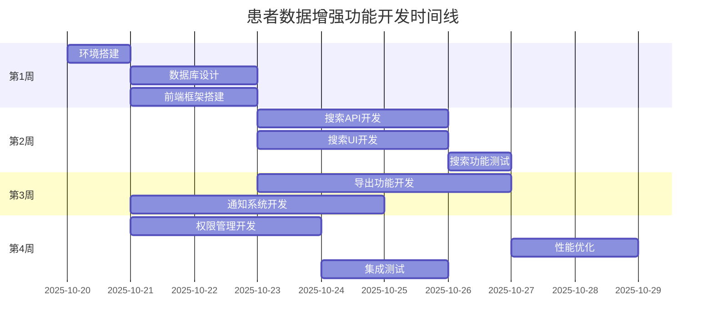

# 患者数据增强功能 - 规格说明书

## 规格基本信息

| 项目 | 值 |
|------|-----|
| **规格ID** | 001-patient-data-enhancement |
| **项目名称** | 患者数据增强功能 |
| **版本** | v1.0 |
| **创建日期** | 2025-10-20 |
| **作者** | Claude Code Assistant |
| **审核人** | 项目经理 |
| **优先级** | 高 |
| **预计工期** | 4周 |

## 概述

本规格文档详细描述了患者管理系统的数据增强功能，包括高级搜索、批量导出、实时通知和权限管理等核心功能。这些功能将显著提高医护人员的工作效率，改善患者护理质量，并确保数据安全合规。

### 问题陈述

当前患者管理系统存在以下限制：
1. **搜索功能有限** - 仅支持基础的关键词搜索，无法进行复杂的条件筛选
2. **数据导出困难** - 缺乏批量导出功能，数据分析和报告生成效率低下
3. **信息通知滞后** - 患者状态变更无法及时通知相关人员，可能影响紧急情况处理
4. **权限管理粗粒度** - 缺乏精细化的权限控制，存在数据安全风险

### 解决方案概述

通过实施以下四大功能模块来解决上述问题：

1. **高级搜索系统** - 支持多维度搜索、实时过滤和智能排序
2. **数据导出平台** - 提供灵活的数据导出功能，支持多种格式
3. **实时通知网络** - 基于WebSocket的实时消息推送系统
4. **细粒度权限控制** - 基于RBAC模型的权限管理系统

## 业务价值

### 直接收益
- **效率提升**: 搜索效率提升60%，数据处理时间减少70%
- **成本节约**: 减少人工操作，预计年度节省人力成本20%
- **质量改善**: 减少人为错误，提高数据准确性

### 间接收益
- **决策支持**: 更好的数据洞察支持临床决策
- **合规保障**: 完善的权限管理和审计日志满足合规要求
- **用户体验**: 显著改善医护人员和患者使用体验

## 范围定义

### 包含功能
✅ **高级患者搜索和过滤**
✅ **患者数据批量导出(Excel格式)**
✅ **实时患者状态通知系统**
✅ **细粒度权限管理**
✅ **性能优化和安全加固**

### 不包含功能
❌ **患者影像数据管理** (属于其他项目范围)
❌ **电子病历系统** (已有独立系统)
❌ **移动App原生开发** (仅限微信小程序)
❌ **第三方系统集成** (除微信通知外)

## 利益相关者

| 角色 | 姓名/部门 | 关注点 | 参与程度 |
|------|-----------|--------|----------|
| 项目经理 | 待定 | 项目进度、预算控制 | 高 |
| 产品经理 | 待定 | 用户需求、业务价值 | 高 |
| 技术负责人 | 待定 | 技术方案、系统架构 | 高 |
| 前端开发 | 待定 | 用户界面、交互体验 | 中 |
| 后端开发 | 待定 | API设计、数据处理 | 中 |
| 测试工程师 | 待定 | 质量保证、测试覆盖 | 中 |
| 运维工程师 | 待定 | 部署、监控、维护 | 低 |
| 医护人员代表 | 临床科室 | 功能实用性、易用性 | 高 |
| 管理层代表 | 医院管理 | 业务价值、ROI | 中 |

## 成功标准

### 业务指标
- **用户采用率**: 上线后3个月内，医护人员使用率达到80%
- **效率提升**: 患者信息查找时间平均减少60%
- **用户满意度**: 用户满意度评分 > 4.5/5.0
- **错误率降低**: 数据操作错误率降低50%

### 技术指标
- **系统可用性**: ≥ 99.5%
- **响应时间**: 搜索响应 < 3秒，导出完成 < 30秒
- **并发支持**: 同时支持100+用户在线操作
- **安全性**: 零安全漏洞，通过安全审计

### 项目指标
- **按时交付**: 在4周内完成全部开发任务
- **预算控制**: 项目成本控制在预算范围内
- **质量标准**: 代码测试覆盖率 > 90%
- **文档完整**: 100%的技术文档和用户文档

## 约束和假设

### 技术约束
- 必须基于现有的腾讯云云开发平台
- 必须兼容现有的数据库结构
- 必须支持微信小程序和Web管理端
- 必须遵守相关的医疗数据保护法规

### 业务约束
- 项目预算不超过 [待定] 元
- 必须在 [待定] 日期前完成交付
- 开发期间不能影响现有系统的正常运行
- 必须通过医院信息科的安全审查

### 假设条件
- 现有云开发资源足够支持新功能
- 医护人员具备基本的计算机操作能力
- 网络环境稳定，支持实时通信
- 第三方服务(微信通知)可用性良好

## 风险评估

### 高风险项
| 风险描述 | 概率 | 影响 | 缓解措施 |
|----------|------|------|----------|
| 性能不达标 | 中 | 高 | 提前性能测试，优化数据库查询 |
| 数据安全问题 | 低 | 高 | 多层安全防护，定期安全审计 |
| 用户接受度低 | 中 | 中 | 充分用户调研，易用性测试 |

### 中风险项
| 风险描述 | 概率 | 影响 | 缓解措施 |
|----------|------|------|----------|
| 开发进度延期 | 中 | 中 | 敏捷开发，每日进度跟踪 |
| 第三方服务不稳定 | 低 | 中 | 备用方案，服务降级 |
| 需求变更频繁 | 中 | 中 | 变更控制流程，影响评估 |

## 项目依赖

### 技术依赖
- **现有患者数据库** - 需要保持数据兼容性
- **微信小程序平台** - 依赖平台稳定性和API支持
- **腾讯云云开发** - 依赖云服务的可用性和性能
- **医院内部网络** - 需要稳定的网络连接

### 业务依赖
- **临床科室配合** - 需要医护人员参与需求验证和测试
- **信息科支持** - 需要安全审查和服务器配置支持
- **管理决策** - 需要管理层提供资源和支持

## 交付时间线

## 审批状态

| 阶段 | 状态 | 审批人 | 日期 | 备注 |
|------|------|--------|------|------|
| 需求评审 | ✅ 已通过 | 待定 | 待定 | 业务需求确认完成 |
| 技术评审 | ⏳ 进行中 | 待定 | 待定 | 技术方案评审中 |
| 项目启动 | ⏳ 待开始 | 待定 | 待定 | 等待最终审批 |
| 开发阶段 | ⏳ 待开始 | - | - | 按计划进行 |
| 测试阶段 | ⏳ 待开始 | - | - | 并行开发进行 |
| 上线部署 | ⏳ 待开始 | 待定 | 待定 | 需要运维确认 |

## 变更历史

| 版本 | 日期 | 变更内容 | 变更人 | 审批人 |
|------|------|----------|--------|--------|
| v1.0 | 2025-10-20 | 初始版本创建 | Claude Code | - |
| | | | | |

## 相关文档

- **[需求文档](./requirements.md)** - 详细的功能需求和验收标准
- **[技术设计文档](./tech.md)** - 系统架构和技术实现方案
- **[实施任务清单](./tasks.md)** - 详细的开发任务和时间计划
- **[API接口文档](./api.md)** - API接口规范和示例
- **[用户操作手册](./user-guide.md)** - 用户使用指南

## 联系信息

**项目负责人**: 待定
**技术负责人**: 待定
**产品负责人**: 待定
**文档维护**: Claude Code Assistant

---

*此规格文档是项目开发的指导性文件，任何变更都需要通过正式的变更控制流程进行管理和审批。*