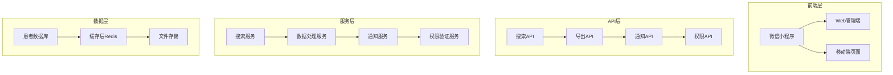
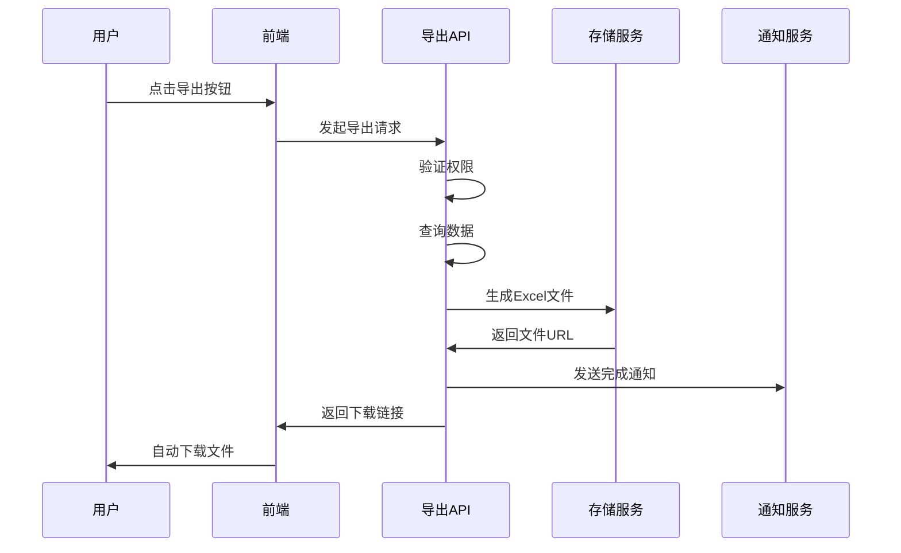
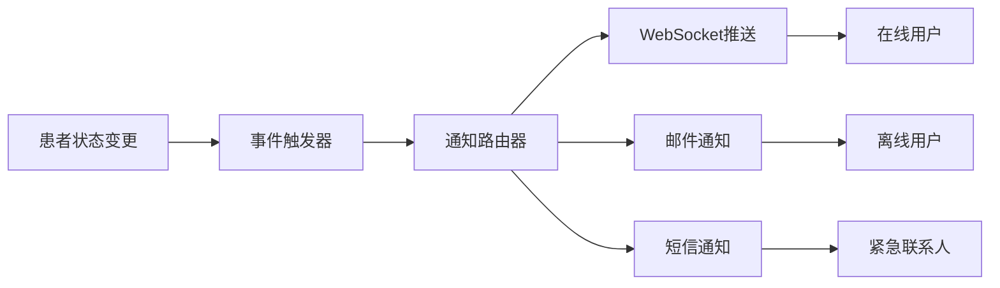

# 患者数据增强功能 - 技术设计文档

## 系统架构

### 整体架构图



## 技术栈选择

### 前端技术
- **微信小程序**: 原生小程序开发框架
- **Web管理端**: React + TypeScript + Vite
- **UI组件**: Tailwind CSS + Headless UI
- **状态管理**: React Context + useReducer

### 后端技术
- **云函数**: 腾讯云云开发 CloudBase
- **数据库**: 云开发数据库 (MongoDB兼容)
- **缓存**: Redis (云开发缓存)
- **文件存储**: 云开发存储

### 通信协议
- **WebSocket**: 实时通知推送
- **HTTP/HTTPS**: RESTful API
- **数据格式**: JSON

## 核心模块设计

### 1. 高级搜索模块

#### 数据结构设计
```javascript
// 搜索过滤器接口
interface SearchFilter {
  keyword?: string;           // 关键词搜索
  dateRange?: {              // 时间范围
    start: Date;
    end: Date;
  };
  status?: PatientStatus[];   // 患者状态
  department?: string[];      // 科室
  severity?: SeverityLevel;   // 严重程度
}

// 搜索结果接口
interface SearchResult {
  patients: Patient[];
  total: number;
  hasMore: boolean;
  searchTime: number;        // 搜索耗时(ms)
}
```

#### 搜索算法设计
1. **索引策略**: 基于MongoDB复合索引
2. **缓存策略**: 热门搜索结果缓存5分钟
3. **分页策略**: 游标分页，支持大数据集

#### 云函数实现
```javascript
// cloudfunctions/patientSearch/index.js
exports.main = async (event, context) => {
  const { filter, page = 1, limit = 20 } = event;

  // 构建查询条件
  const query = buildQuery(filter);

  // 执行搜索
  const result = await db.collection('patients')
    .where(query)
    .skip((page - 1) * limit)
    .limit(limit)
    .get();

  return {
    patients: result.data,
    total: result.total,
    hasMore: result.data.length === limit
  };
};
```

### 2. 数据导出模块

#### 导出流程设计


#### Excel生成策略
- **库选择**: ExcelJS (Node.js)
- **内存优化**: 流式处理，支持大数据集
- **格式支持**:
  - 中文UTF-8编码
  - 日期格式本地化
  - 数字格式保持
  - 单元格样式

#### 云函数实现
```javascript
// cloudfunctions/patientExport/index.js
const ExcelJS = require('exceljs');

exports.main = async (event, context) => {
  const { filter, columns } = event;

  // 验证导出权限
  if (!await checkExportPermission(context.OPENID)) {
    throw new Error('无导出权限');
  }

  // 创建工作簿
  const workbook = new ExcelJS.Workbook();
  const worksheet = workbook.addWorksheet('患者数据');

  // 设置表头
  worksheet.columns = columns.map(col => ({
    header: col.title,
    key: col.key,
    width: col.width || 15
  }));

  // 分批获取数据并写入
  const batchSize = 1000;
  let offset = 0;
  let hasMore = true;

  while (hasMore) {
    const patients = await fetchPatients(filter, offset, batchSize);

    patients.forEach(patient => {
      worksheet.addRow(formatPatientData(patient, columns));
    });

    hasMore = patients.length === batchSize;
    offset += batchSize;
  }

  // 生成文件
  const buffer = await workbook.xlsx.writeBuffer();
  const fileName = `patients_${Date.now()}.xlsx`;

  // 上传到云存储
  const fileUrl = await uploadToCloudStorage(buffer, fileName);

  return { fileUrl, fileName };
};
```

### 3. 实时通知模块

#### 通知架构设计


#### 通知策略
1. **实时推送**: WebSocket连接，5秒内送达
2. **离线通知**: 邮件 + 微信模板消息
3. **优先级**: 紧急 > 重要 > 一般
4. **去重**: 相同内容10分钟内只发送一次

#### WebSocket实现
```javascript
// cloudfunctions/websocketNotification/index.js
exports.main = async (event, context) => {
  const { action, data } = event;

  switch (action) {
    case 'connect':
      return handleConnect(context);
    case 'message':
      return handleMessage(data, context);
    case 'disconnect':
      return handleDisconnect(context);
  }
};

function handleConnect(context) {
  const userId = context.OPENID;
  const connectionId = context.websocket_id;

  // 存储连接映射
  redis.setex(`ws:${userId}`, 3600, connectionId);

  return {
    status: 'connected',
    userId,
    timestamp: Date.now()
  };
}

async function sendNotification(userId, notification) {
  // 获取用户连接
  const connectionId = await redis.get(`ws:${userId}`);

  if (connectionId) {
    // WebSocket在线推送
    await websocket.send(connectionId, {
      type: 'notification',
      data: notification
    });
  } else {
    // 离线通知
    await sendEmailNotification(userId, notification);
  }
}
```

### 4. 权限管理模块

#### 权限模型设计
```javascript
// 权限规则接口
interface PermissionRule {
  resource: string;          // 资源类型: patient, department, data_field
  action: string;            // 操作类型: read, write, export, delete
  conditions?: {             // 权限条件
    department?: string[];
    patientGroup?: string[];
    dataFields?: string[];
    timeRange?: {
      start: string;
      end: string;
    };
  };
  priority: number;          // 权限优先级
}

// 角色权限配置
interface RolePermissions {
  roleId: string;
  permissions: PermissionRule[];
  inherited?: string[];      // 继承的其他角色
}
```

#### 权限验证算法
```javascript
async function checkPermission(userId, resource, action, context = {}) {
  // 获取用户角色
  const roles = await getUserRoles(userId);

  // 收集所有权限规则
  const allPermissions = [];
  for (const role of roles) {
    const rolePerms = await getRolePermissions(role);
    allPermissions.push(...rolePerms);
  }

  // 按优先级排序
  allPermissions.sort((a, b) => b.priority - a.priority);

  // 查找匹配的权限规则
  for (const perm of allPermissions) {
    if (matchPermission(perm, resource, action, context)) {
      return perm; // 返回匹配的权限
    }
  }

  return null; // 无权限
}
```

## 性能优化策略

### 1. 数据库优化
- **索引策略**:
  - 复合索引: `{status: 1, createTime: -1}`
  - 文本索引: `{name: "text", idCard: "text"}`
  - 稀疏索引: `{emergencyContact: 1}`
- **查询优化**: 使用聚合管道减少网络传输
- **分页优化**: 游标分页替代OFFSET

### 2. 缓存策略
```javascript
// 缓存层级设计
const cacheStrategy = {
  // L1: 内存缓存 (应用级)
  memory: {
    ttl: 300,        // 5分钟
    maxSize: 1000,   // 最大1000个条目
    strategy: 'LRU'
  },

  // L2: Redis缓存 (分布式)
  redis: {
    ttl: 1800,       // 30分钟
    prefix: 'patient:',
    compression: true
  },

  // L3: 数据库查询结果缓存
  query: {
    ttl: 3600,       // 1小时
    key: 'query_hash'
  }
};
```

### 3. 前端优化
- **虚拟滚动**: 大列表渲染优化
- **防抖搜索**: 减少API调用频率
- **懒加载**: 图片和组件按需加载
- **代码分割**: 路由级别的代码分割

## 安全设计

### 1. 身份认证
- **JWT Token**: 包含用户ID、角色、权限
- **Token刷新**: 自动续期机制
- **多因素认证**: 支持短信验证码

### 2. 数据加密
```javascript
// 敏感数据加密
const encryptionConfig = {
  // 传输加密: TLS 1.3
  transport: 'TLS_1_3',

  // 存储加密: AES-256
  storage: {
    algorithm: 'AES-256-GCM',
    keyRotation: 90 // 天
  },

  // 字段级加密
  fieldEncryption: {
    idCard: true,
    phone: true,
    address: true
  }
};
```

### 3. 访问控制
- **RBAC模型**: 基于角色的访问控制
- **ABAC增强**: 基于属性的访问控制
- **API限流**: 防止恶意请求
- **审计日志**: 完整的操作记录

## 监控和日志

### 1. 性能监控
```javascript
const metrics = {
  // API响应时间
  responseTime: {
    search: '<3s',
    export: '<30s',
    notification: '<5s'
  },

  // 系统资源
  resources: {
    cpu: '<80%',
    memory: '<85%',
    disk: '<90%'
  },

  // 业务指标
  business: {
    searchSuccess: '>99%',
    exportSuccess: '>98%',
    notificationDelivery: '>95%'
  }
};
```

### 2. 错误处理
- **统一错误格式**: 标准化错误响应
- **错误分类**: 系统错误、业务错误、用户错误
- **错误上报**: 自动收集和报告
- **降级策略**: 服务不可用时的备选方案

### 3. 日志管理
```javascript
const logConfig = {
  levels: ['error', 'warn', 'info', 'debug'],
  format: 'json',

  // 日志路由
  outputs: {
    file: {
      level: 'info',
      rotation: 'daily',
      retention: 30
    },

    cloudwatch: {
      level: 'warn',
      realTime: true
    },

    audit: {
      level: 'info',
      types: ['access', 'permission', 'data']
    }
  }
};
```

## 部署和运维

### 1. 环境配置
- **开发环境**: 本地模拟器 + 测试数据
- **测试环境**: 独立云环境 + 自动化测试
- **预生产环境**: 生产数据副本
- **生产环境**: 高可用配置

### 2. CI/CD流程
```yaml
# .github/workflows/deploy.yml
name: Deploy Patient Enhancement

on:
  push:
    branches: [main]

jobs:
  test:
    runs-on: ubuntu-latest
    steps:
      - name: Run Tests
        run: npm run test:spec
      - name: Security Scan
        run: npm run security:scan

  deploy:
    needs: test
    runs-on: ubuntu-latest
    steps:
      - name: Deploy Cloud Functions
        run: npm run deploy:functions
      - name: Update Database Indexes
        run: npm run db:index
      - name: Health Check
        run: npm run health:check
```

### 3. 备份和恢复
- **数据备份**: 每日自动备份
- **增量备份**: 每小时增量备份
- **恢复测试**: 月度恢复演练
- **异地备份**: 多地域备份

## 测试策略

### 1. 单元测试
- **覆盖率要求**: >90%
- **测试框架**: Jest + React Testing Library
- **Mock策略**: 数据库和外部服务Mock

### 2. 集成测试
- **API测试**: Postman + Newman
- **数据库测试**: 测试环境数据验证
- **WebSocket测试**: 连接和消息推送测试

### 3. E2E测试
- **用户场景**: 完整业务流程测试
- **性能测试**: 并发用户和大数据量测试
- **兼容性测试**: 多浏览器和设备测试

这个技术设计为患者数据增强功能提供了完整的技术实现方案，确保功能的高性能、高可用性和高安全性。