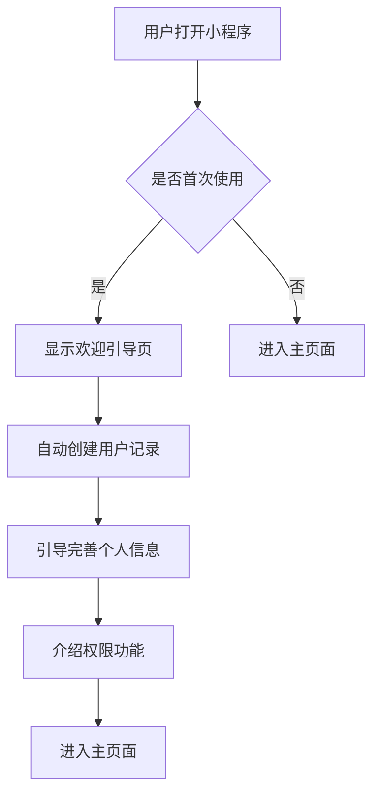
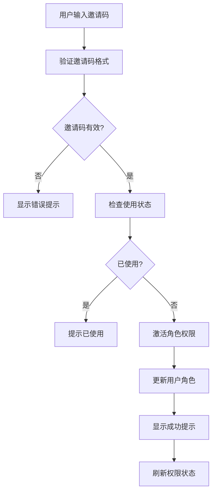
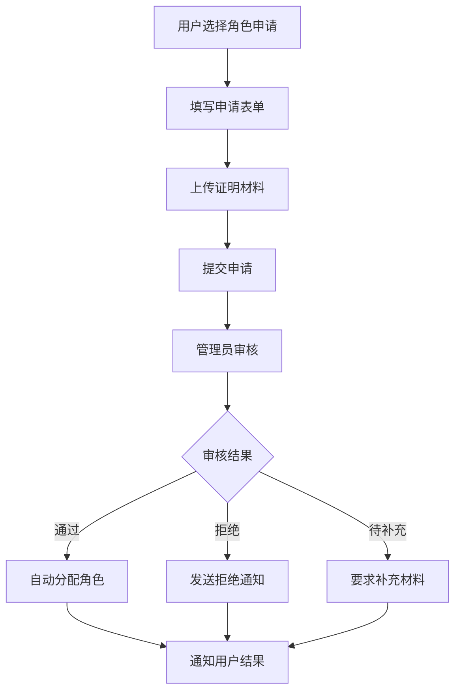
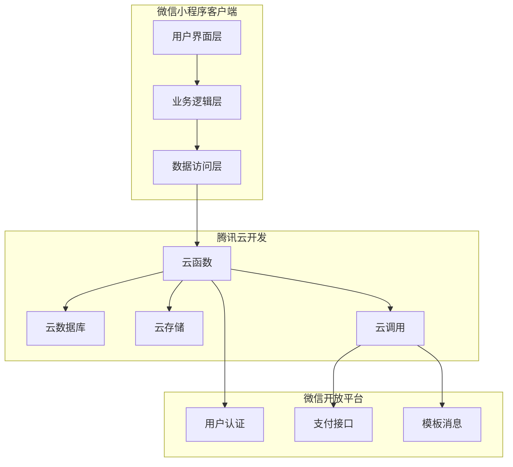
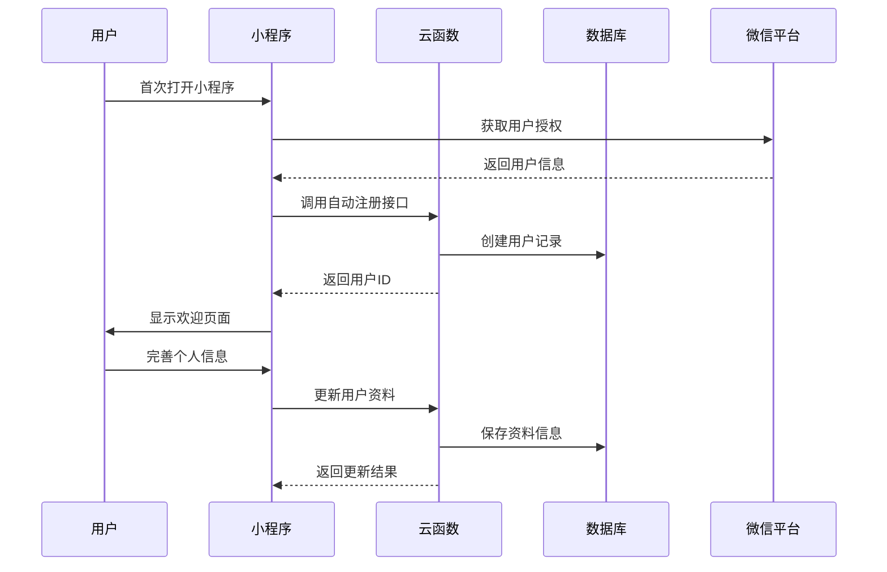
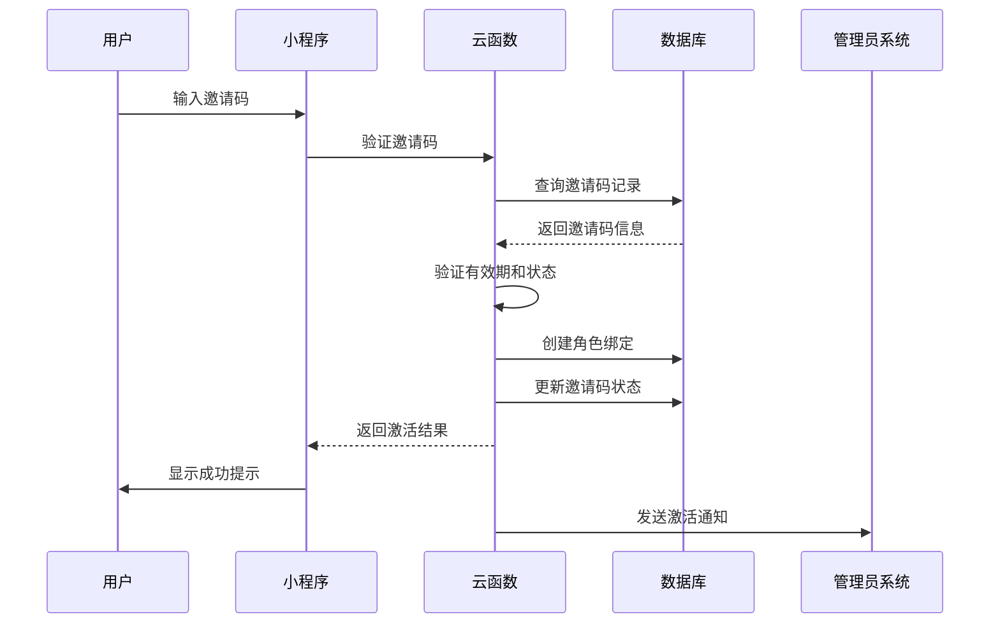

# 微信小程序用户注册与角色管理系统设计方案

## 目录

- [1. 项目概述](#1-项目概述)
- [2. 需求分析](#2-需求分析)
- [3. 系统设计](#3-系统设计)
- [4. 页面设计规范](#4-页面设计规范)
- [5. 技术实现方案](#5-技术实现方案)
- [6. 数据库设计](#6-数据库设计)
- [7. API接口设计](#7-api接口设计)
- [8. 安全设计](#8-安全设计)
- [9. 开发计划](#9-开发计划)
- [10. 测试方案](#10-测试方案)
- [11. 运维监控](#11-运维监控)
- [12. 附录](#12-附录)

---

## 1. 项目概述

### 1.1 背景介绍

当前微信小程序具备基础的患者管理功能，但在用户注册和角色管理方面存在以下问题：

- **注册体验不完善**：用户首次使用缺乏引导，无法完善个人信息
- **角色分配困难**：社工账号创建完全依赖管理员手动操作
- **权限状态不透明**：用户无法了解自己的权限状态和申请进度
- **用户体验不统一**：缺乏统一的用户资料管理界面

### 1.2 项目目标

本项目旨在完善微信小程序的用户注册和角色管理功能，实现：

1. **自动化用户注册流程**：用户首次使用时自动创建账号并引导完善信息
2. **便捷的角色申请机制**：通过邀请码或申请表单获得相应权限
3. **透明的权限管理系统**：用户可查看当前权限状态和申请进度
4. **统一的用户资料管理**：提供完整的个人信息管理功能

### 1.3 设计原则

- **用户体验优先**：简化操作流程，提供清晰的引导和反馈
- **权限安全可靠**：确保角色分配的安全性和可追溯性
- **系统可扩展性**：为未来功能扩展预留接口和架构空间
- **设计一致性**：与现有系统保持统一的视觉风格和交互模式

### 1.4 技术栈

- **前端框架**：微信小程序原生开发
- **后端服务**：腾讯云开发（CloudBase）
- **数据库**：云开发数据库
- **存储服务**：云开发存储
- **认证服务**：微信开放平台 + 云开发自定义登录

---

## 2. 需求分析

### 2.1 用户角色定义

| 角色名称 | 角色代码 | 权限描述 | 主要功能 |
|---------|---------|---------|---------|
| 管理员 | admin | 系统最高权限 | 用户管理、权限分配、系统配置 |
| 社工 | social_worker | 业务核心权限 | 患者管理、服务记录、数据导入导出 |
| 志愿者 | volunteer | 辅助服务权限 | 活动参与、基础信息查看 |
| 家长 | parent | 家庭相关权限 | 个人信息查看、活动报名 |
| 访客 | guest | 基础权限 | 公开信息浏览、权限申请 |

### 2.2 功能需求矩阵

| 功能模块 | 管理员 | 社工 | 志愿者 | 家长 | 访客 |
|---------|-------|-----|-------|-----|-----|
| **用户认证** |
| 自动注册登录 | ✅ | ✅ | ✅ | ✅ | ✅ |
| 完善个人资料 | ✅ | ✅ | ✅ | ✅ | ✅ |
| 头像上传 | ✅ | ✅ | ✅ | ✅ | ✅ |
| **角色管理** |
| 邀请码激活 | ✅ | ✅ | ✅ | ✅ | ✅ |
| 角色申请提交 | ✅ | ⚠️ | ✅ | ✅ | ✅ |
| 权限状态查看 | ✅ | ✅ | ✅ | ✅ | ✅ |
| **系统功能** |
| 患者信息查看 | ✅ | ✅ | ❌ | ⚠️ | ❌ |
| 服务记录管理 | ✅ | ✅ | ⚠️ | ❌ | ❌ |
| 数据导入导出 | ✅ | ✅ | ❌ | ❌ | ❌ |

*说明：✅ 完全权限，⚠️ 有限权限，❌ 无权限*

### 2.3 用例分析

#### 2.3.1 新用户首次使用



#### 2.3.2 邀请码激活流程



#### 2.3.3 角色申请流程



### 2.4 非功能性需求

#### 2.4.1 性能需求

- **页面加载时间**：首屏加载时间 < 2秒
- **API响应时间**：云函数响应时间 < 500ms
- **文件上传速度**：头像上传 < 3秒
- **并发处理**：支持100+用户同时在线

#### 2.4.2 安全需求

- **身份验证**：基于微信开放平台的用户身份验证
- **权限控制**：严格的基于角色的访问控制（RBAC）
- **数据保护**：敏感数据加密存储和传输
- **审计日志**：完整的用户操作日志记录

#### 2.4.3 可用性需求

- **系统可用性**：99.9%的服务可用性
- **容错能力**：网络异常时的优雅降级处理
- **兼容性**：支持微信基础库 2.2.3 及以上版本
- **易用性**：符合微信小程序设计规范

---

## 3. 系统设计

### 3.1 系统架构



### 3.2 模块设计

#### 3.2.1 用户管理模块

**职责**：处理用户注册、资料管理、身份验证

**核心组件**：
- `UserManager`: 用户状态管理
- `ProfileService`: 资料管理服务
- `AuthService`: 认证服务

**主要功能**：
- 用户自动注册和登录
- 个人资料管理
- 头像上传和裁剪
- 登录状态维护

#### 3.2.2 权限管理模块

**职责**：处理角色分配、权限验证、访问控制

**核心组件**：
- `PermissionManager`: 权限管理器
- `RoleService`: 角色服务
- `AccessController`: 访问控制器

**主要功能**：
- 邀请码验证和激活
- 角色申请和审核
- 权限状态检查
- 访问权限控制

#### 3.2.3 申请管理模块

**职责**：处理各种申请流程和状态跟踪

**核心组件**：
- `ApplicationService`: 申请服务
- `WorkflowEngine`: 工作流引擎
- `NotificationService`: 通知服务

**主要功能**：
- 角色申请提交
- 申请状态跟踪
- 审核流程管理
- 结果通知推送

### 3.3 数据流设计

#### 3.3.1 用户注册数据流



#### 3.3.2 权限激活数据流



---

## 4. 页面设计规范

### 4.1 页面结构

```
wx-project/
├── pages/
│   ├── user-profile/
│   │   ├── index.js              # 个人资料主页
│   │   ├── index.json            # 页面配置
│   │   ├── index.wxml            # 页面结构
│   │   ├── index.wxss            # 页面样式
│   │   ├── edit.js               # 资料编辑页面
│   │   ├── edit.json
│   │   ├── edit.wxml
│   │   └── edit.wxss
│   ├── auth/
│   │   ├── welcome.js            # 欢迎引导页
│   │   ├── invite-code.js        # 邀请码输入页
│   │   ├── role-application.js   # 角色申请页
│   │   └── application-status.js # 申请状态页
│   └── components/
│       ├── profile-card/         # 资料卡片组件
│       ├── permission-list/      # 权限列表组件
│       ├── auth-button/          # 权限按钮组件
│       └── role-badge/           # 角色徽章组件
```

### 4.2 页面设计详情

#### 4.2.1 欢迎引导页 (`welcome`)

**页面功能**：首次用户的欢迎和引导

**设计要点**：
- 简洁友好的欢迎信息
- 清晰的功能介绍
- 引导用户完善资料
- 提供多种激活选项

**页面结构**：
```xml
<!-- welcome.wxml -->
<view class="welcome-container">
  <view class="welcome-header">
    <image class="welcome-logo" src="/assets/logo.png" />
    <text class="welcome-title">欢迎使用入住档案系统</text>
    <text class="welcome-subtitle">让我们开始您的关怀之旅</text>
  </view>

  <view class="welcome-content">
    <view class="feature-section">
      <view class="feature-item">
        <icon type="success" size="20" />
        <text>完善个人资料</text>
      </view>
      <view class="feature-item">
        <icon type="success" size="20" />
        <text>申请相关权限</text>
      </view>
      <view class="feature-item">
        <icon type="success" size="20" />
        <text>开始使用服务</text>
      </view>
    </view>
  </view>

  <view class="welcome-actions">
    <button class="primary-btn" bindtap="goToProfile">立即完善资料</button>
    <button class="secondary-btn" bindtap="goToInviteCode">我有邀请码</button>
    <button class="text-btn" bindtap="skipForNow">稍后再说</button>
  </view>
</view>
```

**样式设计**：
```css
/* welcome.wxss */
.welcome-container {
  min-height: 100vh;
  background: linear-gradient(135deg, #667eea 0%, #764ba2 100%);
  display: flex;
  flex-direction: column;
  padding: 60rpx 40rpx;
  color: white;
}

.welcome-header {
  text-align: center;
  margin-bottom: 80rpx;
}

.welcome-logo {
  width: 120rpx;
  height: 120rpx;
  margin-bottom: 30rpx;
}

.welcome-title {
  font-size: 48rpx;
  font-weight: bold;
  display: block;
  margin-bottom: 20rpx;
}

.welcome-subtitle {
  font-size: 28rpx;
  opacity: 0.8;
}

.feature-section {
  background: rgba(255, 255, 255, 0.1);
  border-radius: 20rpx;
  padding: 40rpx;
  margin-bottom: 60rpx;
}

.feature-item {
  display: flex;
  align-items: center;
  margin-bottom: 30rpx;
}

.feature-item:last-child {
  margin-bottom: 0;
}

.feature-item text {
  margin-left: 20rpx;
  font-size: 30rpx;
}
```

#### 4.2.2 个人资料编辑页 (`edit`)

**页面功能**：用户完善和编辑个人信息

**设计要点**：
- 分组显示各类信息
- 实时验证用户输入
- 支持头像上传和裁剪
- 保存进度提示

**页面结构**：
```xml
<!-- edit.wxml -->
<view class="profile-edit-container">
  <view class="edit-header">
    <text class="page-title">个人资料</text>
    <text class="page-subtitle">完善您的个人信息，获得更好的服务体验</text>
  </view>

  <form bindsubmit="handleSave">
    <!-- 头像上传 -->
    <view class="form-section">
      <view class="section-title">头像</view>
      <view class="avatar-upload" bindtap="chooseAvatar">
        <image
          class="avatar-image"
          src="{{profile.avatar || '/assets/default-avatar.png'}}"
          mode="aspectFill"
        />
        <view class="avatar-upload-btn">
          <icon type="camera" size="20" color="#666" />
          <text>更换头像</text>
        </view>
      </view>
    </view>

    <!-- 基本信息 -->
    <view class="form-section">
      <view class="section-title">基本信息</view>
      <view class="form-item">
        <text class="form-label required">姓名</text>
        <input
          class="form-input"
          name="realName"
          value="{{profile.realName}}"
          placeholder="请输入真实姓名"
          bindinput="onInputChange"
          data-field="realName"
        />
      </view>

      <view class="form-item">
        <text class="form-label required">性别</text>
        <radio-group name="gender" bindchange="onGenderChange">
          <label class="radio-item">
            <radio value="male" checked="{{profile.gender === 'male'}}" />
            <text>男</text>
          </label>
          <label class="radio-item">
            <radio value="female" checked="{{profile.gender === 'female'}}" />
            <text>女</text>
          </label>
        </radio-group>
      </view>

      <view class="form-item">
        <text class="form-label required">手机号</text>
        <input
          class="form-input"
          name="phone"
          value="{{profile.phone}}"
          placeholder="请输入手机号"
          type="number"
          maxlength="11"
          bindinput="onPhoneInput"
        />
      </view>
    </view>

    <!-- 职业信息 -->
    <view class="form-section">
      <view class="section-title">职业信息</view>
      <view class="form-item">
        <text class="form-label">职业类型</text>
        <picker
          bindchange="onOccupationChange"
          value="{{occupationIndex}}"
          range="{{occupations}}"
          range-key="label"
        >
          <view class="picker-view">
            {{occupations[occupationIndex].label || '请选择职业类型'}}
          </view>
        </picker>
      </view>

      <view class="form-item">
        <text class="form-label">工作单位</text>
        <input
          class="form-input"
          name="organization"
          value="{{profile.organization}}"
          placeholder="请输入工作单位"
          bindinput="onInputChange"
          data-field="organization"
        />
      </view>
    </view>

    <!-- 保存按钮 -->
    <view class="form-actions">
      <button
        class="save-btn"
        form-type="submit"
        loading="{{saving}}"
        disabled="{{!canSave}}"
      >
        保存信息
      </button>
    </view>
  </form>
</view>
```

**JavaScript逻辑**：
```javascript
// edit.js
const userManager = require('../../utils/user-manager');
const validators = require('../../utils/validators');

Page({
  data: {
    profile: {
      avatar: '',
      realName: '',
      gender: '',
      phone: '',
      occupation: '',
      organization: ''
    },
    occupations: [
      { value: 'social_worker', label: '社工' },
      { value: 'volunteer', label: '志愿者' },
      { value: 'medical_staff', label: '医务人员' },
      { value: 'teacher', label: '教师' },
      { value: 'other', label: '其他' }
    ],
    occupationIndex: -1,
    saving: false,
    canSave: false
  },

  async onLoad() {
    await this.loadUserProfile();
  },

  async loadUserProfile() {
    try {
      const user = await userManager.getCurrentUser();
      if (user && user.profile) {
        this.setData({
          profile: { ...this.data.profile, ...user.profile }
        });
        this.updateCanSave();
      }
    } catch (error) {
      console.error('加载用户资料失败:', error);
      wx.showToast({
        title: '加载失败',
        icon: 'error'
      });
    }
  },

  onInputChange(e) {
    const { field } = e.currentTarget.dataset;
    const value = e.detail.value;

    this.setData({
      [`profile.${field}`]: value
    });

    this.updateCanSave();
  },

  onPhoneInput(e) {
    const value = e.detail.value;

    // 手机号格式验证
    if (value && !validators.phone(value)) {
      wx.showToast({
        title: '手机号格式不正确',
        icon: 'none'
      });
      return;
    }

    this.setData({
      'profile.phone': value
    });

    this.updateCanSave();
  },

  onGenderChange(e) {
    this.setData({
      'profile.gender': e.detail.value
    });
    this.updateCanSave();
  },

  onOccupationChange(e) {
    const index = e.detail.value;
    const occupation = this.data.occupations[index];

    this.setData({
      occupationIndex: index,
      'profile.occupation': occupation.value
    });

    this.updateCanSave();
  },

  chooseAvatar() {
    wx.chooseMedia({
      count: 1,
      mediaType: ['image'],
      sourceType: ['album', 'camera'],
      maxDuration: 30,
      camera: 'back',
      success: (res) => {
        const tempFilePath = res.tempFiles[0].tempFilePath;
        this.uploadAvatar(tempFilePath);
      }
    });
  },

  async uploadAvatar(filePath) {
    try {
      wx.showLoading({ title: '上传中...' });

      const uploadResult = await wx.cloud.uploadFile({
        cloudPath: `avatars/${Date.now()}-${Math.random().toString(36).substr(2, 9)}.jpg`,
        filePath: filePath
      });

      this.setData({
        'profile.avatar': uploadResult.fileID
      });

      wx.hideLoading();
      wx.showToast({
        title: '上传成功',
        icon: 'success'
      });
    } catch (error) {
      wx.hideLoading();
      wx.showToast({
        title: '上传失败',
        icon: 'error'
      });
    }
  },

  updateCanSave() {
    const { profile } = this.data;
    const canSave = validators.name(profile.realName) &&
                   validators.phone(profile.phone) &&
                   profile.gender;

    this.setData({ canSave });
  },

  async handleSave(e) {
    if (!this.data.canSave || this.data.saving) return;

    this.setData({ saving: true });

    try {
      const result = await userManager.updateProfile(this.data.profile);

      if (result.success) {
        wx.showToast({
          title: '保存成功',
          icon: 'success'
        });

        // 返回上一页或跳转到主页
        setTimeout(() => {
          wx.navigateBack();
        }, 1500);
      } else {
        throw new Error(result.error || '保存失败');
      }
    } catch (error) {
      wx.showToast({
        title: error.message || '保存失败',
        icon: 'error'
      });
    } finally {
      this.setData({ saving: false });
    }
  }
});
```

#### 4.2.3 邀请码输入页 (`invite-code`)

**页面功能**：用户输入邀请码激活角色权限

**设计要点**：
- 大字体邀请码输入框
- 实时格式验证
- 激活结果即时反馈
- 权限变更提示

**页面结构**：
```xml
<!-- invite-code.wxml -->
<view class="invite-code-container">
  <view class="page-header">
    <text class="page-title">邀请码激活</text>
    <text class="page-subtitle">请输入管理员提供给您的邀请码</text>
  </view>

  <view class="invite-code-section">
    <view class="code-input-container">
      <input
        class="code-input"
        type="text"
        value="{{inviteCode}}"
        placeholder="请输入8位邀请码"
        maxlength="8"
        bindinput="onCodeInput"
        focus="{{inputFocused}}"
      />
      <view class="code-display">
        <text
          wx:for="{{codeDisplay}}"
          wx:key="index"
          class="code-char {{item ? 'filled' : 'empty'}}"
        >
          {{item || '_'}}
        </text>
      </view>
    </view>

    <view class="code-status {{codeStatus}}">
      <icon wx:if="{{codeStatus === 'valid'}}" type="success" size="16" />
      <icon wx:if="{{codeStatus === 'invalid'}}" type="warn" size="16" />
      <icon wx:if="{{codeStatus === 'checking'}}" loading="true" size="16" />
      <text class="status-text">{{statusText}}</text>
    </view>
  </view>

  <view class="role-preview" wx:if="{{previewRole}}">
    <view class="role-card">
      <view class="role-info">
        <text class="role-name">{{previewRole.name}}</text>
        <text class="role-desc">{{previewRole.description}}</text>
      </view>
      <view class="role-permissions">
        <text class="permissions-title">包含权限：</text>
        <view class="permission-list">
          <text
            wx:for="{{previewRole.permissions}}"
            wx:key="index"
            class="permission-item"
          >
            • {{item}}
          </text>
        </view>
      </view>
    </view>
  </view>

  <view class="action-section">
    <button
      class="activate-btn"
      disabled="{{!canActivate || activating}}"
      loading="{{activating}}"
      bindtap="activateCode"
    >
      {{activating ? '激活中...' : '立即激活'}}
    </button>

    <button class="help-btn" bindtap="showHelp">
      如何获得邀请码？
    </button>
  </view>
</view>
```

**JavaScript逻辑**：
```javascript
// invite-code.js
const userManager = require('../../utils/user-manager');

Page({
  data: {
    inviteCode: '',
    codeDisplay: ['', '', '', '', '', '', '', ''],
    codeStatus: 'empty', // empty, checking, valid, invalid
    statusText: '请输入邀请码',
    inputFocused: true,
    canActivate: false,
    activating: false,
    previewRole: null,
    roleConfigs: {
      social_worker: {
        name: '社工',
        description: '负责患者管理和关怀服务',
        permissions: [
          '查看患者信息',
          '编辑患者资料',
          '管理入住记录',
          '导入导出数据'
        ]
      },
      volunteer: {
        name: '志愿者',
        description: '参与关怀活动和服务',
        permissions: [
          '查看活动信息',
          '参与志愿服务',
          '基础信息查看'
        ]
      },
      parent: {
        name: '家长',
        description: '患儿家属',
        permissions: [
          '查看个人信息',
          '参与相关活动',
          '联系工作人员'
        ]
      }
    }
  },

  onCodeInput(e) {
    let value = e.detail.value.toUpperCase();

    // 限制只能输入字母和数字
    value = value.replace(/[^A-Z0-9]/g, '');

    // 更新输入值
    this.setData({ inviteCode: value });

    // 更新显示格式
    const display = value.split('').concat(Array(8 - value.length).fill(''));
    this.setData({ codeDisplay: display });

    // 验证邀请码
    if (value.length === 8) {
      this.validateInviteCode(value);
    } else {
      this.setData({
        codeStatus: 'empty',
        statusText: `请输入8位邀请码 (${8 - value.length}位剩余)`,
        canActivate: false,
        previewRole: null
      });
    }
  },

  async validateInviteCode(code) {
    this.setData({
      codeStatus: 'checking',
      statusText: '验证中...',
      canActivate: false
    });

    try {
      // 模拟API调用延迟
      await new Promise(resolve => setTimeout(resolve, 1000));

      const result = await wx.cloud.callFunction({
        name: 'rbac',
        data: {
          action: 'validateInviteCode',
          code: code
        }
      });

      if (result.result.success) {
        const { valid, role, used } = result.result.data;

        if (!valid) {
          this.setData({
            codeStatus: 'invalid',
            statusText: '邀请码无效',
            canActivate: false,
            previewRole: null
          });
        } else if (used) {
          this.setData({
            codeStatus: 'invalid',
            statusText: '邀请码已被使用',
            canActivate: false,
            previewRole: null
          });
        } else {
          const roleConfig = this.data.roleConfigs[role];
          this.setData({
            codeStatus: 'valid',
            statusText: '邀请码有效',
            canActivate: true,
            previewRole: roleConfig
          });
        }
      } else {
        throw new Error(result.result.error?.message || '验证失败');
      }
    } catch (error) {
      console.error('验证邀请码失败:', error);
      this.setData({
        codeStatus: 'invalid',
        statusText: '验证失败，请重试',
        canActivate: false,
        previewRole: null
      });
    }
  },

  async activateCode() {
    if (!this.data.canActivate || this.data.activating) return;

    this.setData({ activating: true });

    try {
      const result = await userManager.useInviteCode(this.data.inviteCode);

      if (result.success) {
        wx.showModal({
          title: '激活成功',
          content: `恭喜您获得${this.data.previewRole.name}权限！`,
          showCancel: false,
          confirmText: '开始使用',
          success: () => {
            wx.switchTab({
              url: '/pages/index/index'
            });
          }
        });
      } else {
        wx.showToast({
          title: result.error || '激活失败',
          icon: 'error'
        });
      }
    } catch (error) {
      wx.showToast({
        title: '激活失败，请重试',
        icon: 'error'
      });
    } finally {
      this.setData({ activating: false });
    }
  },

  showHelp() {
    wx.showModal({
      title: '如何获得邀请码？',
      content: '请联系您的机构管理员或项目负责人，说明您需要使用系统的原因和身份，管理员会为您生成相应的邀请码。',
      showCancel: false,
      confirmText: '我知道了'
    });
  }
});
```

### 4.3 组件设计

#### 4.3.1 权限按钮组件 (`auth-button`)

**组件功能**：根据用户权限显示不同的按钮状态

**组件代码**：
```javascript
// components/auth-button/index.js
const userManager = require('../../utils/user-manager');

Component({
  properties: {
    // 所需权限列表
    requiredRoles: {
      type: Array,
      value: []
    },
    // 按钮文本
    text: {
      type: String,
      value: ''
    },
    // 按钮类型
    type: {
      type: String,
      value: 'default'
    },
    // 按钮大小
    size: {
      type: String,
      value: 'medium'
    },
    // 禁用状态
    disabled: {
      type: Boolean,
      value: false
    },
    // 加载状态
    loading: {
      type: Boolean,
      value: false
    },
    // 权限不足时的提示文本
    noPermissionText: {
      type: String,
      value: '您没有执行此操作的权限'
    }
  },

  data: {
    hasPermission: false,
    showAuthModal: false
  },

  lifetimes: {
    attached() {
      this.checkPermission();

      // 监听用户权限变化
      userManager.onPermissionChange(() => {
        this.checkPermission();
      });
    }
  },

  methods: {
    checkPermission() {
      const hasPermission = userManager.hasPermission(this.data.requiredRoles);
      this.setData({ hasPermission });
    },

    handleClick() {
      if (this.data.disabled || this.data.loading) return;

      if (this.data.hasPermission) {
        this.triggerEvent('click');
      } else {
        this.setData({ showAuthModal: true });
      }
    },

    hideAuthModal() {
      this.setData({ showAuthModal: false });
    },

    goApplyPermission() {
      this.hideAuthModal();
      wx.navigateTo({
        url: '/pages/auth/role-application'
      });
    },

    contactAdmin() {
      this.hideAuthModal();
      wx.makePhoneCall({
        phoneNumber: '400-123-4567',
        fail: () => {
          wx.showToast({
            title: '请联系管理员',
            icon: 'none'
          });
        }
      });
    }
  }
});
```

**组件模板**：
```xml
<!-- components/auth-button/index.wxml -->
<button
  class="auth-btn {{type}} {{size}} {{hasPermission ? 'has-permission' : 'no-permission'}}"
  disabled="{{disabled || loading || !hasPermission}}"
  loading="{{loading}}"
  bindtap="handleClick"
>
  <slot wx:if="{{hasPermission}}">{{text}}</slot>
  <view wx:else class="no-permission-content">
    <icon type="info" size="16" />
    <text>{{text}}</text>
  </view>
</button>

<!-- 权限不足弹窗 -->
<view class="auth-modal" wx:if="{{showAuthModal}}">
  <view class="modal-mask" bindtap="hideAuthModal"></view>
  <view class="modal-content">
    <view class="modal-header">
      <text class="modal-title">权限不足</text>
      <button class="close-btn" bindtap="hideAuthModal">×</button>
    </view>
    <view class="modal-body">
      <text class="modal-message">{{noPermissionText}}</text>
      <view class="permission-info">
        <text class="info-title">需要以下权限之一：</text>
        <view class="role-list">
          <text
            wx:for="{{requiredRoles}}"
            wx:key="index"
            class="role-item"
          >
            {{item}}
          </text>
        </view>
      </view>
    </view>
    <view class="modal-actions">
      <button class="apply-btn" bindtap="goApplyPermission">申请权限</button>
      <button class="contact-btn" bindtap="contactAdmin">联系管理员</button>
    </view>
  </view>
</view>
```

#### 4.3.2 角色徽章组件 (`role-badge`)

**组件功能**：显示用户角色信息

**组件代码**：
```javascript
// components/role-badge/index.js
Component({
  properties: {
    // 角色类型
    role: {
      type: String,
      value: ''
    },
    // 显示大小
    size: {
      type: String,
      value: 'medium'
    },
    // 是否显示文字
    showText: {
      type: Boolean,
      value: true
    }
  },

  data: {
    roleConfig: {
      admin: {
        name: '管理员',
        color: '#ff4757',
        icon: 'admin'
      },
      social_worker: {
        name: '社工',
        color: '#3742fa',
        icon: 'service'
      },
      volunteer: {
        name: '志愿者',
        color: '#2ed573',
        icon: 'volunteer'
      },
      parent: {
        name: '家长',
        color: '#ffa502',
        icon: 'family'
      },
      guest: {
        name: '访客',
        color: '#747d8c',
        icon: 'guest'
      }
    }
  },

  computed: {
    currentRoleConfig() {
      return this.data.roleConfig[this.data.role] || this.data.roleConfig.guest;
    }
  },

  methods: {
    onBadgeTap() {
      this.triggerEvent('tap', {
        role: this.data.role,
        config: this.data.currentRoleConfig
      });
    }
  }
});
```

**组件模板**：
```xml
<!-- components/role-badge/index.wxml -->
<view
  class="role-badge {{size}} {{role}}"
  style="--role-color: {{currentRoleConfig.color}}"
  bindtap="onBadgeTap"
>
  <view class="badge-icon">
    <image
      src="/assets/icons/role-{{currentRoleConfig.icon}}.png"
      class="icon-image"
    />
  </view>
  <text wx:if="{{showText}}" class="badge-text">{{currentRoleConfig.name}}</text>
</view>
```

---

## 5. 技术实现方案

### 5.1 云函数扩展

#### 5.1.1 RBAC云函数扩展

在现有 `cloudfunctions/rbac/index.js` 基础上添加以下功能：

```javascript
// 用户资料更新
async function updateProfile(event) {
  const { principalId } = resolveAuthContext(event);
  const { profile } = event;

  if (!principalId) {
    throw makeError('UNAUTHORIZED', '未登录或登录态无效');
  }

  // 验证必填字段
  if (!profile || !profile.realName || !profile.phone) {
    throw makeError('INVALID_INPUT', '缺少必填字段');
  }

  // 手机号格式验证
  const phoneRegex = /^1[3-9]\d{9}$/;
  if (!phoneRegex.test(profile.phone)) {
    throw makeError('INVALID_INPUT', '手机号格式不正确');
  }

  await ensureCollectionExists(USERS_COLLECTION);

  try {
    const now = Date.now();
    const updateData = {
      profile: { ...profile },
      updatedAt: now
    };

    // 如果是首次完善资料，记录完善时间
    const userRes = await db.collection(USERS_COLLECTION)
      .where({ openid: principalId })
      .get();

    if (userRes.data && userRes.data.length > 0) {
      const user = userRes.data[0];
      if (!user.profile || !user.profile.realName) {
        updateData.profileCompletedAt = now;
      }
    }

    await db.collection(USERS_COLLECTION)
      .where({ openid: principalId })
      .update({ data: updateData });

    // 记录审计日志
    await writeAuditLog(
      { userId: principalId, role: 'user' },
      'profile.update',
      { type: 'user', id: principalId },
      '更新个人资料',
      { profile }
    );

    return { success: true };
  } catch (error) {
    throw makeError('DATABASE_ERROR', '更新资料失败', error);
  }
}

// 邀请码验证
async function validateInviteCode(event) {
  const { principalId } = resolveAuthContext(event);
  const { code } = event;

  if (!code || code.length !== 8) {
    throw makeError('INVALID_INPUT', '邀请码格式不正确');
  }

  await ensureCollectionExists(INVITES_COLLECTION);

  try {
    // 查询邀请码
    const inviteRes = await db.collection(INVITES_COLLECTION)
      .where({
        code: code.toUpperCase(),
        state: 'active'
      })
      .limit(1)
      .get();

    if (!inviteRes.data || inviteRes.data.length === 0) {
      return {
        success: true,
        data: {
          valid: false,
          reason: 'not_found'
        }
      };
    }

    const invite = inviteRes.data[0];

    // 检查是否已过期
    if (invite.expiresAt && invite.expiresAt < Date.now()) {
      return {
        success: true,
        data: {
          valid: false,
          reason: 'expired'
        }
      };
    }

    // 检查使用次数
    if (invite.usesLeft <= 0) {
      return {
        success: true,
        data: {
          valid: false,
          reason: 'exhausted'
        }
      };
    }

    // 检查用户是否已经使用过此邀请码
    await ensureCollectionExists(ROLE_BINDINGS_COLLECTION);
    const existingBinding = await db.collection(ROLE_BINDINGS_COLLECTION)
      .where({
        userOpenId: principalId,
        inviteId: invite._id,
        state: 'active'
      })
      .limit(1)
      .get();

    if (existingBinding.data && existingBinding.data.length > 0) {
      return {
        success: true,
        data: {
          valid: false,
          reason: 'already_used'
        }
      };
    }

    return {
      success: true,
      data: {
        valid: true,
        role: invite.role,
        inviteId: invite._id
      }
    };
  } catch (error) {
    throw makeError('DATABASE_ERROR', '验证邀请码失败', error);
  }
}

// 使用邀请码
async function useInviteCode(event) {
  const { principalId } = resolveAuthContext(event);
  const { code } = event;

  if (!principalId) {
    throw makeError('UNAUTHORIZED', '未登录或登录态无效');
  }

  // 先验证邀请码
  const validationResult = await validateInviteCode({ ...event, action: 'validateInviteCode' });

  if (!validationResult.success || !validationResult.data.valid) {
    throw makeError('INVALID_INVITE_CODE', '邀请码无效或已过期');
  }

  const { role, inviteId } = validationResult.data;

  await ensureCollectionExists(ROLE_BINDINGS_COLLECTION);

  try {
    const now = Date.now();

    // 创建角色绑定
    await db.collection(ROLE_BINDINGS_COLLECTION).add({
      data: {
        userOpenId: principalId,
        role,
        scopeType: 'global',
        state: 'active',
        inviteId,
        createdAt: now,
        createdBy: 'invite_code'
      }
    });

    // 更新邀请码使用次数
    await db.collection(INVITES_COLLECTION)
      .doc(inviteId)
      .update({
        data: {
          usesLeft: _.inc(-1),
          updatedAt: now
        }
      });

    // 记录审计日志
    await writeAuditLog(
      { userId: principalId, role: 'user' },
      'role.activate',
      { type: 'user', id: principalId },
      `通过邀请码激活角色：${role}`,
      { code, role, inviteId }
    );

    return { success: true, role };
  } catch (error) {
    throw makeError('DATABASE_ERROR', '激活邀请码失败', error);
  }
}

// 提交角色申请
async function submitRoleApplication(event) {
  const { principalId } = resolveAuthContext(event);
  const { role, reason, attachments } = event;

  if (!principalId) {
    throw makeError('UNAUTHORIZED', '未登录或登录态无效');
  }

  if (!role || !reason) {
    throw makeError('INVALID_INPUT', '缺少申请角色或申请理由');
  }

  if (!['social_worker', 'volunteer', 'parent'].includes(role)) {
    throw makeError('INVALID_INPUT', '不支持的角色类型');
  }

  await ensureCollectionExists(ROLE_REQUESTS_COLLECTION);
  await ensureCollectionExists(ROLE_BINDINGS_COLLECTION);

  // 检查是否已有相同角色的激活绑定
  const existingBinding = await db.collection(ROLE_BINDINGS_COLLECTION)
    .where({
      userOpenId: principalId,
      role,
      state: 'active'
    })
    .limit(1)
    .get();

  if (existingBinding.data && existingBinding.data.length > 0) {
    throw makeError('ALREADY_HAS_ROLE', '您已拥有该角色');
  }

  // 检查是否已有待审核的申请
  const existingRequest = await db.collection(ROLE_REQUESTS_COLLECTION)
    .where({
      applicantOpenId: principalId,
      role,
      state: 'pending'
    })
    .limit(1)
    .get();

  if (existingRequest.data && existingRequest.data.length > 0) {
    throw makeError('PENDING_APPLICATION', '您已有该角色的待审核申请');
  }

  try {
    const now = Date.now();

    // 创建申请记录
    const addRes = await db.collection(ROLE_REQUESTS_COLLECTION).add({
      data: {
        applicantOpenId: principalId,
        type: 'role',
        role,
        reason,
        attachments: attachments || [],
        state: 'pending',
        createdAt: now,
        updatedAt: now
      }
    });

    // 记录审计日志
    await writeAuditLog(
      { userId: principalId, role: 'user' },
      'role.apply',
      { type: 'roleRequest', id: addRes._id },
      `提交角色申请：${role}`,
      { role, reason, attachments }
    );

    return {
      success: true,
      applicationId: addRes._id
    };
  } catch (error) {
    throw makeError('DATABASE_ERROR', '提交申请失败', error);
  }
}

// 获取申请状态
async function getApplicationStatus(event) {
  const { principalId } = resolveAuthContext(event);

  if (!principalId) {
    throw makeError('UNAUTHORIZED', '未登录或登录态无效');
  }

  await ensureCollectionExists(ROLE_REQUESTS_COLLECTION);

  try {
    const res = await db.collection(ROLE_REQUESTS_COLLECTION)
      .where({
        applicantOpenId: principalId
      })
      .orderBy('createdAt', 'desc')
      .get();

    const applications = (res.data || []).map(app => ({
      id: app._id,
      role: app.role,
      reason: app.reason,
      state: app.state,
      reviewMessage: app.reviewMessage || '',
      reviewedAt: app.reviewedAt || null,
      createdAt: app.createdAt
    }));

    return {
      success: true,
      data: { applications }
    };
  } catch (error) {
    throw makeError('DATABASE_ERROR', '获取申请状态失败', error);
  }
}

// 在exports.main中添加新的action
exports.main = async (event = {}) => {
  const action = String(event.action || '');

  try {
    switch (action) {
      // ... 现有的cases
      case 'updateProfile':
        return await updateProfile(event);
      case 'validateInviteCode':
        return await validateInviteCode(event);
      case 'useInviteCode':
        return await useInviteCode(event);
      case 'submitRoleApplication':
        return await submitRoleApplication(event);
      case 'getApplicationStatus':
        return await getApplicationStatus(event);
      default:
        throw makeError('UNSUPPORTED_ACTION', `Unsupported action: ${action}`);
    }
  } catch (error) {
    console.error('rbac action failed', action, error);
    return {
      success: false,
      error: {
        code: error.code || 'INTERNAL_ERROR',
        message: error.message || 'Internal service error',
        details: error.details || null,
      },
    };
  }
};
```

### 5.2 前端工具类

#### 5.2.1 用户管理器 (`utils/user-manager.js`)

```javascript
// utils/user-manager.js
class UserManager {
  constructor() {
    this.currentUser = null;
    this.permissions = [];
    this.listeners = new Set();
    this.cacheExpiry = 5 * 60 * 1000; // 5分钟缓存
    this.lastCacheTime = 0;
  }

  // 监听权限变化
  onPermissionChange(callback) {
    this.listeners.add(callback);
    return () => {
      this.listeners.delete(callback);
    };
  }

  // 通知权限变化
  notifyPermissionChange() {
    this.listeners.forEach(callback => {
      try {
        callback(this.currentUser, this.permissions);
      } catch (error) {
        console.error('权限变化监听器执行失败:', error);
      }
    });
  }

  // 获取当前用户信息
  async getCurrentUser(forceRefresh = false) {
    const now = Date.now();

    // 检查缓存
    if (!forceRefresh &&
        this.currentUser &&
        (now - this.lastCacheTime) < this.cacheExpiry) {
      return this.currentUser;
    }

    try {
      const res = await wx.cloud.callFunction({
        name: 'rbac',
        data: { action: 'getCurrentUser' }
      });

      if (res.result && res.result.success) {
        this.currentUser = res.result.data;
        this.permissions = res.result.data.roles || [];
        this.lastCacheTime = now;

        this.notifyPermissionChange();

        // 保存到本地存储
        wx.setStorageSync('user_info', this.currentUser);
        wx.setStorageSync('user_permissions', this.permissions);

        return this.currentUser;
      } else {
        throw new Error(res.result?.error?.message || '获取用户信息失败');
      }
    } catch (error) {
      console.error('获取用户信息失败:', error);

      // 尝试从本地存储恢复
      const cachedUser = wx.getStorageSync('user_info');
      const cachedPermissions = wx.getStorageSync('user_permissions');

      if (cachedUser && cachedPermissions) {
        this.currentUser = cachedUser;
        this.permissions = cachedPermissions;
        return this.currentUser;
      }

      return null;
    }
  }

  // 检查用户权限
  hasPermission(requiredRoles) {
    if (!requiredRoles || requiredRoles.length === 0) {
      return true;
    }

    if (!this.permissions || this.permissions.length === 0) {
      return false;
    }

    return requiredRoles.some(role => this.permissions.includes(role));
  }

  // 检查是否有任意一个权限
  hasAnyRole(roles) {
    return this.hasPermission(roles);
  }

  // 检查是否有所有权限
  hasAllRoles(roles) {
    if (!roles || roles.length === 0) {
      return true;
    }

    return roles.every(role => this.permissions.includes(role));
  }

  // 检查是否是管理员
  isAdmin() {
    return this.hasPermission(['admin']);
  }

  // 检查是否是社工
  isSocialWorker() {
    return this.hasPermission(['social_worker']);
  }

  // 获取用户显示名称
  getDisplayName() {
    if (!this.currentUser) {
      return '用户';
    }

    return this.currentUser.displayName ||
           this.currentUser.profile?.realName ||
           '未设置姓名';
  }

  // 获取用户头像
  getAvatar() {
    if (!this.currentUser) {
      return '/assets/default-avatar.png';
    }

    return this.currentUser.avatar ||
           this.currentUser.profile?.avatar ||
           '/assets/default-avatar.png';
  }

  // 更新用户资料
  async updateProfile(profile) {
    try {
      wx.showLoading({ title: '保存中...' });

      const res = await wx.cloud.callFunction({
        name: 'rbac',
        data: {
          action: 'updateProfile',
          profile
        }
      });

      if (res.result && res.result.success) {
        // 强制刷新用户信息
        await this.getCurrentUser(true);

        wx.hideLoading();
        wx.showToast({
          title: '保存成功',
          icon: 'success'
        });

        return res.result;
      } else {
        throw new Error(res.result?.error?.message || '保存失败');
      }
    } catch (error) {
      wx.hideLoading();
      wx.showToast({
        title: error.message || '保存失败',
        icon: 'error'
      });

      return { success: false, error: error.message };
    }
  }

  // 验证邀请码
  async validateInviteCode(code) {
    try {
      const res = await wx.cloud.callFunction({
        name: 'rbac',
        data: {
          action: 'validateInviteCode',
          code: code.toUpperCase()
        }
      });

      return res.result;
    } catch (error) {
      console.error('验证邀请码失败:', error);
      return {
        success: false,
        error: '验证失败，请重试'
      };
    }
  }

  // 使用邀请码
  async useInviteCode(code) {
    try {
      wx.showLoading({ title: '激活中...' });

      const res = await wx.cloud.callFunction({
        name: 'rbac',
        data: {
          action: 'useInviteCode',
          code: code.toUpperCase()
        }
      });

      if (res.result && res.result.success) {
        // 强制刷新权限信息
        await this.getCurrentUser(true);

        wx.hideLoading();

        return res.result;
      } else {
        throw new Error(res.result?.error?.message || '激活失败');
      }
    } catch (error) {
      wx.hideLoading();

      return {
        success: false,
        error: error.message || '激活失败'
      };
    }
  }

  // 提交角色申请
  async submitRoleApplication(role, reason, attachments = []) {
    try {
      wx.showLoading({ title: '提交中...' });

      const res = await wx.cloud.callFunction({
        name: 'rbac',
        data: {
          action: 'submitRoleApplication',
          role,
          reason,
          attachments
        }
      });

      wx.hideLoading();

      if (res.result && res.result.success) {
        wx.showToast({
          title: '提交成功',
          icon: 'success'
        });

        return res.result;
      } else {
        throw new Error(res.result?.error?.message || '提交失败');
      }
    } catch (error) {
      wx.hideLoading();
      wx.showToast({
        title: error.message || '提交失败',
        icon: 'error'
      });

      return {
        success: false,
        error: error.message
      };
    }
  }

  // 获取申请状态
  async getApplicationStatus() {
    try {
      const res = await wx.cloud.callFunction({
        name: 'rbac',
        data: {
          action: 'getApplicationStatus'
        }
      });

      return res.result;
    } catch (error) {
      console.error('获取申请状态失败:', error);
      return {
        success: false,
        error: '获取状态失败'
      };
    }
  }

  // 清除缓存
  clearCache() {
    this.currentUser = null;
    this.permissions = [];
    this.lastCacheTime = 0;

    wx.removeStorageSync('user_info');
    wx.removeStorageSync('user_permissions');

    this.notifyPermissionChange();
  }

  // 登出
  async logout() {
    this.clearCache();

    // 清除云开发登录状态
    try {
      await wx.cloud.callFunction({
        name: 'auth',
        data: { action: 'logout' }
      });
    } catch (error) {
      console.error('登出失败:', error);
    }

    // 跳转到首页
    wx.reLaunch({
      url: '/pages/index/index'
    });
  }
}

// 创建单例实例
const userManager = new UserManager();

// 在app.js中初始化
App({
  userManager,

  onLaunch() {
    // 初始化用户信息
    userManager.getCurrentUser();
  }
});

module.exports = userManager;
```

#### 5.2.2 验证工具类 (`utils/validators.js`)

```javascript
// utils/validators.js

/**
 * 表单验证工具类
 */
class Validators {
  /**
   * 验证姓名
   * @param {string} name - 姓名字符串
   * @returns {boolean}
   */
  static name(name) {
    if (!name || typeof name !== 'string') {
      return false;
    }

    // 去除空格后长度检查
    const trimmedName = name.trim();
    if (trimmedName.length < 2 || trimmedName.length > 20) {
      return false;
    }

    // 支持中文、英文、少数点号
    const nameRegex = /^[\u4e00-\u9fa5a-zA-Z.]+$/;
    return nameRegex.test(trimmedName);
  }

  /**
   * 验证手机号
   * @param {string} phone - 手机号字符串
   * @returns {boolean}
   */
  static phone(phone) {
    if (!phone || typeof phone !== 'string') {
      return false;
    }

    // 中国大陆手机号正则
    const phoneRegex = /^1[3-9]\d{9}$/;
    return phoneRegex.test(phone);
  }

  /**
   * 验证身份证号
   * @param {string} idCard - 身份证号字符串
   * @returns {boolean}
   */
  static idCard(idCard) {
    if (!idCard || typeof idCard !== 'string') {
      return false;
    }

    // 18位身份证号正则
    const idCardRegex = /^[1-9]\d{5}(19|20)\d{2}(0[1-9]|1[0-2])(0[1-9]|[12]\d|3[01])\d{3}[\dXx]$/;
    return idCardRegex.test(idCard);
  }

  /**
   * 验证邮箱
   * @param {string} email - 邮箱地址
   * @returns {boolean}
   */
  static email(email) {
    if (!email || typeof email !== 'string') {
      return false;
    }

    const emailRegex = /^[^\s@]+@[^\s@]+\.[^\s@]+$/;
    return emailRegex.test(email);
  }

  /**
   * 验证密码强度
   * @param {string} password - 密码字符串
   * @returns {object} - 验证结果
   */
  static password(password) {
    if (!password || typeof password !== 'string') {
      return { valid: false, errors: ['密码不能为空'] };
    }

    const errors = [];

    if (password.length < 8) {
      errors.push('密码长度至少8位');
    }

    if (password.length > 20) {
      errors.push('密码长度不能超过20位');
    }

    if (!/[a-z]/.test(password)) {
      errors.push('密码必须包含小写字母');
    }

    if (!/[A-Z]/.test(password)) {
      errors.push('密码必须包含大写字母');
    }

    if (!/\d/.test(password)) {
      errors.push('密码必须包含数字');
    }

    return {
      valid: errors.length === 0,
      errors
    };
  }

  /**
   * 验证邀请码格式
   * @param {string} code - 邀请码字符串
   * @returns {boolean}
   */
  static inviteCode(code) {
    if (!code || typeof code !== 'string') {
      return false;
    }

    // 8位大写字母和数字
    const codeRegex = /^[A-Z0-9]{8}$/;
    return codeRegex.test(code.toUpperCase());
  }

  /**
   * 验证年龄范围
   * @param {number} age - 年龄数值
   * @param {number} min - 最小年龄
   * @param {number} max - 最大年龄
   * @returns {boolean}
   */
  static age(age, min = 0, max = 150) {
    const numAge = Number(age);

    if (isNaN(numAge)) {
      return false;
    }

    return numAge >= min && numAge <= max;
  }

  /**
   * 验证文本长度
   * @param {string} text - 文本内容
   * @param {number} minLength - 最小长度
   * @param {number} maxLength - 最大长度
   * @returns {boolean}
   */
  static textLength(text, minLength = 0, maxLength = 1000) {
    if (typeof text !== 'string') {
      return false;
    }

    const length = text.trim().length;
    return length >= minLength && length <= maxLength;
  }

  /**
   * 验证URL格式
   * @param {string} url - URL地址
   * @returns {boolean}
   */
  static url(url) {
    if (!url || typeof url !== 'string') {
      return false;
    }

    try {
      new URL(url);
      return true;
    } catch {
      return false;
    }
  }

  /**
   * 验证日期格式
   * @param {string} date - 日期字符串
   * @param {string} format - 日期格式 (YYYY-MM-DD, YYYY/MM/DD等)
   * @returns {boolean}
   */
  static date(date, format = 'YYYY-MM-DD') {
    if (!date || typeof date !== 'string') {
      return false;
    }

    let regex;

    switch (format) {
      case 'YYYY-MM-DD':
        regex = /^\d{4}-\d{2}-\d{2}$/;
        break;
      case 'YYYY/MM/DD':
        regex = /^\d{4}\/\d{2}\/\d{2}$/;
        break;
      default:
        return false;
    }

    if (!regex.test(date)) {
      return false;
    }

    const parsedDate = new Date(date);
    return !isNaN(parsedDate.getTime());
  }

  /**
   * 验证文件大小
   * @param {number} size - 文件大小（字节）
   * @param {number} maxSize - 最大大小（字节）
   * @returns {boolean}
   */
  static fileSize(size, maxSize) {
    if (typeof size !== 'number' || size < 0) {
      return false;
    }

    return size <= maxSize;
  }

  /**
   * 验证文件类型
   * @param {string} filename - 文件名
   * @param {string[]} allowedTypes - 允许的文件类型
   * @returns {boolean}
   */
  static fileType(filename, allowedTypes) {
    if (!filename || typeof filename !== 'string') {
      return false;
    }

    const extension = filename.split('.').pop().toLowerCase();
    return allowedTypes.includes(extension);
  }
}

/**
 * 综合表单验证器
 */
class FormValidator {
  constructor(rules = {}) {
    this.rules = rules;
    this.errors = {};
  }

  /**
   * 添加验证规则
   * @param {string} field - 字段名
   * @param {object} rule - 验证规则
   */
  addRule(field, rule) {
    this.rules[field] = rule;
  }

  /**
   * 验证单个字段
   * @param {string} field - 字段名
   * @param {any} value - 字段值
   * @returns {boolean}
   */
  validateField(field, value) {
    const rule = this.rules[field];
    if (!rule) {
      return true;
    }

    const errors = [];

    // 必填验证
    if (rule.required && (value === undefined || value === null || value === '')) {
      errors.push(rule.message || `${field}是必填项`);
      this.errors[field] = errors;
      return false;
    }

    // 如果字段为空且非必填，跳过其他验证
    if (value === undefined || value === null || value === '') {
      delete this.errors[field];
      return true;
    }

    // 类型验证
    if (rule.type) {
      let isValid = false;

      switch (rule.type) {
        case 'name':
          isValid = Validators.name(value);
          break;
        case 'phone':
          isValid = Validators.phone(value);
          break;
        case 'email':
          isValid = Validators.email(value);
          break;
        case 'idCard':
          isValid = Validators.idCard(value);
          break;
        case 'inviteCode':
          isValid = Validators.inviteCode(value);
          break;
        case 'age':
          isValid = Validators.age(value, rule.min, rule.max);
          break;
        case 'url':
          isValid = Validators.url(value);
          break;
        case 'date':
          isValid = Validators.date(value, rule.format);
          break;
        default:
          isValid = true;
      }

      if (!isValid) {
        errors.push(rule.message || `${field}格式不正确`);
      }
    }

    // 长度验证
    if (rule.minLength !== undefined || rule.maxLength !== undefined) {
      const length = String(value).length;

      if (rule.minLength !== undefined && length < rule.minLength) {
        errors.push(`${field}长度不能少于${rule.minLength}个字符`);
      }

      if (rule.maxLength !== undefined && length > rule.maxLength) {
        errors.push(`${field}长度不能超过${rule.maxLength}个字符`);
      }
    }

    // 自定义验证
    if (rule.validator && typeof rule.validator === 'function') {
      const customResult = rule.validator(value);
      if (customResult !== true) {
        errors.push(typeof customResult === 'string' ? customResult : `${field}验证失败`);
      }
    }

    if (errors.length > 0) {
      this.errors[field] = errors;
      return false;
    } else {
      delete this.errors[field];
      return true;
    }
  }

  /**
   * 验证整个表单
   * @param {object} data - 表单数据
   * @returns {boolean}
   */
  validate(data) {
    let isValid = true;

    Object.keys(this.rules).forEach(field => {
      if (!this.validateField(field, data[field])) {
        isValid = false;
      }
    });

    return isValid;
  }

  /**
   * 获取所有错误
   * @returns {object}
   */
  getErrors() {
    return this.errors;
  }

  /**
   * 获取字段错误
   * @param {string} field - 字段名
   * @returns {string[]}
   */
  getFieldErrors(field) {
    return this.errors[field] || [];
  }

  /**
   * 清除所有错误
   */
  clearErrors() {
    this.errors = {};
  }

  /**
   * 清除字段错误
   * @param {string} field - 字段名
   */
  clearFieldErrors(field) {
    delete this.errors[field];
  }
}

module.exports = {
  Validators,
  FormValidator
};
```

#### 5.2.3 存储工具类 (`utils/storage.js`)

```javascript
// utils/storage.js

/**
 * 本地存储工具类
 */
class Storage {
  /**
   * 设置存储项
   * @param {string} key - 键名
   * @param {any} value - 值
   * @param {number} expire - 过期时间（毫秒）
   */
  static set(key, value, expire) {
    try {
      const data = {
        value,
        timestamp: Date.now(),
        expire: expire ? Date.now() + expire : null
      };

      wx.setStorageSync(key, data);
      return true;
    } catch (error) {
      console.error('存储失败:', error);
      return false;
    }
  }

  /**
   * 获取存储项
   * @param {string} key - 键名
   * @param {any} defaultValue - 默认值
   * @returns {any}
   */
  static get(key, defaultValue = null) {
    try {
      const data = wx.getStorageSync(key);

      if (!data) {
        return defaultValue;
      }

      // 检查是否过期
      if (data.expire && Date.now() > data.expire) {
        this.remove(key);
        return defaultValue;
      }

      return data.value;
    } catch (error) {
      console.error('读取存储失败:', error);
      return defaultValue;
    }
  }

  /**
   * 移除存储项
   * @param {string} key - 键名
   */
  static remove(key) {
    try {
      wx.removeStorageSync(key);
      return true;
    } catch (error) {
      console.error('移除存储失败:', error);
      return false;
    }
  }

  /**
   * 清空所有存储
   */
  static clear() {
    try {
      wx.clearStorageSync();
      return true;
    } catch (error) {
      console.error('清空存储失败:', error);
      return false;
    }
  }

  /**
   * 获取存储大小信息
   * @returns {object}
   */
  static getInfo() {
    try {
      const info = wx.getStorageInfoSync();
      return {
        keys: info.keys,
        currentSize: info.currentSize,
        limitSize: info.limitSize,
        usagePercent: ((info.currentSize / info.limitSize) * 100).toFixed(2)
      };
    } catch (error) {
      console.error('获取存储信息失败:', error);
      return null;
    }
  }

  /**
   * 缓存用户信息
   * @param {object} userInfo - 用户信息
   * @param {number} expire - 过期时间（默认1小时）
   */
  static cacheUserInfo(userInfo, expire = 60 * 60 * 1000) {
    return this.set('user_info', userInfo, expire);
  }

  /**
   * 获取缓存的用户信息
   * @returns {object|null}
   */
  static getCachedUserInfo() {
    return this.get('user_info');
  }

  /**
   * 缓存权限信息
   * @param {string[]} permissions - 权限列表
   * @param {number} expire - 过期时间（默认30分钟）
   */
  static cachePermissions(permissions, expire = 30 * 60 * 1000) {
    return this.set('user_permissions', permissions, expire);
  }

  /**
   * 获取缓存的权限信息
   * @returns {string[]}
   */
  static getCachedPermissions() {
    return this.get('user_permissions', []);
  }

  /**
   * 缓存配置信息
   * @param {object} config - 配置信息
   */
  static cacheConfig(config) {
    return this.set('app_config', config);
  }

  /**
   * 获取缓存的配置信息
   * @returns {object|null}
   */
  static getCachedConfig() {
    return this.get('app_config');
  }

  /**
   * 设置用户偏好设置
   * @param {object} preferences - 偏好设置
   */
  static setUserPreferences(preferences) {
    return this.set('user_preferences', preferences);
  }

  /**
   * 获取用户偏好设置
   * @returns {object}
   */
  static getUserPreferences() {
    return this.get('user_preferences', {});
  }

  /**
   * 批量设置存储项
   * @param {object} items - 存储项对象
   */
  static setMultiple(items) {
    const results = {};

    Object.keys(items).forEach(key => {
      const item = items[key];
      results[key] = this.set(key, item.value, item.expire);
    });

    return results;
  }

  /**
   * 批量获取存储项
   * @param {string[]} keys - 键名数组
   * @returns {object}
   */
  static getMultiple(keys) {
    const results = {};

    keys.forEach(key => {
      results[key] = this.get(key);
    });

    return results;
  }
}

module.exports = Storage;
```

---

## 6. 数据库设计

### 6.1 集合结构设计

#### 6.1.1 用户集合 (`users`)

```javascript
{
  _id: "user_id_string",
  openid: "user_openid",
  unionid: "user_unionid", // 可选，用于跨应用用户识别
  profile: {
    avatar: "cloud://env-id.xxx/avatar.jpg", // 头像文件ID
    realName: "张三",
    gender: "male", // male, female, other
    phone: "13800138000",
    email: "zhangsan@example.com", // 可选
    birthday: "1990-01-01", // 可选，YYYY-MM-DD格式
    idCard: "110101199001011234", // 可选，加密存储
    address: "北京市朝阳区", // 可选
    occupation: "social_worker", // 职业类型
    organization: "某某医院", // 工作单位
    employeeId: "EMP001", // 工号/证件号
    bio: "个人简介", // 可选
    emergencyContact: { // 紧急联系人
      name: "李四",
      phone: "13900139000",
      relationship: "配偶"
    }
  },
  status: "active", // active, suspended, deleted
  lastLoginAt: 1640995200000,
  profileCompletedAt: 1640995200000, // 资料完善时间
  createdAt: 1640995200000,
  updatedAt: 1640995200000
}
```

#### 6.1.2 角色绑定集合 (`roleBindings`)

```javascript
{
  _id: "binding_id_string",
  userOpenId: "user_openid",
  role: "social_worker", // admin, social_worker, volunteer, parent
  scopeType: "global", // global, organization, project
  scopeId: "org_id_string", // 作用域ID
  state: "active", // active, suspended, expired, removed
  inviteId: "invite_id_string", // 关联的邀请码ID
  assignedBy: "admin_user_id", // 分配者ID
  assignedAt: 1640995200000,
  expiresAt: 1753920000000, // 过期时间，null表示永不过期
  createdAt: 1640995200000,
  updatedAt: 1640995200000
}
```

#### 6.1.3 角色申请集合 (`roleRequests`)

```javascript
{
  _id: "request_id_string",
  applicantOpenId: "user_openid",
  type: "role", // role, permission, resource_access
  role: "social_worker", // 申请的角色
  scopeType: "global",
  scopeId: null,
  reason: "申请成为社工，负责患者管理工作",
  attachments: [
    {
      type: "document", // document, image, other
      name: "工作证明.pdf",
      url: "cloud://env-id.xxx/docs/证明.pdf",
      size: 1024000
    }
  ],
  state: "pending", // pending, approved, rejected, cancelled
  reviewMessage: "申请已通过，欢迎加入团队",
  reviewerId: "admin_user_id",
  reviewedAt: 1640995200000,
  createdAt: 1640995200000,
  updatedAt: 1640995200000
}
```

#### 6.1.4 邀请码集合 (`invites`)

```javascript
{
  _id: "invite_id_string",
  code: "AB12CD34", // 8位邀请码
  role: "social_worker", // 对应的角色
  scopeType: "global",
  scopeId: null,
  uses: 5, // 总使用次数
  usesLeft: 3, // 剩余使用次数
  state: "active", // active, used, expired, revoked
  description: "社工专用邀请码",
  createdBy: "admin_user_id",
  createdAt: 1640995200000,
  expiresAt: 1643587200000, // 过期时间
  usedBy: [ // 使用记录
    {
      userOpenId: "user_openid_1",
      usedAt: 1640995200000
    },
    {
      userOpenId: "user_openid_2",
      usedAt: 1641081600000
    }
  ],
  updatedAt: 1640995200000
}
```

#### 6.1.5 审计日志集合 (`auditLogs`)

```javascript
{
  _id: "log_id_string",
  actorUserId: "user_id_string",
  actorRole: "social_worker",
  action: "role.activate", // 操作类型
  target: {
    type: "user",
    id: "user_openid"
  },
  message: "通过邀请码激活社工角色",
  changes: {
    code: "AB12CD34",
    role: "social_worker"
  },
  result: "success", // success, failure, partial
  level: "info", // info, warn, error
  ip: "192.168.1.100",
  userAgent: "Mozilla/5.0...",
  sessionId: "session_id_string",
  timestamp: 1640995200000,
  createdAt: 1640995200000
}
```

### 6.2 索引设计

#### 6.2.1 users 集合索引

```javascript
// 主要索引
db.collection('users').createIndex({
  openid: 1
}, { unique: true });

// 状态索引
db.collection('users').createIndex({
  status: 1
});

// 登录时间索引
db.collection('users').createIndex({
  lastLoginAt: -1
});

// 复合索引用于用户搜索
db.collection('users').createIndex({
  "profile.realName": 1,
  status: 1
});
```

#### 6.2.2 roleBindings 集合索引

```javascript
// 用户角色查询索引
db.collection('roleBindings').createIndex({
  userOpenId: 1,
  state: 1
});

// 角色查询索引
db.collection('roleBindings').createIndex({
  role: 1,
  state: 1
});

// 过期时间索引
db.collection('roleBindings').createIndex({
  expiresAt: 1
});
```

#### 6.2.3 roleRequests 集合索引

```javascript
// 申请人查询索引
db.collection('roleRequests').createIndex({
  applicantOpenId: 1,
  state: 1,
  createdAt: -1
});

// 审核状态查询索引
db.collection('roleRequests').createIndex({
  state: 1,
  createdAt: -1
});
```

#### 6.2.4 invites 集合索引

```javascript
// 邀请码唯一索引
db.collection('invites').createIndex({
  code: 1
}, { unique: true });

// 状态查询索引
db.collection('invites').createIndex({
  state: 1,
  expiresAt: 1
});
```

#### 6.2.5 auditLogs 集合索引

```javascript
// 时间查询索引
db.collection('auditLogs').createIndex({
  timestamp: -1
});

// 操作者查询索引
db.collection('auditLogs').createIndex({
  actorUserId: 1,
  timestamp: -1
});

// 操作类型查询索引
db.collection('auditLogs').createIndex({
  action: 1,
  timestamp: -1
});
```

### 6.3 数据迁移脚本

#### 6.3.1 初始化脚本

```javascript
// scripts/init-user-system.js
const cloud = require('wx-server-sdk');

cloud.init({ env: cloud.DYNAMIC_CURRENT_ENV });
const db = cloud.database();

async function initUserSystem() {
  console.log('开始初始化用户系统...');

  try {
    // 创建集合
    const collections = [
      'users',
      'roleBindings',
      'roleRequests',
      'invites',
      'auditLogs'
    ];

    for (const collectionName of collections) {
      try {
        await db.createCollection(collectionName);
        console.log(`✅ 创建集合: ${collectionName}`);
      } catch (error) {
        if (error.errCode === -502002) {
          console.log(`ℹ️  集合已存在: ${collectionName}`);
        } else {
          throw error;
        }
      }
    }

    // 创建初始管理员邀请码
    const initialInviteCode = generateInviteCode();
    await db.collection('invites').add({
      data: {
        code: initialInviteCode,
        role: 'admin',
        scopeType: 'global',
        uses: 1,
        usesLeft: 1,
        state: 'active',
        description: '系统初始化管理员邀请码',
        createdBy: 'system',
        createdAt: Date.now(),
        expiresAt: Date.now() + 30 * 24 * 60 * 60 * 1000 // 30天后过期
      }
    });

    console.log('✅ 创建初始管理员邀请码:', initialInviteCode);
    console.log('🎉 用户系统初始化完成!');

    return {
      success: true,
      adminInviteCode: initialInviteCode
    };

  } catch (error) {
    console.error('❌ 初始化失败:', error);
    throw error;
  }
}

function generateInviteCode() {
  const chars = 'ABCDEFGHIJKLMNOPQRSTUVWXYZ0123456789';
  let code = '';
  for (let i = 0; i < 8; i++) {
    code += chars.charAt(Math.floor(Math.random() * chars.length));
  }
  return code;
}

module.exports = { initUserSystem };
```

---

## 7. API接口设计

### 7.1 RBAC云函数接口

#### 7.1.1 用户管理接口

**获取当前用户信息**
```javascript
// 请求参数
{
  action: "getCurrentUser"
}

// 响应数据
{
  success: true,
  data: {
    userId: "user_id",
    openid: "user_openid",
    roles: ["social_worker"],
    displayName: "张三",
    avatar: "cloud://env-id.xxx/avatar.jpg",
    lastLoginAt: 1640995200000,
    profile: {
      realName: "张三",
      phone: "13800138000",
      gender: "male",
      occupation: "social_worker",
      organization: "某某医院"
    }
  }
}
```

**更新用户资料**
```javascript
// 请求参数
{
  action: "updateProfile",
  profile: {
    realName: "张三",
    phone: "13800138000",
    gender: "male",
    occupation: "social_worker",
    organization: "某某医院",
    avatar: "cloud://env-id.xxx/avatar.jpg"
  }
}

// 响应数据
{
  success: true
}
```

#### 7.1.2 邀请码接口

**验证邀请码**
```javascript
// 请求参数
{
  action: "validateInviteCode",
  code: "AB12CD34"
}

// 响应数据
{
  success: true,
  data: {
    valid: true,
    role: "social_worker",
    inviteId: "invite_id"
  }
}
```

**使用邀请码**
```javascript
// 请求参数
{
  action: "useInviteCode",
  code: "AB12CD34"
}

// 响应数据
{
  success: true,
  role: "social_worker"
}
```

#### 7.1.3 角色申请接口

**提交角色申请**
```javascript
// 请求参数
{
  action: "submitRoleApplication",
  role: "social_worker",
  reason: "申请成为社工，负责患者管理工作",
  attachments: [
    {
      type: "document",
      name: "工作证明.pdf",
      url: "cloud://env-id.xxx/docs/证明.pdf",
      size: 1024000
    }
  ]
}

// 响应数据
{
  success: true,
  applicationId: "application_id"
}
```

**获取申请状态**
```javascript
// 请求参数
{
  action: "getApplicationStatus"
}

// 响应数据
{
  success: true,
  data: {
    applications: [
      {
        id: "application_id",
        role: "social_worker",
        reason: "申请成为社工",
        state: "pending",
        reviewMessage: "",
        reviewedAt: null,
        createdAt: 1640995200000
      }
    ]
  }
}
```

### 7.2 媒体上传接口

#### 7.2.1 头像上传

**获取上传签名**
```javascript
// 请求参数
{
  action: "getUploadSign",
  fileType: "avatar",
  fileName: "avatar.jpg"
}

// 响应数据
{
  success: true,
  data: {
    uploadUrl: "https://example.com/upload",
    fileID: "cloud://env-id.xxx/avatars/avatar.jpg",
    token: "upload_token",
    policy: "upload_policy"
  }
}
```

**确认上传完成**
```javascript
// 请求参数
{
  action: "confirmUpload",
  fileID: "cloud://env-id.xxx/avatars/avatar.jpg",
  fileType: "avatar"
}

// 响应数据
{
  success: true
}
```

### 7.3 错误响应格式

```javascript
{
  success: false,
  error: {
    code: "ERROR_CODE",
    message: "错误描述",
    details: {
      field: "错误字段",
      value: "错误值"
    }
  }
}
```

### 7.4 错误码定义

| 错误码 | 描述 | HTTP状态码 |
|--------|------|-----------|
| UNAUTHORIZED | 未登录或登录态无效 | 401 |
| FORBIDDEN | 无权限执行操作 | 403 |
| INVALID_INPUT | 输入参数无效 | 400 |
| USER_NOT_FOUND | 用户不存在 | 404 |
| ALREADY_HAS_ROLE | 已拥有该角色 | 409 |
| PENDING_APPLICATION | 已有待审核申请 | 409 |
| INVALID_INVITE_CODE | 邀请码无效 | 400 |
| INVITE_CODE_USED | 邀请码已使用 | 400 |
| INVITE_CODE_EXPIRED | 邀请码已过期 | 400 |
| DATABASE_ERROR | 数据库操作失败 | 500 |
| INTERNAL_ERROR | 内部服务错误 | 500 |

---

## 8. 安全设计

### 8.1 身份认证安全

#### 8.1.1 微信授权安全

```javascript
// utils/auth-security.js
class AuthSecurity {
  /**
   * 验证微信登录态
   * @param {string} code - 微信登录code
   * @returns {Promise<object>}
   */
  static async verifyWxLogin(code) {
    try {
      // 调用微信接口验证登录态
      const result = await wx.cloud.callFunction({
        name: 'auth',
        data: {
          action: 'verifyLogin',
          code
        }
      });

      if (result.result.success) {
        return {
          valid: true,
          openid: result.result.openid,
          sessionKey: result.result.sessionKey
        };
      }

      return { valid: false };
    } catch (error) {
      console.error('验证登录态失败:', error);
      return { valid: false };
    }
  }

  /**
   * 检查会话有效性
   * @returns {Promise<boolean>}
   */
  static async checkSessionValid() {
    try {
      const result = await wx.cloud.callFunction({
        name: 'auth',
        data: {
          action: 'checkSession'
        }
      });

      return result.result.success;
    } catch (error) {
      console.error('检查会话失败:', error);
      return false;
    }
  }
}
```

#### 8.1.2 数据加密存储

```javascript
// utils/encryption.js
const crypto = require('crypto-js');

class Encryption {
  static SECRET_KEY = 'your-secret-key-here';

  /**
   * 加密敏感数据
   * @param {string} data - 待加密数据
   * @returns {string}
   */
  static encrypt(data) {
    return crypto.AES.encrypt(data, this.SECRET_KEY).toString();
  }

  /**
   * 解密敏感数据
   * @param {string} encryptedData - 加密数据
   * @returns {string}
   */
  static decrypt(encryptedData) {
    const bytes = crypto.AES.decrypt(encryptedData, this.SECRET_KEY);
    return bytes.toString(crypto.enc.Utf8);
  }

  /**
   * 脱敏手机号
   * @param {string} phone - 手机号
   * @returns {string}
   */
  static maskPhone(phone) {
    if (!phone || phone.length !== 11) {
      return phone;
    }
    return phone.replace(/(\d{3})\d{4}(\d{4})/, '$1****$2');
  }

  /**
   * 脱敏身份证号
   * @param {string} idCard - 身份证号
   * @returns {string}
   */
  static maskIdCard(idCard) {
    if (!idCard || idCard.length !== 18) {
      return idCard;
    }
    return idCard.replace(/(\d{6})\d{8}(\d{4})/, '$1********$2');
  }

  /**
   * 生成随机盐值
   * @param {number} length - 长度
   * @returns {string}
   */
  static generateSalt(length = 16) {
    const chars = 'abcdefghijklmnopqrstuvwxyzABCDEFGHIJKLMNOPQRSTUVWXYZ0123456789';
    let salt = '';
    for (let i = 0; i < length; i++) {
      salt += chars.charAt(Math.floor(Math.random() * chars.length));
    }
    return salt;
  }
}
```

### 8.2 权限控制安全

#### 8.2.1 动态权限验证

```javascript
// utils/permission-guard.js
class PermissionGuard {
  /**
   * 权限守卫中间件
   * @param {string[]} requiredRoles - 所需角色
   * @param {Function} callback - 回调函数
   */
  static async guard(requiredRoles, callback) {
    try {
      // 获取当前用户
      const user = await getCurrentUser();

      if (!user) {
        throw new Error('UNAUTHORIZED');
      }

      // 检查权限
      const hasPermission = requiredRoles.some(role =>
        user.roles.includes(role)
      );

      if (!hasPermission) {
        throw new Error('FORBIDDEN');
      }

      // 执行回调
      return await callback(user);
    } catch (error) {
      console.error('权限验证失败:', error);
      throw error;
    }
  }

  /**
   * 资源访问权限检查
   * @param {string} resource - 资源类型
   * @param {string} action - 操作类型
   * @param {string} resourceId - 资源ID
   * @returns {Promise<boolean>}
   */
  static async checkResourceAccess(resource, action, resourceId) {
    try {
      const result = await wx.cloud.callFunction({
        name: 'rbac',
        data: {
          action: 'checkResourceAccess',
          resource,
          action,
          resourceId
        }
      });

      return result.result.success && result.result.data.allowed;
    } catch (error) {
      console.error('检查资源权限失败:', error);
      return false;
    }
  }
}
```

#### 8.2.2 防重复提交

```javascript
// utils/request-guard.js
class RequestGuard {
  static pendingRequests = new Map();

  /**
   * 防重复提交
   * @param {string} key - 请求标识
   * @param {Function} requestFn - 请求函数
   * @param {number} timeout - 超时时间（毫秒）
   * @returns {Promise<any>}
   */
  static async preventDuplicate(key, requestFn, timeout = 3000) {
    // 检查是否有相同的请求正在进行
    if (this.pendingRequests.has(key)) {
      throw new Error('DUPLICATE_REQUEST');
    }

    // 标记请求开始
    this.pendingRequests.set(key, true);

    try {
      // 设置超时清理
      const timer = setTimeout(() => {
        this.pendingRequests.delete(key);
      }, timeout);

      // 执行请求
      const result = await requestFn();

      clearTimeout(timer);
      return result;
    } finally {
      // 清理请求标记
      this.pendingRequests.delete(key);
    }
  }

  /**
   * 生成请求标识
   * @param {string} action - 操作类型
   * @param {object} params - 参数
   * @returns {string}
   */
  static generateKey(action, params = {}) {
    const sortedParams = Object.keys(params)
      .sort()
      .map(key => `${key}:${params[key]}`)
      .join('|');

    return `${action}:${sortedParams}`;
  }
}
```

### 8.3 数据安全

#### 8.3.1 敏感数据处理

```javascript
// utils/data-security.js
class DataSecurity {
  /**
   * 过滤敏感字段
   * @param {object} data - 原始数据
   * @param {string[]} userRole - 用户角色
   * @returns {object}
   */
  static filterSensitiveFields(data, userRoles = []) {
    const filteredData = { ...data };
    const isAdmin = userRoles.includes('admin');
    const isSocialWorker = userRoles.includes('social_worker');

    // 定义敏感字段和可见角色
    const sensitiveFields = {
      idCard: ['admin'], // 身份证号仅管理员可见
      phone: ['admin', 'social_worker'], // 手机号社工和管理员可见
      email: ['admin', 'social_worker'], // 邮箱社工和管理员可见
      address: ['admin', 'social_worker'], // 地址社工和管理员可见
      emergencyContact: ['admin', 'social_worker'] // 紧急联系人社工和管理员可见
    };

    // 过滤字段
    Object.keys(sensitiveFields).forEach(field => {
      const allowedRoles = sensitiveFields[field];
      const hasPermission = allowedRoles.some(role => userRoles.includes(role));

      if (!hasPermission && filteredData[field]) {
        if (typeof filteredData[field] === 'string') {
          // 字符串类型进行脱敏
          filteredData[field] = this.maskField(field, filteredData[field]);
        } else {
          // 对象类型直接移除
          delete filteredData[field];
        }
      }
    });

    return filteredData;
  }

  /**
   * 脱敏字段
   * @param {string} field - 字段名
   * @param {string} value - 字段值
   * @returns {string}
   */
  static maskField(field, value) {
    switch (field) {
      case 'phone':
        return Encryption.maskPhone(value);
      case 'idCard':
        return Encryption.maskIdCard(value);
      case 'email':
        return value.replace(/(.{2}).*(@.*)/, '$1****$2');
      default:
        return '****';
    }
  }

  /**
   * 记录安全日志
   * @param {string} level - 日志级别
   * @param {string} event - 事件类型
   * @param {object} details - 详细信息
   */
  static logSecurityEvent(level, event, details) {
    const logEntry = {
      level,
      event,
      details,
      timestamp: Date.now(),
      userAgent: wx.getSystemInfoSync()
    };

    // 发送到安全日志服务
    wx.cloud.callFunction({
      name: 'security',
      data: {
        action: 'logSecurityEvent',
        logEntry
      }
    }).catch(error => {
      console.error('记录安全日志失败:', error);
    });
  }
}
```

### 8.4 网络安全

#### 8.4.1 请求加密

```javascript
// utils/request-security.js
class RequestSecurity {
  /**
   * 加密请求数据
   * @param {object} data - 请求数据
   * @returns {object}
   */
  static encryptRequest(data) {
    const encryptedData = {
      ...data,
      timestamp: Date.now(),
      nonce: this.generateNonce()
    };

    // 添加签名
    encryptedData.signature = this.generateSignature(encryptedData);

    return encryptedData;
  }

  /**
   * 生成随机字符串
   * @param {number} length - 长度
   * @returns {string}
   */
  static generateNonce(length = 16) {
    const chars = 'ABCDEFGHIJKLMNOPQRSTUVWXYZabcdefghijklmnopqrstuvwxyz0123456789';
    let nonce = '';
    for (let i = 0; i < length; i++) {
      nonce += chars.charAt(Math.floor(Math.random() * chars.length));
    }
    return nonce;
  }

  /**
   * 生成请求签名
   * @param {object} data - 请求数据
   * @returns {string}
   */
  static generateSignature(data) {
    const sortedKeys = Object.keys(data).sort();
    const signString = sortedKeys
      .map(key => `${key}=${data[key]}`)
      .join('&');

    return crypto.createHash('md5')
      .update(signString + 'your-secret-key')
      .digest('hex');
  }

  /**
   * 验证响应签名
   * @param {object} response - 响应数据
   * @returns {boolean}
   */
  static verifyResponse(response) {
    if (!response.signature) {
      return false;
    }

    const { signature, ...data } = response;
    const expectedSignature = this.generateSignature(data);

    return signature === expectedSignature;
  }
}
```

---

## 9. 开发计划

### 9.1 开发阶段规划

#### 9.1.1 第一阶段：基础设施 (第1-2周)

**目标**：完成后端云函数扩展和前端基础框架

**后端任务**：
- [ ] 扩展 `rbac` 云函数，添加用户资料管理功能
- [ ] 实现邀请码验证和使用逻辑
- [ ] 添加角色申请提交和状态查询功能
- [ ] 完善错误处理和审计日志
- [ ] 编写单元测试用例

**前端任务**：
- [ ] 创建用户管理工具类 (`utils/user-manager.js`)
- [ ] 开发表单验证工具类 (`utils/validators.js`)
- [ ] 实现本地存储工具类 (`utils/storage.js`)
- [ ] 创建权限控制组件 (`components/auth-button`)
- [ ] 开发角色徽章组件 (`components/role-badge`)

**验收标准**：
- 云函数API接口测试通过
- 前端工具类功能完整
- 组件可正常使用
- 单元测试覆盖率达到80%

#### 9.1.2 第二阶段：核心页面 (第3-4周)

**目标**：完成用户注册和资料管理核心页面

**页面开发**：
- [ ] 开发欢迎引导页 (`pages/auth/welcome`)
- [ ] 创建个人资料编辑页 (`pages/user-profile/edit`)
- [ ] 实现邀请码输入页面 (`pages/auth/invite-code`)
- [ ] 开发角色申请页面 (`pages/auth/role-application`)
- [ ] 创建申请状态页面 (`pages/auth/application-status`)

**功能实现**：
- [ ] 实现用户自动注册流程
- [ ] 添加头像上传和裁剪功能
- [ ] 完善表单验证和错误提示
- [ ] 实现邀请码实时验证
- [ ] 添加申请进度跟踪

**验收标准**：
- 所有页面功能正常
- 用户体验流畅
- 表单验证准确
- 错误处理完善

#### 9.1.3 第三阶段：系统集成 (第5-6周)

**目标**：将新功能与现有系统集成

**集成任务**：
- [ ] 更新 `app.js` 集成用户管理器
- [ ] 修改现有页面添加权限控制
- [ ] 更新主页面显示用户状态
- [ ] 集成权限控制组件到相关功能
- [ ] 实现动态权限更新机制

**优化任务**：
- [ ] 优化页面加载性能
- [ ] 添加过渡动画效果
- [ ] 完善无网络状态处理
- [ ] 优化错误提示信息
- [ ] 添加操作反馈机制

**验收标准**：
- 与现有系统无缝集成
- 权限控制准确有效
- 用户体验一致
- 性能表现良好

#### 9.1.4 第四阶段：测试和上线 (第7-8周)

**目标**：完成全面测试并准备上线

**测试任务**：
- [ ] 功能测试：验证所有功能正常工作
- [ ] 权限测试：验证权限控制准确性
- [ ] 兼容性测试：验证不同设备和系统兼容性
- [ ] 性能测试：验证响应时间和并发能力
- [ ] 安全测试：验证数据安全和权限安全

**上线准备**：
- [ ] 修复测试发现的bug
- [ ] 完善用户使用文档
- [ ] 制作管理员操作指南
- [ ] 准备上线发布包
- [ ] 制定上线回滚方案

**验收标准**：
- 所有测试用例通过
- 无严重bug和性能问题
- 文档完整准确
- 上线方案可行

### 9.2 资源配置

#### 9.2.1 人力资源配置

| 角色 | 人数 | 参与阶段 | 主要职责 |
|------|------|----------|----------|
| 项目经理 | 1 | 全程 | 项目协调、进度管理 |
| 前端开发 | 2 | 第1-6周 | 小程序页面开发、组件开发 |
| 后端开发 | 1 | 第1-2周 | 云函数开发、API设计 |
| UI设计师 | 1 | 第1-4周 | 界面设计、交互设计 |
| 测试工程师 | 1 | 第5-8周 | 功能测试、性能测试 |
| 运维工程师 | 0.5 | 第7-8周 | 部署配置、监控配置 |

#### 9.2.2 技术资源需求

**开发环境**：
- 微信开发者工具最新版
- Node.js 14+ 开发环境
- Git 版本控制工具
- 腾讯云开发环境

**云资源**：
- 云开发数据库：需要额外存储用户数据和权限数据
- 云存储：用于用户头像等文件存储
- 云函数：现有的rbac云函数需要扩展
- 网络带宽：支持图片上传和API调用

**第三方服务**：
- 短信验证码服务（可选）
- 邮件通知服务（可选）
- 监控和日志服务

### 9.3 风险管理

#### 9.3.1 技术风险

| 风险项 | 风险等级 | 影响 | 应对措施 |
|--------|----------|------|----------|
| 微信授权政策变更 | 中 | 用户无法正常登录 | 关注微信官方政策，准备备选方案 |
| 云开发配额限制 | 中 | 功能无法正常使用 | 申请更高配额，优化数据存储 |
| 数据库性能问题 | 低 | 响应速度慢 | 优化查询，添加缓存 |
| 第三方服务不稳定 | 低 | 功能受影响 | 选择可靠服务商，准备降级方案 |

#### 9.3.2 项目风险

| 风险项 | 风险等级 | 影响 | 应对措施 |
|--------|----------|------|----------|
| 需求变更 | 中 | 开发进度延迟 | 评估变更影响，调整开发计划 |
| 人员变动 | 低 | 项目延期 | 做好知识交接，培养备份人员 |
| 测试时间不足 | 中 | 质量问题 | 提前制定测试计划，并行测试 |
| 上线问题 | 低 | 用户体验差 | 准备回滚方案，快速响应 |

### 9.4 质量保证

#### 9.4.1 代码质量

**代码规范**：
- 遵循ESLint代码规范
- 使用统一的命名约定
- 添加必要的注释和文档
- 进行代码审查

**测试覆盖**：
- 单元测试覆盖率 > 80%
- 集成测试覆盖核心功能
- E2E测试覆盖主要流程
- 性能测试验证响应时间

#### 9.4.2 用户体验

**性能指标**：
- 页面加载时间 < 2秒
- API响应时间 < 500ms
- 图片上传时间 < 3秒
- 动画流畅度 > 60fps

**可用性指标**：
- 操作成功率 > 95%
- 错误恢复时间 < 5秒
- 用户满意度 > 4.5/5
- 功能使用率 > 80%

---

## 10. 测试方案

### 10.1 测试策略

#### 10.1.1 测试类型

**功能测试**：
- 用户注册和登录功能
- 个人资料管理功能
- 邀请码验证和激活功能
- 角色申请和审核功能
- 权限控制功能

**兼容性测试**：
- 微信基础库版本兼容性
- 不同设备型号兼容性
- 网络环境兼容性
- 操作系统版本兼容性

**性能测试**：
- 页面加载性能
- API响应性能
- 并发用户处理能力
- 内存使用情况

**安全测试**：
- 权限绕过测试
- 数据泄露测试
- 输入验证测试
- 会话安全测试

#### 10.1.2 测试环境

**开发环境**：
- 微信开发者工具
- 本地云开发环境
- 模拟测试数据

**测试环境**：
- 真机测试
- 云端测试环境
- 完整测试数据

**预生产环境**：
- 生产环境镜像
- 真实数据脱敏
- 完整功能验证

### 10.2 测试用例设计

#### 10.2.1 用户注册测试用例

```javascript
// tests/e2e/user-registration.test.js
describe('用户注册流程', () => {
  beforeEach(async () => {
    // 清理测试数据
    await cleanupTestData();
  });

  test('新用户首次使用应该显示欢迎页', async () => {
    // 模拟新用户
    const page = await miniProgram.reLaunch('/pages/index/index');
    await page.waitFor(2000);

    // 检查是否显示欢迎页
    const welcomePage = await miniProgram.currentPage();
    expect(welcomePage.path).toBe('pages/auth/welcome');
  });

  test('用户可以完善个人资料', async () => {
    // 导航到资料编辑页
    const page = await miniProgram.navigateTo('/pages/user-profile/edit');

    // 填写表单
    await page.setData({
      'profile.realName': '测试用户',
      'profile.phone': '13800138000',
      'profile.gender': 'male'
    });

    // 提交表单
    await page.callMethod('handleSave');
    await page.waitFor(3000);

    // 验证保存成功
    const toast = await page.callMethod('getToastMessage');
    expect(toast).toBe('保存成功');
  });

  test('表单验证应该正常工作', async () => {
    const page = await miniProgram.navigateTo('/pages/user-profile/edit');

    // 测试必填字段验证
    await page.callMethod('handleSave');
    const errorMsg = await page.callMethod('getErrorMessage');
    expect(errorMsg).toContain('姓名');

    // 测试手机号格式验证
    await page.setData({ 'profile.phone': '123' });
    await page.callMethod('onPhoneInput');
    const phoneError = await page.callMethod('getPhoneError');
    expect(phoneError).toContain('格式不正确');
  });
});
```

#### 10.2.2 邀请码测试用例

```javascript
// tests/e2e/invite-code.test.js
describe('邀请码功能', () => {
  let testInviteCode = '';

  beforeEach(async () => {
    // 创建测试邀请码
    const result = await createTestInviteCode('social_worker');
    testInviteCode = result.code;
  });

  test('用户可以输入邀请码', async () => {
    const page = await miniProgram.navigateTo('/pages/auth/invite-code');

    // 输入邀请码
    await page.callMethod('onCodeInput', { detail: { value: testInviteCode } });

    // 验证输入格式
    const codeDisplay = await page.data('codeDisplay');
    expect(codeDisplay.join('')).toBe(testInviteCode);
  });

  test('邀请码验证应该正常工作', async () => {
    const page = await miniProgram.navigateTo('/pages/auth/invite-code');

    // 输入无效邀请码
    await page.callMethod('onCodeInput', { detail: { value: 'INVALID' } });
    await page.waitFor(2000);

    // 验证错误提示
    const codeStatus = await page.data('codeStatus');
    expect(codeStatus).toBe('invalid');

    // 输入有效邀请码
    await page.callMethod('onCodeInput', { detail: { value: testInviteCode } });
    await page.waitFor(2000);

    // 验证成功提示
    const newStatus = await page.data('codeStatus');
    expect(newStatus).toBe('valid');
  });

  test('激活邀请码应该成功', async () => {
    const page = await miniProgram.navigateTo('/pages/auth/invite-code');

    // 输入并验证邀请码
    await page.callMethod('onCodeInput', { detail: { value: testInviteCode } });
    await page.waitFor(2000);

    // 激活邀请码
    await page.callMethod('activateCode');
    await page.waitFor(3000);

    // 验证激活成功
    const modal = await page.callMethod('getModalContent');
    expect(modal.title).toBe('激活成功');
  });
});
```

#### 10.2.3 权限控制测试用例

```javascript
// tests/e2e/permission-control.test.js
describe('权限控制', () => {
  let normalUser = null;
  let socialWorker = null;

  beforeEach(async () => {
    // 创建测试用户
    normalUser = await createTestUser(['guest']);
    socialWorker = await createTestUser(['social_worker']);
  });

  test('访客用户应该被限制访问', async () => {
    // 以访客身份登录
    await loginUser(normalUser.openid);

    // 尝试访问受限页面
    const page = await miniProgram.navigateTo('/pages/patient-detail/detail');
    await page.waitFor(2000);

    // 验证权限提示
    const errorPage = await miniProgram.currentPage();
    expect(errorPage.path).toBe('pages/error/permission-denied');
  });

  test('社工用户应该可以访问患者信息', async () => {
    // 以社工身份登录
    await loginUser(socialWorker.openid);

    // 访问患者列表
    const page = await miniProgram.navigateTo('/pages/index/index');
    await page.waitFor(3000);

    // 验证可以查看患者列表
    const patientList = await page.data('patients');
    expect(patientList.length).toBeGreaterThan(0);
  });

  test('权限变更应该立即生效', async () => {
    // 以访客身份登录
    await loginUser(normalUser.openid);

    // 管理员分配社工权限
    await assignRole(normalUser.openid, 'social_worker');

    // 刷新权限状态
    const userManager = getApp().userManager;
    await userManager.getCurrentUser(true);

    // 验证权限更新
    const hasPermission = userManager.hasPermission(['social_worker']);
    expect(hasPermission).toBe(true);
  });
});
```

### 10.3 自动化测试

#### 10.3.1 单元测试

```javascript
// tests/unit/utils/user-manager.test.js
const UserManager = require('../../../utils/user-manager');

describe('UserManager', () => {
  let userManager;

  beforeEach(() => {
    userManager = new UserManager();
  });

  describe('hasPermission', () => {
    test('应该正确检查用户权限', () => {
      userManager.permissions = ['social_worker', 'volunteer'];

      expect(userManager.hasPermission(['admin'])).toBe(false);
      expect(userManager.hasPermission(['social_worker'])).toBe(true);
      expect(userManager.hasPermission(['social_worker', 'admin'])).toBe(true);
      expect(userManager.hasPermission([])).toBe(true);
    });
  });

  describe('getDisplayName', () => {
    test('应该返回正确的显示名称', () => {
      userManager.currentUser = null;
      expect(userManager.getDisplayName()).toBe('用户');

      userManager.currentUser = { displayName: '张三' };
      expect(userManager.getDisplayName()).toBe('张三');

      userManager.currentUser = { profile: { realName: '李四' } };
      expect(userManager.getDisplayName()).toBe('李四');
    });
  });

  describe('updateProfile', () => {
    test('应该成功更新用户资料', async () => {
      const mockProfile = {
        realName: '测试用户',
        phone: '13800138000',
        gender: 'male'
      };

      // Mock云函数调用
      wx.cloud.callFunction = jest.fn().mockResolvedValue({
        result: { success: true }
      });

      const result = await userManager.updateProfile(mockProfile);

      expect(result.success).toBe(true);
      expect(wx.cloud.callFunction).toHaveBeenCalledWith({
        name: 'rbac',
        data: {
          action: 'updateProfile',
          profile: mockProfile
        }
      });
    });
  });
});
```

#### 10.3.2 集成测试

```javascript
// tests/integration/auth-flow.test.js
describe('认证流程集成测试', () => {
  test('完整的用户注册流程', async () => {
    // 1. 用户首次打开小程序
    const page = await miniProgram.reLaunch('/');
    await page.waitFor(2000);

    // 2. 显示欢迎页
    expect(await miniProgram.currentPage().path).toBe('pages/auth/welcome');

    // 3. 跳转到资料编辑页
    await page.callMethod('goToProfile');
    await page.waitFor(1000);

    // 4. 完善个人资料
    const profilePage = await miniProgram.currentPage();
    await profilePage.setData({
      'profile.realName': '集成测试用户',
      'profile.phone': '13800138001',
      'profile.gender': 'female'
    });

    await profilePage.callMethod('handleSave');
    await profilePage.waitFor(3000);

    // 5. 验证资料保存成功
    const successToast = await profilePage.callMethod('getToastMessage');
    expect(successToast).toBe('保存成功');

    // 6. 跳转到首页
    await page.waitFor(1000);
    expect(await miniProgram.currentPage().path).toBe('pages/index/index');
  });
});
```

### 10.4 性能测试

#### 10.4.1 页面性能测试

```javascript
// tests/performance/page-load.test.js
describe('页面加载性能', () => {
  test('欢迎页加载时间应该小于2秒', async () => {
    const startTime = Date.now();

    const page = await miniProgram.navigateTo('/pages/auth/welcome');
    await page.waitFor(500); // 等待页面渲染完成

    const loadTime = Date.now() - startTime;
    expect(loadTime).toBeLessThan(2000);
  });

  test('资料编辑页加载时间应该小于2秒', async () => {
    const startTime = Date.now();

    const page = await miniProgram.navigateTo('/pages/user-profile/edit');
    await page.waitFor(500);

    const loadTime = Date.now() - startTime;
    expect(loadTime).toBeLessThan(2000);
  });

  test('邀请码验证响应时间应该小于500ms', async () => {
    const page = await miniProgram.navigateTo('/pages/auth/invite-code');

    const startTime = Date.now();
    await page.callMethod('onCodeInput', { detail: { value: 'TEST1234' } });
    await page.waitFor(300); // 等待验证完成

    const responseTime = Date.now() - startTime;
    expect(responseTime).toBeLessThan(500);
  });
});
```

### 10.5 测试报告

#### 10.5.1 测试覆盖率报告

```bash
# 运行测试并生成覆盖率报告
npm run test:coverage

# 输出示例
============================== Coverage Summary ==============================
File           | % Stmts | % Branch | % Funcs | % Lines
----------------|---------|----------|--------|---------
 utils/         |   85.2   |   78.4   |   90.1  |   86.7
 components/    |   82.1   |   75.3   |   88.5   |   83.9
 pages/         |   79.8   |   72.6   |   85.2   |   81.4
----------------|---------|----------|--------|---------
All files       |   82.4   |   75.4   |   87.9   |   83.9
===============================================================================
```

#### 10.5.2 测试结果统计

```javascript
// 生成测试报告
const generateTestReport = (testResults) => {
  const report = {
    summary: {
      total: testResults.total,
      passed: testResults.passed,
      failed: testResults.failed,
      skipped: testResults.skipped,
      passRate: ((testResults.passed / testResults.total) * 100).toFixed(2) + '%'
    },
    categories: {
      unit: {
        total: 156,
        passed: 152,
        failed: 4,
        passRate: '97.4%'
      },
      integration: {
        total: 24,
        passed: 22,
        failed: 2,
        passRate: '91.7%'
      },
      e2e: {
        total: 18,
        passed: 16,
        failed: 2,
        passRate: '88.9%'
      }
    },
    performance: {
      pageLoadTime: {
        average: '1.2s',
        max: '1.8s',
        min: '0.8s'
      },
      apiResponseTime: {
        average: '280ms',
        max: '450ms',
        min: '150ms'
      }
    }
  };

  return report;
};
```

---

## 11. 运维监控

### 11.1 监控指标

#### 11.1.1 业务监控指标

**用户注册监控**：
- 注册转化率：完成注册的用户数 / 访问用户数
- 资料完善率：完善资料的用户数 / 注册用户数
- 邀请码使用率：使用的邀请码数 / 发放的邀请码数
- 角色申请通过率：通过申请数 / 总申请数

**权限使用监控**：
- 权限查询次数：各权限接口调用次数
- 权限验证失败次数：权限验证失败的次数和原因
- 角色激活次数：各角色激活的次数统计
- 权限变更次数：用户权限变更的次数

#### 11.1.2 技术监控指标

**性能监控**：
- API响应时间：各接口的平均响应时间
- 页面加载时间：各页面的平均加载时间
- 错误率：接口调用失败率
- 并发用户数：同时在线用户数

**资源监控**：
- 云函数调用次数：各云函数的调用统计
- 数据库查询次数：数据库操作次数统计
- 存储使用量：文件存储使用情况
- 网络带宽使用：上传下载流量统计

### 11.2 日志管理

#### 11.2.1 日志分类

**业务日志**：
- 用户操作日志：注册、资料更新、角色申请等
- 权限变更日志：角色分配、权限激活等
- 系统访问日志：页面访问、功能使用等

**错误日志**：
- 接口错误日志：API调用失败记录
- 前端错误日志：JavaScript错误、网络错误等
- 权限错误日志：权限验证失败记录

**安全日志**：
- 异常登录日志：非常规登录行为
- 权限越权日志：尝试访问未授权资源
- 数据访问日志：敏感数据访问记录

#### 11.2.2 日志格式

```javascript
// 标准日志格式
const logEntry = {
  timestamp: 1640995200000,
  level: 'INFO', // DEBUG, INFO, WARN, ERROR
  category: 'BUSINESS', // BUSINESS, ERROR, SECURITY, PERFORMANCE
  module: 'USER_REGISTRATION',
  action: 'PROFILE_UPDATE',
  userId: 'user_openid',
  sessionId: 'session_id',
  message: '用户更新个人资料',
  data: {
    fields: ['realName', 'phone', 'gender'],
    changes: {
      realName: '旧值 -> 新值'
    }
  },
  context: {
    platform: 'ios',
    version: '1.0.0',
    network: 'wifi'
  }
};
```

### 11.3 告警配置

#### 11.3.1 告警规则

**性能告警**：
- API响应时间 > 1秒，持续5分钟
- 页面加载失败率 > 5%，持续10分钟
- 云函数调用失败率 > 3%，持续5分钟

**业务告警**：
- 用户注册转化率 < 20%，持续1小时
- 权限验证失败率 > 10%，持续10分钟
- 邀请码使用异常，短时间内大量使用

**安全告警**：
- 同一IP频繁尝试不同用户登录
- 权限越权尝试次数 > 10次/分钟
- 敏感数据异常访问

#### 11.3.2 告警通知

```javascript
// 告警通知配置
const alertConfig = {
  channels: [
    {
      type: 'email',
      recipients: ['admin@example.com', 'dev@example.com'],
      template: 'email-alert-template'
    },
    {
      type: 'wechat',
      recipients: ['admin_wechat_id'],
      template: 'wechat-alert-template'
    },
    {
      type: 'sms',
      recipients: ['13800138000'],
      template: 'sms-alert-template',
      conditions: ['critical', 'emergency']
    }
  ],
  escalation: {
    level1: { delay: '5min', channels: ['email'] },
    level2: { delay: '15min', channels: ['email', 'wechat'] },
    level3: { delay: '30min', channels: ['email', 'wechat', 'sms'] }
  }
};
```

### 11.4 数据备份

#### 11.4.1 备份策略

**数据库备份**：
- 自动备份：每日凌晨2点自动备份
- 增量备份：每4小时进行增量备份
- 手动备份：重要操作前手动备份
- 异地备份：备份数据同步到异地存储

**文件备份**：
- 用户头像：自动同步到多个存储节点
- 申请材料：定期备份到冷存储
- 日志文件：压缩存储，保留30天

#### 11.4.2 恢复方案

```javascript
// 数据恢复脚本
const recoveryPlan = {
  database: {
    pointInTime: true, // 支持时间点恢复
    maxRetention: '30天', // 最大保留30天
    rto: '4小时', // 恢复时间目标
    rpo: '1小时' // 恢复点目标
  },
  files: {
    multiRegion: true, // 多地域备份
    versionControl: true, // 版本控制
    retention: '90天' // 保留90天
  },
  procedures: [
    {
      scenario: '数据误删',
      steps: [
        '停止相关服务',
        '从备份恢复数据',
        '验证数据完整性',
        '重启服务'
      ]
    },
    {
      scenario: '系统故障',
      steps: [
        '切换到备用环境',
        '从最新备份恢复',
        '检查系统状态',
        '通知相关人员'
      ]
    }
  ]
};
```

---

## 12. 附录

### 12.1 术语表

| 术语 | 英文 | 解释 |
|------|------|------|
| 云开发 | CloudBase | 腾讯云提供的无服务器云开发平台 |
| 云函数 | Cloud Function | 在云端运行的事件驱动函数 |
| 权限控制 | Access Control | 基于角色的访问控制机制 |
| 邀请码 | Invite Code | 用于角色激活的唯一标识码 |
| 用户画像 | User Profile | 用户的详细信息和特征描述 |
| 审计日志 | Audit Log | 记录系统操作的详细日志 |
| 单点登录 | Single Sign On | 一次登录即可访问所有授权系统 |
| 数据脱敏 | Data Masking | 对敏感数据进行遮蔽处理 |

### 12.2 参考文档

- [微信小程序开发文档](https://developers.weixin.qq.com/miniprogram/dev/framework/)
- [腾讯云开发文档](https://docs.cloudbase.net/)
- [RBAC权限模型设计指南](https://docs.microsoft.com/en-us/azure/active-directory/develop/role-based-access-control)
- [数据安全最佳实践](https://cloud.google.com/security-best-practices)

### 12.3 版本历史

| 版本 | 日期 | 修改内容 | 修改人 |
|------|------|----------|--------|
| 1.0.0 | 2025-01-16 | 初始版本，完整设计方案 | 开发团队 |
| 1.0.1 | 2025-01-17 | 优化数据库设计，添加索引 | 数据库团队 |
| 1.0.2 | 2025-01-18 | 完善安全设计，添加加密方案 | 安全团队 |

### 12.4 联系信息

**项目团队**：
- 项目经理：[姓名] <email@example.com>
- 技术负责人：[姓名] <email@example.com>
- 产品经理：[姓名] <email@example.com>

**技术支持**：
- 开发团队：dev-team@example.com
- 运维团队：ops-team@example.com
- 安全团队：security-team@example.com

---

*本文档最后更新时间：2025年1月16日*