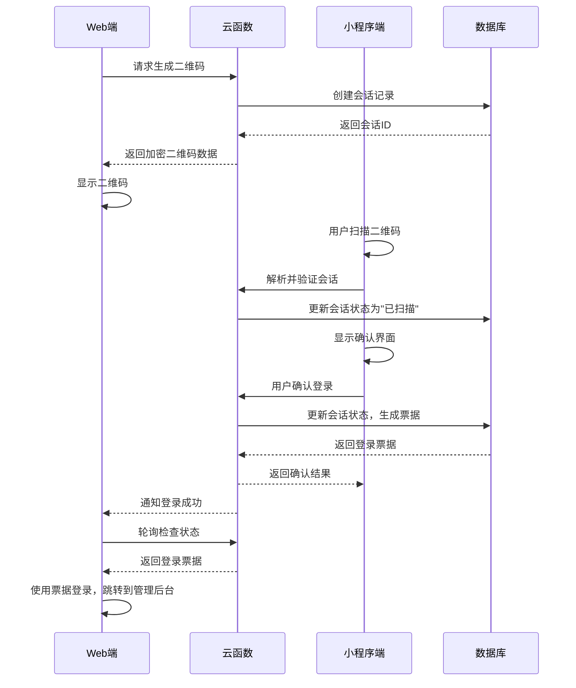
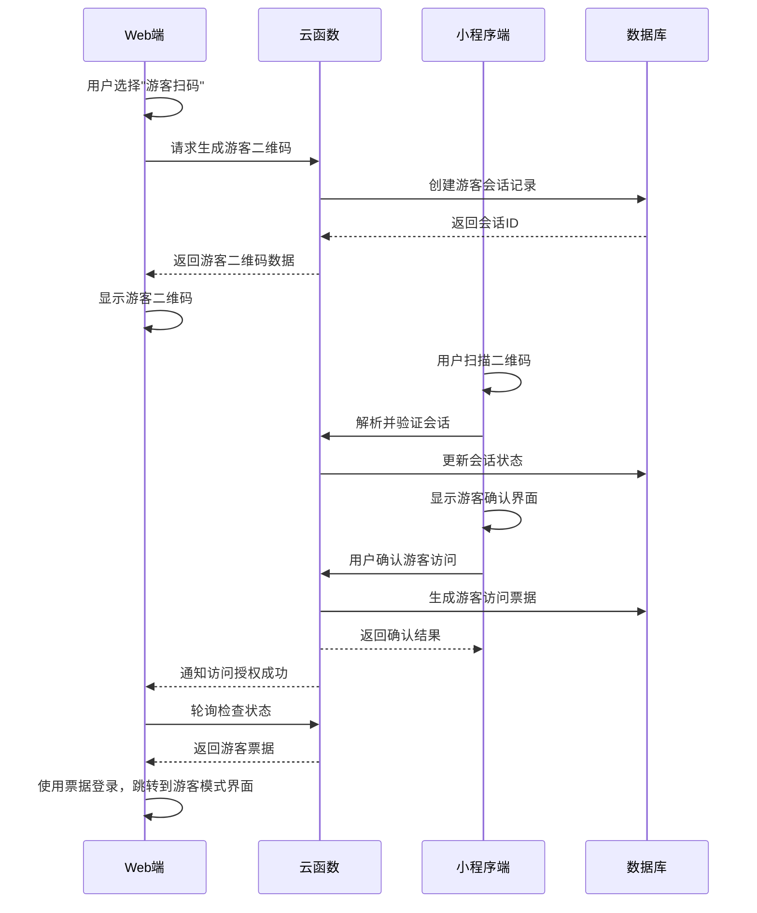

# 扫码登录系统需求文档

## 1. 项目概述

### 1.1 背景
当前系统支持用户名/密码登录的管理后台，为了提升用户体验和适应移动化趋势，需要开发扫码登录功能。该功能允许不同角色的用户（管理员、社工、志愿者、家长等）通过微信小程序扫码快速登录Web管理后台，同时支持游客扫码访问，实现更灵活的权限控制。

### 1.2 目标
- 提供便捷的扫码登录方式，替代传统的用户名密码输入
- 支持多角色用户扫码登录，包括管理员、社工、志愿者、家长等
- 支持游客扫码访问，降低使用门槛
- 保持高安全性的同时提升用户体验
- 与现有RBAC权限系统无缝集成

### 1.3 范围
- Web端管理后台扫码登录功能
- 微信小程序端扫码确认功能
- 多角色用户权限控制（管理员、社工、志愿者、家长等）
- 游客扫码访问权限控制
- 云函数后端服务
- 数据库设计和状态管理

### 1.4 与现有项目约束对齐（本仓库）
- CloudBase 自定义登录：统一复用现有 `auth` 云函数（已支持用户名/密码登录），扫码登录建议以 `auth` 的新 action 形式落地：`qrInit`（生成会话/二维码）、`qrStatus`（查询状态/领取 ticket）、`qrApprove`（小程序侧确认）。也可单独新建 `qrLogin` 云函数，但需保留与 `auth` 的票据颁发一致性。
- Web 调用形态：web-admin 在开发/本地通过 Vite 中间件以 REST 方式代理云函数，路径为 `/api/func/<functionName>`，请求体 `{ data: { ... } }`；生产环境仍建议直连云函数 SDK。
- 集合命名规范：沿用现有集合的驼峰式命名（如 `auditLogs`、`roleBindings`），本方案将 `qr_login_sessions` 更名为 `qrLoginSessions`，`guest_access_logs` 更名为 `guestAccessLogs`，`login_statistics` 更名为 `loginStatistics`，避免与现有命名风格冲突。
- 最小化二维码载荷：二维码仅携带 `sid`（会话ID）等非敏感信息，严禁包含 ticket、用户隐私或可被利用的信息；完整会话数据仅存放在数据库，所有敏感校验在云函数内完成。
- TTL 与轮询：默认二维码有效期 90 秒，Web 每 2 秒轮询一次状态；过期前 20–30 秒进入倒计时提示，过期后自动刷新并更换 `sid`（建议最多自动轮换 3 次）。
- 权限与审计：权限认证复用 `admins` 与 `roleBindings` 集合；每一次 `qrInit/qrApprove/qrConsume/qrCancel` 需落到 `auditLogs`，记录 actor、IP、UA、时间与结果，便于追溯。

## 2. 用户角色和需求

### 2.1 用户角色定义

#### 2.1.1 系统管理员
- **权限**: 完整的系统管理权限，包括用户管理、系统配置、数据管理等
- **需求**: 快速登录系统，进行全面的系统管理和配置
- **场景**: 办公环境下使用电脑，希望通过手机快速登录管理系统

#### 2.1.2 社工
- **权限**: 患者管理权限，包括查看、编辑患者信息，记录护理日志，管理患者档案等
- **需求**: 便捷登录系统，查看和更新患者信息，记录日常工作
- **场景**: 医院或护理机构工作，需要频繁访问患者数据

#### 2.1.3 志愿者
- **权限**: 有限的查看权限，主要查看基础患者信息，记录志愿者服务日志
- **需求**: 登录系统查看分配的志愿服务信息，记录服务内容
- **场景**: 参与志愿服务时，需要查看患者基本信息和服务记录

#### 2.1.4 家长
- **权限**: 查看自己孩子的相关信息，包括护理记录、医疗信息等
- **需求**: 登录系统查看孩子的状况，了解护理进展
- **场景**: 家长想了解孩子在医院的护理和治疗情况

#### 2.1.5 游客用户
- **权限**: 基础的只读访问权限，可查看公开的统计信息和基础数据
- **需求**: 无需注册即可查看公开信息
- **场景**: 临时需要查看系统数据的合作方、审计人员、访客等

### 2.2 多角色权限矩阵

| 功能模块 | 系统管理员 | 社工 | 志愿者 | 家长 | 游客 |
|---------|-----------|------|--------|------|------|
| **患者信息管理** |
| 查看所有患者信息 | ✓ | ✓ | ✓(部分) | ✗ | ✗ |
| 查看负责患者信息 | ✓ | ✓ | ✓(分配) | ✓(自己孩子) | ✗ |
| 编辑患者信息 | ✓ | ✓ | ✗ | ✗ | ✗ |
| 添加新患者 | ✓ | ✓ | ✗ | ✗ | ✗ |
| 删除患者信息 | ✓ | ✗ | ✗ | ✗ | ✗ |
| **护理记录管理** |
| 查看护理记录 | ✓ | ✓ | ✓(相关) | ✓(自己孩子) | ✗ |
| 添加护理记录 | ✓ | ✓ | ✓ | ✗ | ✗ |
| 编辑护理记录 | ✓ | ✓ | ✗ | ✗ | ✗ |
| **医疗信息管理** |
| 查看医疗信息 | ✓ | ✓ | ✓(基础) | ✓(自己孩子) | ✗ |
| 更新医疗信息 | ✓ | ✓ | ✗ | ✗ | ✗ |
| **统计分析** |
| 查看完整统计报告 | ✓ | ✓ | ✗ | ✗ | ✓(公开) |
| 查看部门统计 | ✓ | ✓(自己部门) | ✗ | ✗ | ✗ |
| 导出统计数据 | ✓ | ✓ | ✗ | ✗ | ✗ |
| **用户和权限管理** |
| 用户管理 | ✓ | ✗ | ✗ | ✗ | ✗ |
| 权限分配 | ✓ | ✗ | ✗ | ✗ | ✗ |
| 邀请码管理 | ✓ | ✗ | ✗ | ✗ | ✗ |
| **系统管理** |
| 系统配置 | ✓ | ✗ | ✗ | ✗ | ✗ |
| 数据备份 | ✓ | ✗ | ✗ | ✗ | ✗ |
| 日志查看 | ✓ | ✓(相关) | ✗ | ✗ | ✗ |

### 2.3 用户需求分析

#### 2.3.1 功能性需求

**FR1 - 二维码生成**
- Web端能够生成登录二维码
- 二维码包含唯一的会话标识（sid），不含敏感信息
- 支持多种登录模式（管理员、社工、志愿者、家长、游客）
- 二维码具有时效性（默认90秒，可配置30–300秒，推荐90–180秒）

**FR2 - 扫码识别**
- 小程序端能够扫描并识别Web端二维码
- 解析二维码内容获取会话信息
- 验证二维码有效性
- 支持从相册选择二维码图片

**FR3 - 身份确认**
- 小程序端显示登录确认界面
- 显示Web端设备信息和登录时间
- 用户可选择登录账号（多账号情况下）
- 根据用户角色显示相应的权限说明
- 支持确认和取消操作

**FR4 - 多角色权限控制**
- 根据用户角色（管理员、社工、志愿者、家长、游客）分配相应权限
- 动态显示功能菜单和界面元素
- 实施数据访问控制（如家长只能看自己孩子的信息）
- 支持角色组合权限（如一个用户可能有多个角色）

**FR5 - 状态同步**
- 实时同步登录状态到Web端
- 支持登录成功、失败、取消等状态
- 提供清晰的进度反馈
- 支持多角色状态同步

**FR6 - 会话管理**
- 支持多设备同时登录
- 会话超时自动登出
- 支持手动登出所有会话
- 根据角色设置不同的会话超时时间

**FR7 - 数据访问控制**
- 实施基于角色的数据过滤
- 家长只能访问自己孩子的信息
- 社工只能访问负责的患者信息
- 志愿者只能访问分配的任务信息
- 游客只能访问公开的统计信息

**FR8 - 多设备权限同步**
- 用户在不同设备上保持一致的权限
- 支持权限变更的实时同步
- 提供权限变更通知机制

#### 2.3.2 非功能性需求

**NFR1 - 安全性**
- 二维码数据加密传输
- 防止重放攻击
- 会话劫持防护
- 敏感信息脱敏显示

**NFR2 - 性能**
- 二维码生成响应时间 < 1秒
- 状态轮询间隔 2秒
- 登录确认响应时间 < 3秒
- 支持并发用户数 > 100

**NFR3 - 可用性**
- 系统可用性 > 99.5%
- 界面友好，操作简单
- 支持多种浏览器
- 适配不同屏幕尺寸

**NFR4 - 兼容性**
- 支持微信最新版本
- 兼容主流浏览器（Chrome、Firefox、Safari、Edge）
- 响应式设计，支持移动端访问

## 3. 功能需求详细说明

### 3.1 Web端功能

#### 3.1.1 登录界面设计
- 提供传统登录和扫码登录两种模式切换
- 二维码显示区域，包含刷新按钮
- 实时状态显示（等待扫码、已扫描、已确认等）
- 支持多种登录模式选择（管理员、社工、志愿者、家长、游客）
- 根据用户身份显示不同的界面主题和提示信息

#### 3.1.2 二维码管理
- 自动生成带时效性的登录二维码
- 二维码过期前30秒自动刷新
- 支持手动刷新二维码
- 二维码样式美化，包含品牌标识

#### 3.1.3 状态轮询
- 定期检查二维码扫描状态
- 动态更新界面状态提示
- 登录成功后自动跳转到对应页面
- 异常情况处理和错误提示

#### 3.1.4 多角色界面适配
- 根据用户角色显示不同的界面布局和功能
- 管理员显示完整的管理功能菜单
- 社工显示患者管理和护理记录功能
- 志愿者显示简化的任务查看界面
- 家长显示孩子信息查看界面
- 游客显示基础的公开信息界面
- 隐藏角色不具备权限的操作按钮
- 根据角色进行数据脱敏处理

### 3.2 小程序端功能

#### 3.2.1 扫码界面
- 集成微信扫码API
- 支持从相册选择二维码图片
- 扫码成功后解析会话信息
- 验证二维码有效性

#### 3.2.2 确认界面
- 显示Web端设备信息
- 显示登录请求时间和IP地址
- 账号选择（多账号用户）
- 确认和取消操作

#### 3.2.3 角色确认和权限选择
- 显示当前用户的所有可用角色
- 用户可选择以哪个角色身份登录
- 根据选择的角色显示相应的权限说明
- 管理员可选择以普通用户身份登录（测试用途）
- 不同角色的登录界面和提示信息差异
- 支持多角色用户的权限组合显示

#### 3.2.4 结果反馈
- 登录成功/失败的即时反馈
- Web端跳转状态通知
- 异常情况处理建议

### 3.3 后端服务功能

#### 3.3.1 会话管理
- 生成唯一会话标识
- 维护会话状态机
- 会话过期自动清理
- 并发会话控制

#### 3.3.2 多角色权限验证
- 验证小程序用户身份
- 检查用户所有可用角色
- 根据选择的角色验证相应权限
- 生成对应权限的登录票据
- 支持角色组合权限验证
- 实施细粒度的数据访问控制
- 权限变更和角色变更日志记录

#### 3.3.3 安全控制
- 防重放攻击机制
- IP地址绑定验证
- 设备指纹识别
- 异常行为检测

#### 3.3.4 数据统计
- 扫码登录使用统计
- 用户行为分析
- 性能监控数据
- 安全事件记录

## 4. 业务流程

### 4.1 管理员扫码登录流程



### 4.2 游客扫码访问流程



### 4.3 异常处理流程

#### 4.3.1 二维码过期处理
- 默认90秒自动过期（可配置30–300秒）
- 过期前20–30秒开始倒计时提示
- 过期后自动刷新生成新二维码并更换sid
- 最多连续自动刷新3次，超过阈值需要手动刷新或重新加载

### 4.4 状态机与一致性约束（统一规范）
- 状态集合：
  - `pending`：会话创建完成，等待扫码/确认
  - `scanned`：已扫码但未确认（可选，Web端可不展示此细分态）
  - `approved`：小程序已确认，待Web端领取ticket
  - `consumed`：Web端已领取并完成登录，ticket作废
  - `expired`：会话超时失效
  - `cancelled`：用户取消或系统撤销
- 迁移规则：
  - pending → scanned → approved → consumed
  - pending/scanned → cancelled
  - pending/scanned/approved → expired（到期）
  - approved 一经 Web 领取 ticket 必须立刻转 consumed（单次消费）
- 并发约束：同一 `sid` 的 `qrStatus` 仅能成功下发一次 ticket；其余并发请求返回已消费/无效
- 安全约束：二维码与接口不得出现 ticket；仅服务端保存短暂 ticket 字段，approved→consumed 后清除

#### 4.3.2 网络异常处理
- 网络断开时显示离线状态
- 重连后自动恢复轮询
- 提供手动重试按钮
- 异常信息记录到日志

#### 4.3.3 权限不足处理
- 用户无登录权限时友好提示
- 提供联系管理员的方式
- 记录无效访问尝试
- 支持临时授权申请

## 5. 数据需求

### 5.1 数据存储需求

#### 5.1.1 扫码登录会话表（标准草案）(qr_login_sessions)
```javascript
{
  _id: "会话ID",
  type: "admin|social_worker|volunteer|parent|guest",  // 会话类型
  status: "pending|scanned|confirmed|cancelled|expired",
  qrData: "加密的二维码数据",
  webDeviceInfo: {
    userAgent: "浏览器信息",
    ip: "IP地址",
    fingerprint: "设备指纹"
  },
  wechatUserInfo: {
    openId: "微信用户ID",
    nickName: "用户昵称",
    avatarUrl: "头像URL",
    roles: ["admin", "social_worker"], // 用户角色列表，支持多角色
    selectedRole: "admin",            // 用户选择的角色
    permissions: ["read", "write"],   // 角色对应的权限列表
    departmentId: "dept_001",         // 所属部门（社工使用）
    assignedPatients: ["p001", "p002"], // 负责的患者（社工使用）
    childrenIds: ["c001"],            // 孩子ID列表（家长使用）
    volunteerTasks: ["t001", "t002"]  // 分配的任务（志愿者使用）
  },
  loginTicket: "登录票据",
  rolePermissions: {                  // 角色权限详细配置
    [role]: {
      pages: ["dashboard", "patient-list"],
      actions: ["read", "write"],
      dataFilters: {
        patientIds: ["p001"],
        departments: ["dept_001"]
      }
    }
  },
  accessControl: {                    // 访问控制配置
    dataScope: "all|department|personal|public", // 数据范围
    timeRestrictions: {               // 时间限制
      allowedHours: [8, 9, 10, 11, 14, 15, 16, 17],
      allowedDays: [1, 2, 3, 4, 5]  // 工作日
    }
  },
  expiresAt: "过期时间",
  createdAt: "创建时间",
  updatedAt: "更新时间"
}
```

注：为与本仓库既有集合命名风格保持一致，落地实现时采用驼峰式集合名与精简字段，数据结构建议如下。

#### 5.1.1′ 扫码登录会话表（落地建议）(qrLoginSessions)
```javascript
{
  _id: "<sid>",                  // 会话ID（亦作文档ID，便于快速查询）
  type: "admin|guest",           // 会话类型（可按需扩展）
  status: "pending|approved|consumed|expired|cancelled",
  // 安全：仅存储 nonce 的哈希，避免明文泄露
  nonceHash: "<bcrypt|sha256(hmac)>",
  // 展示用途：二维码文件ID/临时URL（可选）
  qrcode: { fileId?: string, tempUrl?: string, updatedAt?: number },
  approvedBy?: { principalId: string, role?: string, approvedAt: number },
  // 仅在 approved 且未消费时短暂保存，一经领取即删除
  ticket?: string,
  createdAt: number,
  expiresAt: number,
  meta?: { ip?: string, ua?: string, createdFrom?: 'web-admin' }
}
```

#### 5.1.2 游客访问记录表（标准草案）(guest_access_logs)
```javascript
{
  _id: "记录ID",
  sessionId: "会话ID",
  accessTime: "访问时间",
  duration: "访问时长（秒）",
  pagesViewed: "浏览页面数",
  ip: "IP地址",
  userAgent: "浏览器信息",
  actions: "操作记录"
}
```

落地集合命名：`guestAccessLogs`

#### 5.1.3 登录统计表（标准草案）(login_statistics)
```javascript
{
  _id: "统计ID",
  date: "日期",
  statistics: {
    totalLogins: "总登录次数",
    roleLogins: {
      admin: "管理员登录次数",
      social_worker: "社工登录次数",
      volunteer: "志愿者登录次数",
      parent: "家长登录次数",
      guest: "游客登录次数"
    },
    avgSessionDuration: "平均会话时长",
    peakHours: "高峰时段",
    deviceTypes: {
      desktop: "桌面端登录次数",
      mobile: "移动端登录次数"
    }
  }
}
```

落地集合命名：`loginStatistics`

#### 5.1.4 用户角色关联表（可选扩展，优先复用现有 roleBindings/admins）(user_roles)
```javascript
{
  _id: "关联ID",
  userId: "用户ID",
  roles: ["admin", "social_worker"], // 用户拥有的角色列表
  roleAssignments: {
    social_worker: {
      departmentId: "dept_001",
      assignedPatients: ["p001", "p002"],
      permissions: ["patient_read", "patient_write", "care_log_write"]
    },
    volunteer: {
      assignedTasks: ["t001", "t002"],
      permissions: ["task_read", "task_log_write"]
    },
    parent: {
      childrenIds: ["c001", "c002"],
      permissions: ["child_info_read", "care_log_read"]
    }
  },
  grantedBy: "授权人ID",
  grantedAt: "授权时间",
  expiresAt: "角色过期时间（可选）",
  isActive: "是否激活"
}
```

落地建议：优先复用现有 `roleBindings` 与 `admins` 集合；若确需聚合视图，可新增 `userRoles` 只存派生数据或缓存索引。

### 5.2 数据安全需求
- 敏感数据加密存储
- 定期清理过期数据
- 数据备份和恢复机制
- 访问日志完整记录

## 6. 集成需求

### 6.1 与现有系统集成
- 与现有RBAC权限系统集成
- 与用户管理系统集成
- 与审计日志系统集成
- 与监控系统集成

### 6.2 第三方服务集成
- 微信小程序API集成
- CloudBase云函数服务
- 二维码生成库集成
- 加密算法库集成

## 7. 部署需求

### 7.1 环境要求
- Node.js 16+ 运行环境
- CloudBase云函数服务
- MongoDB数据库
- HTTPS域名支持

### 7.2 配置需求
- 环境变量配置
- 域名白名单配置
- 权限配置文件
- 日志配置文件

## 8. 测试需求

### 8.1 功能测试
- 二维码生成和识别测试
- 登录流程完整性测试
- 权限控制准确性测试
- 异常情况处理测试

### 8.2 性能测试
- 并发用户测试
- 响应时间测试
- 稳定性测试
- 压力测试

### 8.3 安全测试
- 数据加密测试
- 防重放攻击测试
- 权限绕过测试
- 数据泄露测试

### 8.4 兼容性测试
- 浏览器兼容性测试
- 微信版本兼容性测试
- 设备兼容性测试
- 网络环境测试

## 9. 验收标准

### 9.1 功能验收标准
- 所有功能点按需求文档实现
- 业务流程完整可用
- 异常情况正确处理
- 用户体验满足要求

### 9.2 性能验收标准
- 响应时间满足需求指标
- 并发用户数达到要求
- 系统稳定性达标
- 资源使用率合理

### 9.3 安全验收标准
- 通过安全测试用例
- 无严重安全漏洞
- 数据保护措施到位
- 访问控制有效

### 9.4 用户体验验收标准
- 界面友好美观
- 操作简单直观
- 反馈及时准确
- 错误提示清晰

## 11. 验收清单（实施自检）
- 配置与调用
  - web-admin 本地通过 `/api/func/auth` 成功调用 `qrInit/qrStatus`（包体 `{ data: {...} }`）
  - 小程序能调用 `qrApprove` 并产生 `approved` 状态
- 状态与TTL
  - `pending → approved → consumed` 主路径可达，TTL 默认90秒、可配置，过期后自动刷新生效
  - 并发领取仅一次成功，下次返回已消费/无效
- 安全
  - ticket 未出现在二维码/HTTP日志，审计日志记录 `qrInit/qrApprove/qrStatus(consume)`
  - 非授权角色扫码审批被拒绝并可见友好提示
- 体验
  - Web 2秒轮询、过期倒计时与自动刷新表现正确
  - 失败场景（网络、中断、取消、无权限）有明确提示与可恢复路径

## 10. 风险评估

### 10.1 技术风险
- 二维码被伪造的风险
- 网络连接不稳定的风险
- 兼容性问题的风险
- 性能瓶颈的风险

### 10.2 安全风险
- 会话劫持风险
- 权限提升风险
- 数据泄露风险
- 恶意攻击风险

### 10.3 业务风险
- 用户接受度不高
- 使用频次低
- 维护成本高
- 竞争对手替代

### 10.4 风险应对措施
- 实施多层安全防护
- 建立监控告警机制
- 制定应急处理预案
- 定期安全评估和改进
