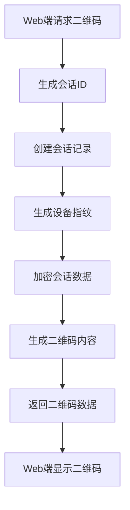

# 扫码登录系统技术设计文档

## 1. 系统架构设计

### 1.1 整体架构

```
┌─────────────────┐    ┌─────────────────┐    ┌─────────────────┐
│   Web管理端     │    │   云函数后端    │    │  微信小程序端   │
│                │    │                │    │                │
│  ┌───────────┐  │    │  ┌───────────┐  │    │  ┌───────────┐  │
│  │登录组件   │◄─┼────┼──┤qrLogin云函数├─┼────┼──►│扫码组件   │  │
│  └───────────┘  │    │  └───────────┘  │    │  └───────────┘  │
│  ┌───────────┐  │    │  ┌───────────┐  │    │  ┌───────────┐  │
│  │状态轮询   │◄─┼────┼──┤auth云函数   ├─┼────┼──►│确认组件   │  │
│  └───────────┘  │    │  └───────────┘  │    │  └───────────┘  │
└─────────────────┘    └─────────────────┘    └─────────────────┘
         │                       │                       │
         └───────────────────────┼───────────────────────┘
                                 │
                    ┌─────────────────┐
                    │  TencentCloud   │
                    │  Database       │
                    │                │
                    │ ┌─────────────┐ │
                    │ │会话管理表   │ │
                    │ └─────────────┘ │
                    │ ┌─────────────┐ │
                    │ │用户权限表   │ │
                    │ └─────────────┘ │
                    │ ┌─────────────┐ │
                    │ │访问日志表   │ │
                    │ └─────────────┘ │
                    └─────────────────┘
```

### 1.2 技术栈选择

#### 1.2.1 Web端技术栈
- **前端框架**: React 18+ with TypeScript
- **状态管理**: React Context + Hooks
- **UI组件库**: 现有Tailwind CSS样式系统
- **HTTP客户端**: Fetch API
- **二维码库**: qrcode.js（或后端返回小程序码/临时URL）
- **加密/签名**: 建议最小化二维码载荷，仅含 sid；如需加密载荷，选用 AES-256-GCM + HMAC（Node.js createCipheriv/createDecipheriv）
- **构建工具**: Vite

#### 1.2.2 小程序端技术栈
- **开发框架**: 原生微信小程序
- **扫码API**: wx.scanCode
- **云调用**: wx.cloud.callFunction
- **状态管理**: 全局 getApp()
- **样式**: WXSS + Tailwind风格

#### 1.2.3 后端技术栈
- **云函数**: Node.js 16+
- **数据库**: Tencent Cloud Database
- **加密**: Node.js crypto模块
- **认证**: CloudBase Auth
- **日志**: Winston

### 1.3 数据流设计

#### 1.3.1 二维码生成流程


#### 1.3.2 扫码确认流程
```mermaid
flowchart TD
    A[小程序扫码] --> B[解析二维码内容]
    B --> C[验证会话有效性]
    C --> D{验证结果}
    D -->|有效| E[显示确认界面]
    D -->|无效| F[提示错误信息]
    E --> G[用户选择登录模式]
    G --> H[发送确认请求(携带approveNonce)]
    H --> I[生成登录票据]
    I --> J[更新会话状态]
    J --> K[通知Web端]
```

## 2. 数据库设计

### 2.1 数据表结构

#### 2.1.1 扫码登录会话表 (qr_login_sessions)
```javascript
{
  _id: "session_xxxxxxxx",           // 主键，会话唯一标识
  type: "admin|guest",               // 会话类型：管理员/游客
  status: "pending|scanned|confirmed|cancelled|expired", // 会话状态
  qrData: "encrypted_data_hash",     // 加密的二维码数据
  webDeviceInfo: {                   // Web端设备信息
    userAgent: "Mozilla/5.0...",     // 浏览器User-Agent
    ip: "192.168.1.100",            // IP地址
    fingerprint: "device_fp_hash",   // 设备指纹
    screenResolution: "1920x1080",   // 屏幕分辨率
    timezone: "Asia/Shanghai"        // 时区
  },
  wechatUserInfo: {                  // 微信用户信息
    openId: "wx_openid_xxx",        // 微信OpenID
    unionId: "wx_unionid_xxx",       // 微信UnionID（可选）
    nickName: "用户昵称",             // 用户昵称
    avatarUrl: "https://...",        // 头像URL
    role: "admin|user|guest",        // 用户角色
    permissions: ["read", "write"],  // 权限列表
    loginMode: "full|guest"          // 登录模式：完整/游客
  },
  securityInfo: {                    // 安全信息
    sessionToken: "secure_token",    // 会话令牌
    signature: "hmac_signature",     // HMAC签名
    nonce: "random_string",          // 随机数
    encryptedPayload: "aes_data"     // AES加密载荷
  },
  loginTicket: {                     // 登录票据信息
    ticket: "cloudbase_ticket",      // CloudBase登录票据
    refreshToken: "refresh_token",   // 刷新令牌
    expiresAt: 1705123456789,        // 票据过期时间
    issuedAt: 1705123456789          // 票据签发时间
  },
  timestamps: {                      // 时间戳信息
    createdAt: 1705123456789,        // 创建时间
    scannedAt: 1705123466789,        // 扫描时间
    confirmedAt: 1705123476789,      // 确认时间
    expiresAt: 1705127056789,        // 过期时间（5分钟）
    updatedAt: 1705123476789         // 更新时间
  },
  metadata: {                        // 元数据
    source: "web_admin",             // 来源标识
    version: "1.0.0",                // 版本号
    environment: "production",       // 环境标识
    sessionId: "browser_session_id"  // 浏览器会话ID
  }
}
```

#### 2.1.1′ 扫码登录会话表（落地简化版，推荐）(qrLoginSessions)
```javascript
{
  _id: "<sid>",                   // 会话ID（文档ID）
  type: "admin|guest",            // 会话类型（可按需扩展）
  status: "pending|approved|consumed|expired|cancelled", // 简化状态机
  nonceHash: "<bcrypt|hmac_sha256>", // 仅存哈希，不保存明文nonce
  qrcode?: { fileId?: string, tempUrl?: string, updatedAt?: number },
  approvedBy?: { principalId: string, role?: string, approvedAt: number },
  ticket?: string,                 // 仅在approved、未消费时短暂存在
  createdAt: number,
  expiresAt: number,
  meta?: { ip?: string, ua?: string, createdFrom?: 'web-admin' }
}
```

#### 2.1.2 游客访问记录表 (guest_access_logs)
```javascript
{
  _id: "log_xxxxxxxx",               // 主键，日志唯一标识
  sessionId: "session_xxxxxxxx",     // 关联的会话ID
  guestInfo: {                       // 游客信息
    openId: "wx_openid_xxx",        // 微信OpenID
    nickName: "游客用户",            // 昵称
    avatarUrl: "https://...",        // 头像URL
    visitCount: 5,                   // 访问次数
    firstVisitAt: 1705123456789,     // 首次访问时间
    lastVisitAt: 1705123456789       // 最后访问时间
  },
  accessInfo: {                      // 访问信息
    startTime: 1705123456789,        // 开始访问时间
    endTime: 1705127056789,          // 结束访问时间
    duration: 3600,                  // 访问时长（秒）
    pagesViewed: 15,                 // 浏览页面数
    actionsPerformed: 8,             // 执行操作数
    dataExported: false,             // 是否导出数据
    featuresUsed: ["view", "search"] // 使用的功能
  },
  deviceInfo: {                      // 设备信息
    ip: "192.168.1.100",            // IP地址
    userAgent: "Mozilla/5.0...",     // 浏览器信息
    screenResolution: "1920x1080",   // 屏幕分辨率
    platform: "Web",                // 平台类型
    browser: "Chrome"                // 浏览器类型
  },
  securityInfo: {                    // 安全信息
    riskLevel: "low|medium|high",    // 风险等级
    suspiciousActivity: false,       // 可疑活动标记
    geoLocation: {                   // 地理位置信息
      country: "China",
      province: "Beijing",
      city: "Beijing"
    }
  },
  createdAt: 1705123456789           // 创建时间
}
```

#### 2.1.3 登录统计表 (login_statistics)
```javascript
{
  _id: "stat_20240113",              // 主键，按日期统计
  date: "2024-01-13",                // 统计日期
  statistics: {                      // 统计数据
    totalSessions: 150,              // 总会话数
    successfulLogins: 120,           // 成功登录数
    adminLogins: 80,                 // 管理员登录数
    guestLogins: 40,                 // 游客登录数
    failedLogins: 30,                // 失败登录数
    cancelledLogins: 10,             // 取消登录数
    expiredLogins: 20                // 过期登录数
  },
  performance: {                     // 性能数据
    avgResponseTime: 1500,           // 平均响应时间（毫秒）
    maxResponseTime: 5000,           // 最大响应时间（毫秒）
    avgSessionDuration: 1800,        // 平均会话时长（秒）
    peakConcurrentUsers: 25          // 峰值并发用户数
  },
  timeDistribution: {                // 时间分布
    peakHours: [9, 10, 14, 15, 16], // 高峰时段
    hourlyStats: [                    // 每小时统计
      { hour: 0, count: 2 },
      { hour: 1, count: 1 },
      // ... 24小时数据
    ]
  },
  securityStats: {                   // 安全统计
    suspiciousAttempts: 5,           // 可疑尝试次数
    blockedIPs: 3,                   // 被阻止的IP数
    failedAuthAttempts: 15           // 认证失败次数
  },
  createdAt: 1705123456789,          // 创建时间
  updatedAt: 1705123456789           // 更新时间
}
```

### 2.2 索引设计

#### 2.2.1 qrLoginSessions 表索引（落地建议）
```javascript
// 主键索引
db.qrLoginSessions.createIndex({ "_id": 1 })

// 状态查询索引
db.qrLoginSessions.createIndex({ "status": 1, "expiresAt": 1 })

// 过期清理索引
db.qrLoginSessions.createIndex({ "expiresAt": 1 }, { expireAfterSeconds: 0 })

// 审批人查询索引（如需）
db.qrLoginSessions.createIndex({ "approvedBy.principalId": 1 })

// 设备指纹/来源索引（可选）
// db.qrLoginSessions.createIndex({ "meta.ip": 1 })

// 复合索引：状态和创建时间
db.qrLoginSessions.createIndex({ "status": 1, "createdAt": -1 })
```

#### 2.2.2 guest_access_logs表索引
```javascript
// 主键索引
db.guest_access_logs.createIndex({ "_id": 1 })

// 会话关联索引
db.guest_access_logs.createIndex({ "sessionId": 1 })

// 用户访问索引
db.guest_access_logs.createIndex({ "guestInfo.openId": 1 })

// 时间查询索引
db.guest_access_logs.createIndex({ "accessInfo.startTime": -1 })

// 过期清理索引（保留30天）
db.guest_access_logs.createIndex({ "createdAt": 1 }, { expireAfterSeconds: 2592000 })
```

#### 2.2.3 login_statistics表索引
```javascript
// 主键索引
db.login_statistics.createIndex({ "_id": 1 })

// 日期查询索引
db.login_statistics.createIndex({ "date": -1 })
```

## 3. API接口设计

落地映射（web-admin 本仓库）：
- 开发/本地：通过 Vite 中间件以 `/api/func/<function>` 代理云函数，实际请求体需包裹为 `{ data: { ... } }`。
- 推荐在 `auth` 云函数扩展 action：`qrInit`（生成会话/二维码）、`qrStatus`（查询状态/领取 ticket）、`qrApprove`（小程序确认）。也可新建 `qrLogin` 云函数，接口语义保持一致。
- ticket 为 CloudBase 自定义登录票据（一次性领取、不可复用）；二维码与接口不得包含 ticket。

### 3.1 云函数API设计

#### 3.1.1 qrLogin云函数

**生成二维码接口**
```javascript
// POST /qrLogin
{
  action: "generateQR",
  type: "admin|guest",               // 登录类型
  // 建议：默认expiresIn=90（秒），可配置30–300
  deviceInfo: {                      // 设备信息
    userAgent: "string",
    screenResolution: "string",
    timezone: "string"
  },
  metadata: {                        // 元数据
    source: "web_admin",
    version: "1.0.0"
  }
}

// 响应
{
  success: true,
  data: {
    sessionId: "session_xxx",        // 会话ID（sid）
    qrData: "encrypted_content",     // 加密的二维码数据（本仓库前端使用 qrcode 库生成图片）
    expiresAt: 1705127056789,        // 过期时间
    qrUrl: "data:image/png;base64,..." // 二维码图片URL（可选，可能为空）
  }
}
```

**检查状态接口**
```javascript
// POST /qrLogin
{
  action: "checkStatus",
  sessionId: "session_xxx",
  nonce: "<client_nonce>" // 与服务端nonceHash匹配（单次）
}

// 响应
{
  success: true,
  data: {
    status: "pending|scanned|confirmed|cancelled|expired",
    userInfo: {                      // 扫码用户信息（如果已扫描）
      nickName: "用户昵称",
      avatarUrl: "https://...",
      loginMode: "full|guest"
    },
    webDeviceInfo: {                 // Web端设备信息
      ip: "192.168.1.100",
      userAgent: "..."
    },
    loginTicket: "cloudbase_ticket", // 登录票据（如已批准）；仅一次下发
    expiresAt: 1705127056789
  }
}
```

**确认登录接口**
```javascript
// POST /qrLogin
{
  action: "confirmLogin",
  sessionId: "session_xxx",
  userInfo: {                        // 用户信息
    openId: "wx_openid_xxx",
    nickName: "用户昵称",
    avatarUrl: "https://...",
    role: "admin|user|guest"
  },
  loginMode: "full|guest",           // 登录模式
  deviceInfo: {                      // 小程序设备信息
    platform: "iOS|Android",
    system: "iOS 15.0",
    model: "iPhone 13"
  },
  securityToken: "security_token"    // 安全令牌
}

// 响应
{
  success: true,
  data: {
    confirmed: true,
    loginTicket: "cloudbase_ticket",
    permissions: ["read", "write", "admin"],
    redirectTo: "/dashboard"
  }
}
```

**取消登录接口**
```javascript
// POST /qrLogin
{
  action: "cancelLogin",
  sessionId: "session_xxx",
  reason: "user_cancelled|timeout|security"
}

// 响应
{
  success: true,
  data: {
    cancelled: true,
    reason: "用户取消"
  }
}
```

#### 3.1.2 auth云函数扩展

**验证票据接口**
```javascript
// POST /auth
{
  action: "verifyTicket",
  ticket: "cloudbase_ticket",
  sessionId: "session_xxx"           // 可选，用于关联会话
}

// 响应
{
  success: true,
  data: {
    valid: true,
    userInfo: {
      uid: "user_xxx",
      username: "admin",
      role: "admin|user|guest",
      permissions: ["read", "write"]
    },
    sessionInfo: {
      sessionId: "session_xxx",
      loginMode: "full|guest",
      expiresAt: 1705127056789
    }
  }
}
```

### 3.2 Web端接口设计

#### 3.2.1 扫码登录组件接口
```typescript
// 支持多角色的登录类型
type LoginRole = 'admin' | 'social_worker' | 'volunteer' | 'parent' | 'guest';

interface QRLoginProps {
  mode?: LoginRole | 'multi';        // 登录模式：指定角色或多角色选择
  onLoginSuccess: (userInfo: UserInfo) => void;
  onLoginError: (error: Error) => void;
  onStatusChange: (status: LoginStatus) => void;
  availableRoles?: LoginRole[];       // 可用的角色列表
  defaultRole?: LoginRole;           // 默认角色
}

interface LoginStatus {
  status: 'waiting' | 'scanned' | 'confirmed' | 'error';
  userInfo?: UserInfo;
  expiresAt?: number;
  selectedRole?: LoginRole;          // 用户选择的角色
  availableRoles?: LoginRole[];       // 可用角色列表
}

interface UserInfo {
  uid: string;
  username: string;
  roles: LoginRole[];                // 支持多角色
  selectedRole: LoginRole;           // 当前选择的角色
  permissions: string[];
  avatarUrl?: string;
  nickName?: string;
  departmentId?: string;             // 科室ID（社工使用）
  assignedPatients?: string[];       // 负责的患者（社工使用）
  childrenIds?: string[];            // 孩子ID列表（家长使用）
  volunteerTasks?: string[];         // 分配的任务（志愿者使用）
}

interface RoleInfo {
  role: LoginRole;
  name: string;                      // 角色显示名称
  description: string;               // 角色描述
  permissions: string[];            // 角色权限
  icon?: string;                     // 角色图标
  color?: string;                    // 角色主题色
}
```

#### 3.2.2 状态管理接口
```typescript
interface QRLoginState {
  sessionId: string | null;
  qrData: string | null;
  status: LoginStatus;
  isLoading: boolean;
  error: string | null;
  pollInterval: NodeJS.Timeout | null;
  selectedRole: LoginRole | null;    // 当前选择的角色
  availableRoles: LoginRole[];       // 可用角色列表
  roleInfo: Record<LoginRole, RoleInfo>; // 角色信息映射
}

interface QRLoginActions {
  generateQR: (type: LoginRole) => Promise<void>;
  generateMultiRoleQR: (roles: LoginRole[]) => Promise<void>; // 多角色二维码
  startPolling: () => void;
  stopPolling: () => void;
  checkStatus: () => Promise<void>;
  confirmLogin: (sessionId: string, selectedRole: LoginRole) => Promise<void>;
  cancelLogin: (sessionId: string) => Promise<void>;
  reset: () => void;
  selectRole: (role: LoginRole) => void; // 选择角色
  getRoleInfo: (role: LoginRole) => RoleInfo; // 获取角色信息
}

// 角色权限上下文
interface RolePermissionContext {
  userRoles: LoginRole[];
  selectedRole: LoginRole | null;
  permissions: string[];
  hasPermission: (resource: string, action: string, context?: any) => boolean;
  canAccessPage: (page: string, context?: any) => boolean;
  getDataAccessLevel: (dataType: string, context?: any) => {
    level: string;
    filters?: any;
  };
  switchRole: (role: LoginRole) => Promise<void>;
  getRoleSummary: () => any;
}
```

### 3.3 小程序端接口设计

#### 3.3.1 扫码组件接口
```javascript
// pages/scan-confirm/scan-confirm.js
Component({
  properties: {
    qrData: {
      type: String,
      value: ''
    }
  },

  data: {
    sessionInfo: null,
    userInfo: null,
    loginMode: 'full',
    loading: false,
    error: ''
  },

  methods: {
    // 扫描二维码
    scanQRCode: function() {
      wx.scanCode({
        onlyFromCamera: true,
        success: (res) => {
          this.handleScanResult(res.result);
        },
        fail: (err) => {
          this.setError('扫码失败，请重试');
        }
      });
    },

    // 处理扫码结果
    handleScanResult: function(qrData) {
      // 解析和验证二维码数据
      this.validateAndParseQR(qrData);
    },

    // 确认登录
    confirmLogin: function() {
      this.confirmQRLogin();
    },

    // 取消登录
    cancelLogin: function() {
      this.cancelQRLogin();
    }
  }
});
```

## 4. 安全设计

### 4.1 数据加密方案

#### 4.1.1 二维码数据加密（如确有需要）
优先不在二维码中放敏感信息；若业务强制需要加密载荷，使用 AES-256-GCM 的 `createCipheriv/createDecipheriv`，避免过时接口：

```javascript
import crypto from 'crypto';

const KEY = crypto.scryptSync(process.env.QR_SECRET || 'qr-secret', 'salt', 32);

export function encryptQRData(payload) {
  const iv = crypto.randomBytes(12); // GCM 推荐 12 字节 IV
  const cipher = crypto.createCipheriv('aes-256-gcm', KEY, iv);
  const aad = Buffer.from('qr-login-data');
  cipher.setAAD(aad);
  const enc = Buffer.concat([cipher.update(JSON.stringify(payload), 'utf8'), cipher.final()]);
  const tag = cipher.getAuthTag();
  return { c: enc.toString('base64'), iv: iv.toString('base64'), tag: tag.toString('base64') };
}

export function decryptQRData({ c, iv, tag }) {
  const decipher = crypto.createDecipheriv('aes-256-gcm', KEY, Buffer.from(iv, 'base64'));
  decipher.setAAD(Buffer.from('qr-login-data'));
  decipher.setAuthTag(Buffer.from(tag, 'base64'));
  const dec = Buffer.concat([decipher.update(Buffer.from(c, 'base64')), decipher.final()]);
  return JSON.parse(dec.toString('utf8'));
}
```

#### 4.1.2 HMAC签名验证
```javascript
class HMACSignature {
  constructor(secretKey) {
    this.secretKey = crypto.scryptSync(secretKey, 'hmac-salt', 64);
  }

  // 生成签名
  sign(data) {
    const hmac = crypto.createHmac('sha256', this.secretKey);
    hmac.update(JSON.stringify(data));
    return hmac.digest('hex');
  }

  // 验证签名
  verify(data, signature) {
    const expectedSignature = this.sign(data);
    return crypto.timingSafeEqual(
      Buffer.from(signature, 'hex'),
      Buffer.from(expectedSignature, 'hex')
    );
  }
}
```

### 4.2 防重放攻击机制（本仓库实现）

#### 4.2.1 Nonce机制
实现要点：
- 轮询 nonce：`qrInit` 返回 `nonce`，`qrStatus` 必须携带；校验通过后服务端原子轮换为新 `nonce`（条件更新 where({_id, nonceHash}) + 记录 `usedNonces`），响应携带下一次 `nonce`；并发请求仅一条有效。
- 审批 nonce：`parse` 下发 `approveNonce`，`qrApprove` 必须携带并通过校验，防止跨会话或重放确认。

#### 4.2.2 设备指纹识别
```javascript
class DeviceFingerprint {
  generateFingerprint(userAgent, screen, timezone, canvas) {
    const components = [
      navigator.userAgent,
      `${screen.width}x${screen.height}`,
      timezone,
      this.getCanvasFingerprint(canvas),
      navigator.language,
      navigator.platform,
      navigator.hardwareConcurrency
    ];

    return crypto.createHash('sha256')
      .update(components.join('|'))
      .digest('hex');
  }

  getCanvasFingerprint(canvas) {
    const ctx = canvas.getContext('2d');
    ctx.textBaseline = 'top';
    ctx.font = '14px Arial';
    ctx.fillText('Device fingerprint', 2, 2);
    return canvas.toDataURL();
  }
}
```

### 4.3 访问控制设计

#### 4.3.1 扩展的多角色权限矩阵
```javascript
const PERMISSION_MATRIX = {
  guest: {
    // 页面访问权限
    pages: ['dashboard-public', 'statistics-public'],
    // 操作权限
    actions: ['read', 'search', 'filter'],
    // 数据权限
    data: {
      patientData: 'masked',         // 脱敏显示
      exportData: false,            // 禁止导出
      deleteData: false,            // 禁止删除
      editData: false,              // 禁止编辑
      dataScope: 'public'           // 仅公开数据
    },
    // 时间限制
    timeRestrictions: {
      allowedHours: [9, 10, 11, 14, 15, 16, 17],
      allowedDays: [1, 2, 3, 4, 5]
    },
    // 会话超时
    sessionTimeout: 30 * 60 * 1000  // 30分钟
  },

  parent: {
    pages: ['dashboard-parent', 'patient-detail-child', 'care-log-child'],
    actions: ['read', 'search', 'filter', 'comment'],
    data: {
      patientData: 'filtered',      // 仅显示自己孩子的数据
      exportData: false,            // 禁止导出
      deleteData: false,            // 禁止删除
      editData: false,              // 禁止编辑
      dataScope: 'personal',        // 个人相关数据
      dataFilters: {
        childrenIds: []             // 动态填入孩子ID列表
      }
    },
    timeRestrictions: {
      allowedHours: [8, 9, 10, 11, 14, 15, 16, 17, 18, 19, 20],
      allowedDays: [1, 2, 3, 4, 5, 6, 7]  // 包括周末
    },
    sessionTimeout: 2 * 60 * 60 * 1000  // 2小时
  },

  volunteer: {
    pages: ['dashboard-volunteer', 'task-list', 'patient-basic'],
    actions: ['read', 'search', 'filter', 'task-log', 'comment'],
    data: {
      patientData: 'limited',        // 基础信息，无敏感数据
      exportData: false,            // 禁止导出
      deleteData: false,            // 禁止删除
      editData: false,              // 仅能编辑日志
      dataScope: 'assigned',        // 分配的任务数据
      dataFilters: {
        patientIds: [],             // 动态填入分配的患者ID
        taskIds: []                 // 动态填入分配的任务ID
      }
    },
    timeRestrictions: {
      allowedHours: [8, 9, 10, 11, 14, 15, 16, 17],
      allowedDays: [1, 2, 3, 4, 5, 6]  // 包含周六
    },
    sessionTimeout: 4 * 60 * 60 * 1000  // 4小时
  },

  social_worker: {
    pages: ['dashboard-sw', 'patient-list', 'patient-detail', 'care-log', 'analysis'],
    actions: ['read', 'search', 'filter', 'create', 'edit', 'export', 'assign'],
    data: {
      patientData: 'department',     // 科室范围内的患者数据
      exportData: true,             // 可以导出
      deleteData: false,            // 不能删除（仅归档）
      editData: true,                // 可以编辑
      dataScope: 'department',      // 科室数据
      dataFilters: {
        departmentId: '',           // 动态填入科室ID
        assignedPatients: []         // 动态填入负责的患者
      }
    },
    timeRestrictions: {
      allowedHours: [7, 8, 9, 10, 11, 14, 15, 16, 17, 18, 19, 20, 21],
      allowedDays: [1, 2, 3, 4, 5, 6, 7]  // 全天候
    },
    sessionTimeout: 8 * 60 * 60 * 1000  // 8小时
  },

  admin: {
    pages: '*',                     // 所有页面
    actions: '*',                   // 所有操作
    data: {
      patientData: 'full',          // 完整数据访问
      exportData: true,             // 可以导出
      deleteData: true,             // 可以删除
      editData: true,                // 可以编辑
      dataScope: 'all',             // 所有数据
      adminActions: ['user_manage', 'role_assign', 'system_config']
    },
    timeRestrictions: {
      allowedHours: [0, 1, 2, 3, 4, 5, 6, 7, 8, 9, 10, 11, 12, 13, 14, 15, 16, 17, 18, 19, 20, 21, 22, 23],
      allowedDays: [1, 2, 3, 4, 5, 6, 7]  // 全天候
    },
    sessionTimeout: 24 * 60 * 60 * 1000  // 24小时
  }
};

class MultiRolePermissionManager {
  constructor() {
    this.permissionMatrix = PERMISSION_MATRIX;
  }

  // 检查用户是否有指定权限
  hasPermission(userRoles, resource, action, context = {}) {
    // 支持多角色，任一角色有权限即可
    for (const role of userRoles) {
      if (this.hasSingleRolePermission(role, resource, action, context)) {
        return true;
      }
    }
    return false;
  }

  // 检查单个角色的权限
  hasSingleRolePermission(userRole, resource, action, context = {}) {
    const rolePermissions = this.permissionMatrix[userRole];
    if (!rolePermissions) return false;

    // 检查操作权限
    if (rolePermissions.actions === '*') return true;
    if (!rolePermissions.actions.includes(action)) return false;

    // 检查时间限制
    if (!this.checkTimeRestrictions(rolePermissions.timeRestrictions)) {
      return false;
    }

    // 检查数据访问权限
    if (!this.checkDataAccess(rolePermissions, context)) {
      return false;
    }

    return true;
  }

  // 检查页面访问权限
  canAccessPage(userRoles, page, context = {}) {
    for (const role of userRoles) {
      const rolePermissions = this.permissionMatrix[role];
      if (!rolePermissions) continue;

      if (rolePermissions.pages === '*') return true;
      if (rolePermissions.pages.includes(page)) {
        // 进一步检查数据访问权限
        if (this.checkDataAccess(rolePermissions, context)) {
          return true;
        }
      }
    }
    return false;
  }

  // 获取数据访问级别
  getDataAccessLevel(userRoles, dataType, context = {}) {
    // 返回最高权限级别的访问权限
    let highestLevel = 'denied';
    let bestRole = null;

    for (const role of userRoles) {
      const rolePermissions = this.permissionMatrix[role];
      if (!rolePermissions?.data) continue;

      const accessLevel = rolePermissions.data[dataType] || 'denied';
      if (this.compareAccessLevel(accessLevel, highestLevel) > 0) {
        highestLevel = accessLevel;
        bestRole = role;
      }
    }

    return {
      level: highestLevel,
      role: bestRole,
      filters: bestRole ? this.permissionMatrix[bestRole].data.dataFilters : null
    };
  }

  // 检查时间限制
  checkTimeRestrictions(timeRestrictions) {
    if (!timeRestrictions) return true;

    const now = new Date();
    const currentHour = now.getHours();
    const currentDay = now.getDay();

    const { allowedHours, allowedDays } = timeRestrictions;

    if (allowedHours && !allowedHours.includes(currentHour)) {
      return false;
    }

    if (allowedDays && !allowedDays.includes(currentDay)) {
      return false;
    }

    return true;
  }

  // 检查数据访问权限
  checkDataAccess(rolePermissions, context) {
    const { dataFilters = {} } = rolePermissions.data || {};

    // 如果没有数据过滤器，允许访问
    if (Object.keys(dataFilters).length === 0) {
      return true;
    }

    // 检查上下文是否符合数据过滤条件
    for (const [filterKey, filterValue] of Object.entries(dataFilters)) {
      if (Array.isArray(filterValue) && filterValue.length > 0) {
        const contextValue = context[filterKey];
        if (!contextValue || !this.arraysIntersect(filterValue, contextValue)) {
          return false;
        }
      }
    }

    return true;
  }

  // 比较访问权限级别
  compareAccessLevel(level1, level2) {
    const levels = ['denied', 'masked', 'filtered', 'limited', 'basic', 'department', 'full'];
    return levels.indexOf(level1) - levels.indexOf(level2);
  }

  // 检查数组是否有交集
  arraysIntersect(arr1, arr2) {
    return arr1.some(item => arr2.includes(item));
  }

  // 获取角色的会话超时时间
  getSessionTimeout(userRoles) {
    // 返回最长的会话超时时间
    let maxTimeout = 30 * 60 * 1000; // 默认30分钟

    for (const role of userRoles) {
      const rolePermissions = this.permissionMatrix[role];
      if (rolePermissions?.sessionTimeout) {
        maxTimeout = Math.max(maxTimeout, rolePermissions.sessionTimeout);
      }
    }

    return maxTimeout;
  }

  // 获取角色权限摘要
  getRolePermissionSummary(userRoles) {
    const summary = {
      pages: new Set(),
      actions: new Set(),
      dataScope: 'denied',
      sessionTimeout: 30 * 60 * 1000
    };

    for (const role of userRoles) {
      const rolePermissions = this.permissionMatrix[role];
      if (!rolePermissions) continue;

      // 合并页面权限
      if (rolePermissions.pages === '*') {
        summary.pages.add('*');
      } else {
        rolePermissions.pages.forEach(page => summary.pages.add(page));
      }

      // 合并操作权限
      if (rolePermissions.actions === '*') {
        summary.actions.add('*');
      } else {
        rolePermissions.actions.forEach(action => summary.actions.add(action));
      }

      // 更新数据范围
      const dataScope = rolePermissions.data?.dataScope || 'denied';
      if (this.compareAccessLevel(dataScope, summary.dataScope) > 0) {
        summary.dataScope = dataScope;
      }

      // 更新会话超时
      if (rolePermissions.sessionTimeout) {
        summary.sessionTimeout = Math.max(summary.sessionTimeout, rolePermissions.sessionTimeout);
      }
    }

    return {
      pages: Array.from(summary.pages),
      actions: Array.from(summary.actions),
      dataScope: summary.dataScope,
      sessionTimeout: summary.sessionTimeout
    };
  }
}
```

## 5. 性能优化设计

### 5.1 前端性能优化

#### 5.1.1 轮询优化
```typescript
class PollingManager {
  private interval: number = 2000; // 2秒间隔
  private maxRetries: number = 3;
  private backoffMultiplier: number = 1.5;
  private currentRetries: number = 0;

  startPolling(callback: () => Promise<void>) {
    const poll = async () => {
      try {
        await callback();
        this.currentRetries = 0; // 重置重试计数
      } catch (error) {
        this.currentRetries++;
        if (this.currentRetries >= this.maxRetries) {
          this.stopPolling();
          throw error;
        }
        // 指数退避
        this.interval *= this.backoffMultiplier;
      }

      this.timeoutId = setTimeout(poll, this.interval);
    };

    this.timeoutId = setTimeout(poll, this.interval);
  }

  stopPolling() {
    if (this.timeoutId) {
      clearTimeout(this.timeoutId);
      this.timeoutId = null;
    }
  }
}
```

#### 5.1.2 二维码生成优化
```typescript
class QRCodeGenerator {
  private qrCodeCache = new Map<string, string>();
  private cacheExpiry = 4 * 60 * 1000; // 4分钟缓存

  async generateQRCode(data: string): Promise<string> {
    const cacheKey = this.generateCacheKey(data);
    const cached = this.qrCodeCache.get(cacheKey);

    if (cached && !this.isCacheExpired(cached)) {
      return cached;
    }

    const qrData = await this.createQRCode(data);
    this.qrCodeCache.set(cacheKey, qrData);

    return qrData;
  }

  private createQRCode(data: string): Promise<string> {
    return new Promise((resolve, reject) => {
      QRCode.toDataURL(data, {
        width: 256,
        margin: 2,
        color: {
          dark: '#000000',
          light: '#FFFFFF'
        }
      }, (err, url) => {
        if (err) reject(err);
        else resolve(url);
      });
    });
  }
}
```

### 5.2 后端性能优化

#### 5.2.1 数据库查询优化
```javascript
class SessionManager {
  // 批量查询会话状态
  async batchCheckStatus(sessionIds) {
    const sessions = await db.collection('qr_login_sessions')
      .where({
        _id: db.command.in(sessionIds),
        status: db.command.neq('expired')
      })
      .field({
        _id: 1,
        status: 1,
        wechatUserInfo: 1,
        loginTicket: 1,
        expiresAt: 1
      })
      .get();

    return sessions.data;
  }

  // 索引优化的状态查询
  async getStatusByTimeRange(startTime, endTime) {
    return await db.collection('qr_login_sessions')
      .where({
        'timestamps.createdAt': db.command.gte(startTime).and(db.command.lte(endTime))
      })
      .orderBy('timestamps.createdAt', 'desc')
      .limit(100)
      .get();
  }
}
```

#### 5.2.2 缓存策略
```javascript
class CacheManager {
  constructor() {
    this.cache = new Map();
    this.ttl = 5 * 60 * 1000; // 5分钟TTL
  }

  set(key, value, customTtl) {
    const expiry = Date.now() + (customTtl || this.ttl);
    this.cache.set(key, {
      value,
      expiry
    });
  }

  get(key) {
    const item = this.cache.get(key);
    if (!item || Date.now() > item.expiry) {
      this.cache.delete(key);
      return null;
    }
    return item.value;
  }

  // 缓存会话状态
  cacheSessionStatus(sessionId, status) {
    this.set(`session:${sessionId}`, status, 60000); // 1分钟缓存
  }

  // 获取缓存的会话状态
  getCachedSessionStatus(sessionId) {
    return this.get(`session:${sessionId}`);
  }
}
```

## 6. 监控和日志设计

### 6.1 日志记录规范

#### 6.1.1 日志格式定义
```javascript
const LOG_FORMAT = {
  timestamp: 'ISO8601格式时间戳',
  level: 'DEBUG|INFO|WARN|ERROR',
  service: '服务名称：qr-login-web|qr-login-mini|qr-login-cloud',
  sessionId: '会话ID',
  userId: '用户ID',
  action: '操作类型：generate_qr|scan_qr|confirm_login|cancel_login',
  status: '操作状态：success|failure|pending',
  message: '日志消息',
  metadata: {
    // 详细的上下文信息
    deviceInfo: '设备信息',
    error: '错误详情',
    performance: '性能指标'
  }
};
```

#### 6.1.2 日志记录实现
```javascript
class Logger {
  constructor(serviceName) {
    this.serviceName = serviceName;
  }

  log(level, action, message, metadata = {}) {
    const logEntry = {
      timestamp: new Date().toISOString(),
      level,
      service: this.serviceName,
      sessionId: metadata.sessionId,
      userId: metadata.userId,
      action,
      status: metadata.status || 'success',
      message,
      metadata: {
        ...metadata,
        timestamp: Date.now()
      }
    };

    // 记录到控制台（开发环境）
    if (process.env.NODE_ENV === 'development') {
      console.log(JSON.stringify(logEntry, null, 2));
    }

    // 记录到日志服务（生产环境）
    this.writeToLogService(logEntry);
  }

  // 记录性能指标
  logPerformance(action, duration, metadata = {}) {
    this.log('INFO', action, `Performance: ${duration}ms`, {
      ...metadata,
      performance: { duration }
    });
  }

  // 记录安全事件
  logSecurity(action, details, metadata = {}) {
    this.log('WARN', action, `Security: ${details}`, {
      ...metadata,
      security: { level: 'high', details }
    });
  }
}
```

### 6.2 监控指标设计

#### 6.2.1 业务监控指标
```javascript
const BUSINESS_METRICS = {
  // 登录相关指标
  qrLoginAttempts: {
    type: 'counter',
    description: '扫码登录尝试次数',
    labels: ['type', 'status']
  },
  qrLoginSuccessRate: {
    type: 'gauge',
    description: '扫码登录成功率',
    labels: ['type']
  },
  qrLoginDuration: {
    type: 'histogram',
    description: '扫码登录耗时分布',
    buckets: [1000, 3000, 5000, 10000, 30000]
  },

  // 系统性能指标
  qrGenerationTime: {
    type: 'histogram',
    description: '二维码生成耗时',
    buckets: [100, 300, 500, 1000, 2000]
  },
  statusCheckLatency: {
    type: 'histogram',
    description: '状态检查延迟',
    buckets: [100, 200, 500, 1000, 2000]
  },

  // 安全监控指标
  suspiciousActivities: {
    type: 'counter',
    description: '可疑活动次数',
    labels: ['type']
  },
  failedAuthAttempts: {
    type: 'counter',
    description: '认证失败次数',
    labels: ['reason']
  }
};
```

#### 6.2.2 告警规则设计
```yaml
# Prometheus告警规则示例
groups:
  - name: qr-login-alerts
    rules:
      # 登录成功率过低
      - alert: QRLoginLowSuccessRate
        expr: rate(qr_login_success_total[5m]) / rate(qr_login_attempts_total[5m]) < 0.8
        for: 2m
        labels:
          severity: warning
        annotations:
          summary: "扫码登录成功率过低"
          description: "过去5分钟内扫码登录成功率低于80%"

      # 响应时间过长
      - alert: QRLoginHighLatency
        expr: histogram_quantile(0.95, rate(qr_login_duration_seconds_bucket[5m])) > 10
        for: 3m
        labels:
          severity: critical
        annotations:
          summary: "扫码登录响应时间过长"
          description: "95%的登录请求耗时超过10秒"

      # 可疑活动检测
      - alert: SuspiciousActivityDetected
        expr: rate(suspicious_activities_total[1m]) > 5
        for: 1m
        labels:
          severity: critical
        annotations:
          summary: "检测到可疑活动"
          description: "1分钟内可疑活动次数超过5次"
```

## 7. 部署架构设计

### 7.1 环境架构

#### 7.1.1 环境分层
```
┌─────────────────────────────────────┐
│            CDN层                    │
│  静态资源缓存、HTTPS终端            │
└─────────────────────────────────────┘
                  │
┌─────────────────────────────────────┐
│            负载均衡层                │
│  流量分发、健康检查、SSL卸载        │
└─────────────────────────────────────┘
                  │
┌─────────────────────────────────────┐
│            应用层                    │
│  ┌─────────────┐ ┌─────────────────┐ │
│  │  Web管理端   │ │  API网关        │ │
│  │  (React)     │ │  (Express)      │ │
│  └─────────────┘ └─────────────────┘ │
└─────────────────────────────────────┘
                  │
┌─────────────────────────────────────┐
│            云函数层                  │
│  ┌─────────────┐ ┌─────────────────┐ │
│  │  qrLogin     │ │  auth           │ │
│  │  (Node.js)   │ │  (Node.js)      │ │
│  └─────────────┘ └─────────────────┘ │
└─────────────────────────────────────┘
                  │
┌─────────────────────────────────────┐
│            数据层                    │
│  ┌─────────────┐ ┌─────────────────┐ │
│  │  TencentDB   │ │  Redis缓存      │ │
│  │  (MongoDB)   │ │  (Session)      │ │
│  └─────────────┘ └─────────────────┘ │
└─────────────────────────────────────┘
```

#### 7.1.2 微信小程序架构
```
┌─────────────────────────────────────┐
│            微信小程序                │
│  ┌─────────────┐ ┌─────────────────┐ │
│  │  扫码组件    │ │  确认组件        │ │
│  │  (原生)      │ │  (原生)         │ │
│  └─────────────┘ └─────────────────┘ │
│                  │                  │
│  ┌─────────────┐ ┌─────────────────┐ │
│  │  用户管理    │ │  权限管理        │ │
│  │  (全局)      │ │  (RBAC)         │ │
│  └─────────────┘ └─────────────────┘ │
└─────────────────────────────────────┘
                  │
┌─────────────────────────────────────┐
│            微信云开发                │
│  ┌─────────────┐ ┌─────────────────┐ │
│  │  云函数调用  │ │  数据库操作      │ │
│  │  (wx.cloud)  │ │  (wx.cloud)     │ │
│  └─────────────┘ └─────────────────┘ │
└─────────────────────────────────────┘
```

### 7.2 配置管理

#### 7.2.1 环境变量配置
```javascript
// config/environments.js
const environments = {
  development: {
    TCB_ENV: 'dev-env-id',
    WX_MINIAPP_ID: 'dev-wx-appid',
    QR_LOGIN_EXPIRE_TIME: 5 * 60 * 1000,
    POLLING_INTERVAL: 2000,
    MAX_RETRY_ATTEMPTS: 3,
    LOG_LEVEL: 'DEBUG',
    ENABLE_METRICS: true
  },

  testing: {
    TCB_ENV: 'test-env-id',
    WX_MINIAPP_ID: 'test-wx-appid',
    QR_LOGIN_EXPIRE_TIME: 2 * 60 * 1000,
    POLLING_INTERVAL: 1000,
    MAX_RETRY_ATTEMPTS: 5,
    LOG_LEVEL: 'INFO',
    ENABLE_METRICS: true
  },

  production: {
    TCB_ENV: 'prod-env-id',
    WX_MINIAPP_ID: 'prod-wx-appid',
    QR_LOGIN_EXPIRE_TIME: 5 * 60 * 1000,
    POLLING_INTERVAL: 2000,
    MAX_RETRY_ATTEMPTS: 3,
    LOG_LEVEL: 'WARN',
    ENABLE_METRICS: true,
    SECURITY_HEADERS: {
      'X-Frame-Options': 'DENY',
      'X-Content-Type-Options': 'nosniff',
      'X-XSS-Protection': '1; mode=block',
      'Strict-Transport-Security': 'max-age=31536000'
    }
  }
};
```

#### 7.2.2 功能开关配置
```javascript
// config/feature-flags.js
const featureFlags = {
  // 功能开关
  enableGuestAccess: true,
  enableMultiDeviceLogin: true,
  enableSessionPersistence: true,
  enableAdvancedSecurity: true,

  // 实验性功能
  enableBiometricAuth: false,
  enableDeviceBinding: false,
  enableLocationVerification: false,

  // 性能优化
  enableClientSideCaching: true,
  enableServerSidePolling: true,
  enableCompression: true,

  // 监控和调试
  enableDetailedLogging: process.env.NODE_ENV === 'development',
  enablePerformanceMonitoring: true,
  enableErrorTracking: true
};
```

## 8. 测试策略设计

### 8.1 测试分层

#### 8.1.1 单元测试
```javascript
// tests/unit/qr-login.test.js
describe('QRLoginManager', () => {
  let qrLoginManager;

  beforeEach(() => {
    qrLoginManager = new QRLoginManager();
  });

  describe('generateQR', () => {
    it('should generate valid QR code data', async () => {
      const result = await qrLoginManager.generateQR('admin');

      expect(result).toHaveProperty('sessionId');
      expect(result).toHaveProperty('qrData');
      expect(result).toHaveProperty('expiresAt');
      expect(result.qrData).toMatch(/^[A-Za-z0-9+/=]+$/);
    });

    it('should handle encryption errors gracefully', async () => {
      // Mock encryption error
      jest.spyOn(qrLoginManager.encryption, 'encrypt')
          .mockRejectedValue(new Error('Encryption failed'));

      await expect(qrLoginManager.generateQR('admin'))
          .rejects.toThrow('Encryption failed');
    });
  });

  describe('validateSession', () => {
    it('should validate correct session data', () => {
      const sessionData = {
        sessionId: 'test-session',
        timestamp: Date.now(),
        signature: 'valid-signature'
      };

      expect(qrLoginManager.validateSession(sessionData)).toBe(true);
    });

    it('should reject expired sessions', () => {
      const sessionData = {
        sessionId: 'test-session',
        timestamp: Date.now() - 10 * 60 * 1000, // 10分钟前
        signature: 'valid-signature'
      };

      expect(qrLoginManager.validateSession(sessionData)).toBe(false);
    });
  });
});
```

#### 8.1.2 集成测试
```javascript
// tests/integration/qr-login-flow.test.js
describe('QR Login Integration Test', () => {
  let webApp, miniApp, cloudFunction;

  beforeAll(async () => {
    // 启动测试环境
    webApp = await startWebApp();
    miniApp = await startMiniApp();
    cloudFunction = await deployCloudFunction();
  });

  afterAll(async () => {
    // 清理测试环境
    await stopWebApp(webApp);
    await stopMiniApp(miniApp);
    await cleanupCloudFunction(cloudFunction);
  });

  it('should complete full admin login flow', async () => {
    // 1. Web端生成二维码
    const qrResponse = await webApp.post('/api/qr-login/generate')
      .send({ type: 'admin' })
      .expect(200);

    const { sessionId, qrData } = qrResponse.body.data;

    // 2. 小程序端扫码
    const scanResult = await miniApp.post('/api/scan-qr')
      .send({ qrData })
      .expect(200);

    // 3. 小程序端确认登录
    const confirmResponse = await miniApp.post('/api/confirm-login')
      .send({
        sessionId,
        loginMode: 'full',
        userInfo: {
          openId: 'test-openid',
          nickName: '测试用户'
        }
      })
      .expect(200);

    // 4. Web端轮询检查状态
    const statusResponse = await webApp.post('/api/check-status')
      .send({ sessionId })
      .expect(200);

    expect(statusResponse.body.data.status).toBe('confirmed');
    expect(statusResponse.body.data.loginTicket).toBeDefined();
  });

  it('should handle guest access flow', async () => {
    // 游客登录流程测试
    const guestLoginResult = await performGuestLoginFlow();

    expect(guestLoginResult.userInfo.role).toBe('guest');
    expect(guestLoginResult.permissions).toContain('read');
    expect(guestLoginResult.permissions).not.toContain('delete');
  });
});
```

#### 8.1.3 端到端测试
```javascript
// tests/e2e/qr-login.e2e.js
describe('QR Login E2E Test', () => {
  let browser, webPage, miniPage;

  beforeAll(async () => {
    browser = await puppeteer.launch({ headless: false });
    webPage = await browser.newPage();
    miniPage = await browser.newPage();
  });

  afterAll(async () => {
    await browser.close();
  });

  it('should allow admin to login via QR code', async () => {
    // 1. 打开Web登录页面
    await webPage.goto('http://localhost:3000/login');
    await webPage.click('[data-testid="qr-login-tab"]');

    // 2. 等待二维码生成
    await webPage.waitForSelector('[data-testid="qr-code"]');
    const qrCode = await webPage.$eval('[data-testid="qr-code"]',
      el => el.getAttribute('src'));

    // 3. 模拟小程序扫码
    await miniPage.goto('https://developers.weixin.qq.com/sandbox');
    // 使用微信开发者工具的调试API模拟扫码
    await miniPage.evaluate((qrData) => {
      wx.scanCode({
        onlyFromCamera: false,
        success: (res) => {
          console.log('Scanned:', res.result);
        }
      });
    }, qrCode);

    // 4. 确认登录
    await miniPage.click('[data-testid="confirm-login"]');

    // 5. 验证Web端跳转
    await webPage.waitForNavigation();
    expect(webPage.url()).toContain('/dashboard');

    // 6. 验证用户权限
    const userName = await webPage.$eval('[data-testid="user-name"]',
      el => el.textContent);
    expect(userName).toBe('测试管理员');
  });
});
```

### 8.2 性能测试

#### 8.2.1 负载测试
```javascript
// tests/performance/load-test.js
import http from 'k6/http';
import { check, sleep } from 'k6';
import { Rate } from 'k6/metrics';

const errorRate = new Rate('errors');

export let options = {
  stages: [
    { duration: '2m', target: 10 },   // 预热
    { duration: '5m', target: 50 },   // 负载增加
    { duration: '10m', target: 100 }, // 稳定负载
    { duration: '5m', target: 0 },    // 冷却
  ],
  thresholds: {
    http_req_duration: ['p(95)<3000'], // 95%的请求在3秒内完成
    http_req_failed: ['rate<0.1'],     // 错误率低于10%
    errors: ['rate<0.1'],
  },
};

export default function() {
  // 生成二维码测试
  const generateResponse = http.post('https://api.example.com/qr-login/generate',
    JSON.stringify({ type: 'admin' }), {
      headers: { 'Content-Type': 'application/json' }
    });

  let success = check(generateResponse, {
    'generate QR status is 200': (r) => r.status === 200,
    'generate QR response time < 1000ms': (r) => r.timings.duration < 1000,
  });

  errorRate.add(!success);

  const { sessionId } = generateResponse.json('data');

  // 状态检查测试
  const checkResponse = http.post('https://api.example.com/qr-login/check-status',
    JSON.stringify({ sessionId }), {
      headers: { 'Content-Type': 'application/json' }
    });

  success = check(checkResponse, {
    'check status response time < 500ms': (r) => r.timings.duration < 500,
  });

  errorRate.add(!success);

  sleep(1);
}
```

### 8.3 安全测试

#### 8.3.1 安全漏洞测试
```javascript
// tests/security/security-test.js
describe('QR Login Security Tests', () => {

  describe('Replay Attack Protection', () => {
    it('should prevent QR code replay', async () => {
      // 1. 生成二维码
      const qrResponse = await request(app)
        .post('/api/qr-login/generate')
        .send({ type: 'admin' })
        .expect(200);

      const { qrData } = qrResponse.body.data;

      // 2. 使用相同的二维码数据尝试第二次登录
      const secondAttempt = await request(app)
        .post('/api/qr-login/confirm')
        .send({
          qrData,
          loginMode: 'full'
        })
        .expect(400);

      expect(secondAttempt.body.error.code).toBe('REPLAY_DETECTED');
    });
  });

  describe('Input Validation', () => {
    it('should sanitize malicious input', async () => {
      const maliciousInput = {
        qrData: '<script>alert("xss")</script>',
        sessionId: '../../../etc/passwd',
        loginMode: 'admin; DROP TABLE users;'
      };

      const response = await request(app)
        .post('/api/qr-login/confirm')
        .send(maliciousInput)
        .expect(400);

      expect(response.body.error.code).toBe('INVALID_INPUT');
    });
  });

  describe('Authorization Bypass', () => {
    it('should prevent privilege escalation', async () => {
      // 模拟普通用户尝试获取管理员权限
      const guestSession = await createGuestSession();

      const response = await request(app)
        .post('/api/qr-login/confirm')
        .send({
          sessionId: guestSession.sessionId,
          loginMode: 'full', // 尝试升级为完整权限
          requestedRole: 'admin' // 尝试获取管理员角色
        })
        .expect(403);

      expect(response.body.error.code).toBe('INSUFFICIENT_PERMISSIONS');
    });
  });
});
```

这个技术设计文档提供了扫码登录系统的完整技术实现方案，包括架构设计、数据库设计、API设计、安全设计、性能优化、监控日志、部署架构和测试策略等各个方面的详细设计。这将为后续的开发实现提供全面的技术指导。
