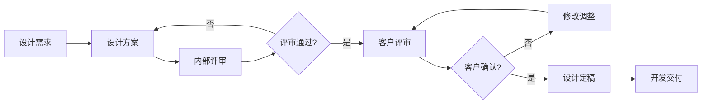

# 微信小程序患者档案管理系统视觉设计文档

<!-- renamed to kebab-case (visual-design-doc.md) -->

## 文档信息

- **项目名称**: 微信小程序患者档案管理系统重构
- **文档版本**: v1.0
- **创建日期**: 2025-09-22
- **设计团队**: UI/UX设计团队
- **更新时间**: 2025-09-22

---

## 目录

1. [设计概述](#1-设计概述)
2. [设计原则](#2-设计原则)
3. [视觉设计系统](#3-视觉设计系统)
4. [页面设计规范](#4-页面设计规范)
5. [组件设计规范](#5-组件设计规范)
6. [交互设计规范](#6-交互设计规范)
7. [响应式设计](#7-响应式设计)
8. [无障碍设计](#8-无障碍设计)
9. [设计交付](#9-设计交付)

---

## 1. 设计概述

### 1.1 项目背景

本项目旨在重构微信小程序患者档案管理系统，为公益组织提供更加人性化、高效的患者档案管理解决方案。系统主要服务于护理人员、管理人员和志愿者，帮助他们更好地管理大病儿童的档案信息。

### 1.2 设计目标

- **提升用户体验**: 创建直观、易用的界面，降低学习成本
- **体现人文关怀**: 通过视觉设计传达温暖、关爱的公益属性
- **提高工作效率**: 优化信息展示和操作流程，提升工作效率
- **确保信息安全**: 在设计中体现数据安全和隐私保护

### 1.3 目标用户

- **护理工作人员** (主要用户): 25-45岁，日常患者信息管理
- **管理人员** (次要用户): 30-50岁，数据查看和决策支持
- **志愿者** (偶尔用户): 20-60岁，辅助信息录入和查看

---

## 2. 设计原则

### 2.1 核心设计原则

#### 温暖关怀 (Warm Care)

**理念**: 体现公益组织的人文关怀，传递温暖与希望
**执行方式**:

- 使用温暖的色彩搭配，以橙色系为主色调
- 采用圆角设计语言，营造亲和感
- 选择具有亲和力的图标和插画
- 使用鼓励性、正向的文案表达

#### 简洁高效 (Simple & Efficient)

**理念**: 降低使用门槛，提高工作效率
**执行方式**:

- 清晰的信息层级和视觉引导
- 最小化操作步骤，减少认知负担
- 统一的界面元素和交互模式
- 智能化的辅助功能和提示

#### 安全可靠 (Safe & Reliable)

**理念**: 保护隐私数据，确保系统安全性
**执行方式**:

- 权限状态的可视化表达
- 操作可追溯的设计呈现
- 数据加密状态的明确提示
- 重要操作的二次确认机制

#### 专业可信 (Professional & Trustworthy)

**理念**: 建立专业形象，获得用户信任
**执行方式**:

- 一致性的设计系统和规范
- 精准的信息呈现和状态反馈
- 高品质的视觉细节处理
- 符合医疗行业特点的设计元素

---

## 3. 视觉设计系统

### 3.1 色彩系统

#### 主色调 (Primary Colors)

```css
/* 主色调 - 温暖橙色系 */
--primary-color: #ff7a45; /* 主橙色 */
--primary-light: #ff9a6b; /* 浅橙色 */
--primary-lighter: #ffb894; /* 更浅橙色 */
--primary-dark: #e85d2b; /* 深橙色 */
--primary-darker: #cc4a1a; /* 更深橙色 */

/* 主色调应用场景 */
.primary-button {
  background-color: var(--primary-color);
}
.primary-link {
  color: var(--primary-color);
}
.primary-badge {
  background-color: var(--primary-color);
}
```

#### 辅助色调 (Secondary Colors)

```css
/* 辅助色 - 蓝色系 */
--secondary-color: #1890ff; /* 主蓝色 */
--secondary-light: #40a9ff; /* 浅蓝色 */
--secondary-dark: #096dd9; /* 深蓝色 */

/* 辅助色应用场景 */
.secondary-button {
  background-color: var(--secondary-color);
}
.info-tag {
  background-color: var(--secondary-light);
}
```

#### 功能色系 (Functional Colors)

```css
/* 成功色 - 绿色 */
--success-color: #52c41a; /* 成功绿 */
--success-light: #73d13d; /* 浅成功绿 */
--success-dark: #389e0d; /* 深成功绿 */
--success-bg: #f6ffed; /* 成功背景色 */

/* 警告色 - 黄色 */
--warning-color: #faad14; /* 警告黄 */
--warning-light: #ffc53d; /* 浅警告黄 */
--warning-dark: #d48806; /* 深警告黄 */
--warning-bg: #fffbe6; /* 警告背景色 */

/* 错误色 - 红色 */
--error-color: #ff4d4f; /* 错误红 */
--error-light: #ff7875; /* 浅错误红 */
--error-dark: #cf1322; /* 深错误红 */
--error-bg: #fff2f0; /* 错误背景色 */

/* 信息色 - 蓝色 */
--info-color: #1890ff; /* 信息蓝 */
--info-light: #40a9ff; /* 浅信息蓝 */
--info-dark: #096dd9; /* 深信息蓝 */
--info-bg: #e6f7ff; /* 信息背景色 */
```

#### 中性色系 (Neutral Colors)

```css
/* 文字颜色 */
--text-color-primary: #262626; /* 主要文字 */
--text-color-secondary: #595959; /* 次要文字 */
--text-color-disabled: #bfbfbf; /* 禁用文字 */
--text-color-white: #ffffff; /* 白色文字 */

/* 背景颜色 */
--bg-color-white: #ffffff; /* 白色背景 */
--bg-color-light: #fafafa; /* 浅色背景 */
--bg-color-gray: #f5f5f5; /* 灰色背景 */
--bg-color-dark: #001529; /* 深色背景 */

/* 边框颜色 */
--border-color-light: #f0f0f0; /* 浅边框 */
--border-color-base: #d9d9d9; /* 基础边框 */
--border-color-dark: #595959; /* 深边框 */

/* 阴影颜色 */
--shadow-light: rgba(0, 0, 0, 0.04);
--shadow-base: rgba(0, 0, 0, 0.08);
--shadow-dark: rgba(0, 0, 0, 0.12);
```

#### 色彩使用规范

```css
/* 主色调使用场景 */
.primary-usage {
  /* 主要操作按钮 */
  /* 重要状态指示 */
  /* 品牌标识元素 */
  /* 关键信息突出 */
}

/* 辅助色使用场景 */
.secondary-usage {
  /* 次要操作按钮 */
  /* 信息提示标签 */
  /* 链接文字 */
  /* 辅助图标 */
}

/* 功能色使用场景 */
.functional-usage {
  /* 状态反馈 */
  /* 系统通知 */
  /* 表单验证 */
  /* 进度指示 */
}
```

### 3.2 字体系统

#### 字体族 (Font Family)

```css
/* 主字体 - 系统字体栈 */
--font-family-primary:
  -apple-system, BlinkMacSystemFont, 'Segoe UI', 'PingFang SC', 'Hiragino Sans GB',
  'Microsoft YaHei', 'Helvetica Neue', Helvetica, Arial, sans-serif;

/* 数字字体 - 等宽字体 */
--font-family-mono: 'SF Mono', Monaco, 'Inconsolata', 'Roboto Mono', 'Source Code Pro', monospace;
```

#### 字体规格 (Font Scale)

```css
/* 标题字体 */
--font-size-h1: 32rpx; /* 页面主标题 */
--font-size-h2: 28rpx; /* 区块标题 */
--font-size-h3: 26rpx; /* 卡片标题 */
--font-size-h4: 24rpx; /* 小标题 */

/* 正文字体 */
--font-size-body-lg: 28rpx; /* 大正文 */
--font-size-body: 26rpx; /* 标准正文 */
--font-size-body-sm: 24rpx; /* 小正文 */

/* 辅助字体 */
--font-size-caption: 22rpx; /* 说明文字 */
--font-size-note: 20rpx; /* 注释文字 */
--font-size-mini: 18rpx; /* 极小文字 */

/* 字重 */
--font-weight-light: 300; /* 细体 */
--font-weight-normal: 400; /* 常规 */
--font-weight-medium: 500; /* 中等 */
--font-weight-semibold: 600; /* 半粗 */
--font-weight-bold: 700; /* 粗体 */

/* 行高 */
--line-height-tight: 1.2; /* 紧密行高 */
--line-height-normal: 1.5; /* 标准行高 */
--line-height-loose: 1.8; /* 宽松行高 */
```

#### 字体使用规范

```css
/* 页面标题 */
.page-title {
  font-size: var(--font-size-h1);
  font-weight: var(--font-weight-bold);
  line-height: var(--line-height-tight);
  color: var(--text-color-primary);
}

/* 卡片标题 */
.card-title {
  font-size: var(--font-size-h3);
  font-weight: var(--font-weight-medium);
  line-height: var(--line-height-normal);
  color: var(--text-color-primary);
}

/* 正文内容 */
.body-text {
  font-size: var(--font-size-body);
  font-weight: var(--font-weight-normal);
  line-height: var(--line-height-normal);
  color: var(--text-color-secondary);
}

/* 辅助说明 */
.caption-text {
  font-size: var(--font-size-caption);
  font-weight: var(--font-weight-normal);
  line-height: var(--line-height-normal);
  color: var(--text-color-disabled);
}

/* 数字文本 */
.number-text {
  font-family: var(--font-family-mono);
  font-variant-numeric: tabular-nums;
}
```

### 3.3 间距系统

#### 间距规格 (Spacing Scale)

```css
/* 基础间距单位 */
--spacing-base: 8rpx; /* 基础单位 */

/* 间距规格 */
--spacing-xs: 8rpx; /* 极小间距 */
--spacing-sm: 16rpx; /* 小间距 */
--spacing-md: 24rpx; /* 中间距 */
--spacing-lg: 32rpx; /* 大间距 */
--spacing-xl: 48rpx; /* 极大间距 */
--spacing-xxl: 64rpx; /* 超大间距 */

/* 页面级间距 */
--spacing-page-margin: 32rpx; /* 页面边距 */
--spacing-section-margin: 48rpx; /* 区块间距 */
--spacing-card-padding: 24rpx; /* 卡片内边距 */
```

#### 间距使用规范

```css
/* 页面布局 */
.page-container {
  padding: var(--spacing-page-margin);
}

/* 卡片内容 */
.card {
  padding: var(--spacing-card-padding);
  margin-bottom: var(--spacing-md);
}

/* 表单元素 */
.form-item {
  margin-bottom: var(--spacing-md);
}

.form-item-label {
  margin-bottom: var(--spacing-xs);
}

/* 按钮组 */
.button-group .button + .button {
  margin-left: var(--spacing-sm);
}
```

### 3.4 圆角系统

#### 圆角规格 (Border Radius)

```css
/* 圆角尺寸 */
--border-radius-sm: 4rpx; /* 小圆角 */
--border-radius-base: 8rpx; /* 基础圆角 */
--border-radius-lg: 12rpx; /* 大圆角 */
--border-radius-xl: 16rpx; /* 超大圆角 */
--border-radius-round: 50%; /* 圆形 */
--border-radius-pill: 1000rpx; /* 胶囊形 */
```

#### 圆角使用规范

```css
/* 卡片 */
.card {
  border-radius: var(--border-radius-lg);
}

/* 按钮 */
.button {
  border-radius: var(--border-radius-base);
}

.button-round {
  border-radius: var(--border-radius-pill);
}

/* 头像 */
.avatar {
  border-radius: var(--border-radius-round);
}

/* 输入框 */
.input {
  border-radius: var(--border-radius-base);
}
```

### 3.5 阴影系统

#### 阴影规格 (Box Shadow)

```css
/* 阴影层级 */
--shadow-sm: 0 2rpx 8rpx rgba(0, 0, 0, 0.04); /* 小阴影 */
--shadow-base: 0 4rpx 16rpx rgba(0, 0, 0, 0.08); /* 基础阴影 */
--shadow-lg: 0 8rpx 24rpx rgba(0, 0, 0, 0.12); /* 大阴影 */
--shadow-xl: 0 12rpx 32rpx rgba(0, 0, 0, 0.16); /* 超大阴影 */

/* 特殊阴影 */
--shadow-focus: 0 0 0 4rpx rgba(255, 122, 69, 0.2); /* 聚焦阴影 */
--shadow-error: 0 0 0 4rpx rgba(255, 77, 79, 0.2); /* 错误阴影 */
```

#### 阴影使用规范

```css
/* 卡片阴影 */
.card {
  box-shadow: var(--shadow-base);
}

.card:hover {
  box-shadow: var(--shadow-lg);
}

/* 浮动按钮 */
.fab {
  box-shadow: var(--shadow-lg);
}

/* 模态框 */
.modal {
  box-shadow: var(--shadow-xl);
}

/* 聚焦状态 */
.input:focus {
  box-shadow: var(--shadow-focus);
}

.input.error:focus {
  box-shadow: var(--shadow-error);
}
```

### 3.6 图标系统

#### 图标风格

- **设计风格**: 线性图标，2rpx描边，圆角端点
- **设计尺寸**: 32rpx, 48rpx, 64rpx三种规格
- **色彩规范**: 跟随文字色彩或使用主题色

#### 核心图标库

```javascript
// 导航图标
const navigationIcons = {
  home: 'icon-home', // 🏠 首页
  patients: 'icon-patients', // 👥 患者
  admission: 'icon-plus', // ➕ 入住
  analytics: 'icon-chart', // 📊 分析
  profile: 'icon-user', // 👤 个人
  search: 'icon-search', // 🔍 搜索
  menu: 'icon-menu', // ☰ 菜单
  back: 'icon-arrow-left', // ← 返回
  more: 'icon-more', // ⋯ 更多
};

// 状态图标
const statusIcons = {
  success: 'icon-check-circle', // ✅ 成功
  warning: 'icon-warning-circle', // ⚠️ 警告
  error: 'icon-error-circle', // ❌ 错误
  info: 'icon-info-circle', // ℹ️ 信息
  loading: 'icon-loading', // ⏳ 加载
  pending: 'icon-clock', // 🕐 等待
};

// 操作图标
const actionIcons = {
  edit: 'icon-edit', // ✏️ 编辑
  delete: 'icon-delete', // 🗑️ 删除
  view: 'icon-eye', // 👁️ 查看
  copy: 'icon-copy', // 📄 复制
  upload: 'icon-upload', // 📤 上传
  download: 'icon-download', // 📥 下载
  refresh: 'icon-refresh', // 🔄 刷新
  settings: 'icon-settings', // ⚙️ 设置
  filter: 'icon-filter', // 🔽 筛选
  sort: 'icon-sort', // ↕️ 排序
};
```

#### 图标使用规范

```css
/* 图标基础样式 */
.icon {
  display: inline-block;
  width: 1em;
  height: 1em;
  fill: currentColor;
  vertical-align: middle;
  font-style: normal;
}

/* 图标尺寸 */
.icon-sm {
  font-size: 32rpx;
}
.icon-md {
  font-size: 48rpx;
}
.icon-lg {
  font-size: 64rpx;
}

/* 图标颜色 */
.icon-primary {
  color: var(--primary-color);
}
.icon-secondary {
  color: var(--secondary-color);
}
.icon-success {
  color: var(--success-color);
}
.icon-warning {
  color: var(--warning-color);
}
.icon-error {
  color: var(--error-color);
}
.icon-disabled {
  color: var(--text-color-disabled);
}

/* 带文字的图标 */
.icon-with-text {
  margin-right: var(--spacing-xs);
}

.icon-with-text-right {
  margin-left: var(--spacing-xs);
}
```

---

## 4. 页面设计规范

### 4.1 首页设计

#### 布局结构

```
┌─────────────────────────────────┐
│ 顶部导航栏 (Navigation Bar)        │
├─────────────────────────────────┤
│ 欢迎区域 (Welcome Section)        │
│ ├ 当日概况                       │
│ └ 快捷提示                       │
├─────────────────────────────────┤
│ 核心数据 (Key Metrics)           │
│ ├ 在住人数 │ 今日入住 │ 本月总计    │
│ └ 待处理事项                     │
├─────────────────────────────────┤
│ 快捷操作 (Quick Actions)         │
│ ├ 新患者入住                     │
│ ├ 查看患者                       │
│ └ 数据统计                       │
├─────────────────────────────────┤
│ 最近动态 (Recent Activities)     │
│ ├ 最新入住                       │
│ ├ 最近更新                       │
│ └ 系统通知                       │
└─────────────────────────────────┘
```

#### 设计要点

- **视觉层次**: 重要信息使用更大字体和更强对比度
- **卡片设计**: 使用卡片容器组织不同功能模块
- **色彩引导**: 使用主色调突出重要操作按钮
- **信息密度**: 合理控制信息密度，避免界面过于拥挤

### 4.2 患者列表页设计

#### 布局结构

```
┌─────────────────────────────────┐
│ 顶部导航栏 + 搜索入口              │
├─────────────────────────────────┤
│ 筛选器 (Filter Bar)              │
│ ├ 状态筛选 │ 时间筛选 │ 更多筛选    │
├─────────────────────────────────┤
│ 患者卡片列表 (Patient Cards)      │
│ ┌─────────────────────────────┐ │
│ │ 患者A │ 基本信息 │ 快捷操作    │ │
│ └─────────────────────────────┘ │
│ ┌─────────────────────────────┐ │
│ │ 患者B │ 基本信息 │ 快捷操作    │ │
│ └─────────────────────────────┘ │
├─────────────────────────────────┤
│ 浮动操作按钮 (FAB)               │
└─────────────────────────────────┘
```

#### 患者卡片设计

```css
.patient-card {
  background: var(--bg-color-white);
  border-radius: var(--border-radius-lg);
  box-shadow: var(--shadow-base);
  padding: var(--spacing-md);
  margin-bottom: var(--spacing-md);
}

.patient-header {
  display: flex;
  align-items: center;
  margin-bottom: var(--spacing-sm);
}

.patient-avatar {
  width: 88rpx;
  height: 88rpx;
  border-radius: var(--border-radius-round);
  margin-right: var(--spacing-md);
}

.patient-info {
  flex: 1;
}

.patient-name {
  font-size: var(--font-size-h3);
  font-weight: var(--font-weight-medium);
  color: var(--text-color-primary);
}

.patient-meta {
  font-size: var(--font-size-body-sm);
  color: var(--text-color-secondary);
  margin-top: var(--spacing-xs);
}

.patient-status {
  padding: 4rpx 12rpx;
  border-radius: var(--border-radius-pill);
  font-size: var(--font-size-caption);
  font-weight: var(--font-weight-medium);
}
```

### 4.3 患者详情页设计

#### 信息层级设计

```
1. 患者头部 (Level 1)
   ├── 基本信息概览
   ├── 当前状态
   └── 快捷操作

2. 详细信息模块 (Level 1)
   ├── 基本信息
   ├── 医疗信息
   ├── 联系信息
   └── 入住记录

3. 附加功能 (Level 2)
   ├── 附件管理
   ├── 操作历史
   └── 相关记录
```

#### Tab导航设计

```css
.detail-tabs {
  background: var(--bg-color-white);
  border-bottom: 1rpx solid var(--border-color-light);
  padding: 0 var(--spacing-page-margin);
}

.tab-item {
  display: inline-block;
  padding: var(--spacing-md) var(--spacing-sm);
  font-size: var(--font-size-body);
  color: var(--text-color-secondary);
  border-bottom: 4rpx solid transparent;
  transition: all 0.3s ease;
}

.tab-item.active {
  color: var(--primary-color);
  border-bottom-color: var(--primary-color);
  font-weight: var(--font-weight-medium);
}
```

### 4.4 表单页面设计

#### 表单布局原则

- **单列布局**: 移动端优先使用单列表单布局
- **逻辑分组**: 相关字段进行分组，使用分割线或卡片区分
- **渐进披露**: 优先显示必填项，选填项可折叠显示
- **实时反馈**: 提供实时验证和错误提示

#### 表单样式规范

```css
.form-section {
  background: var(--bg-color-white);
  border-radius: var(--border-radius-lg);
  padding: var(--spacing-md);
  margin-bottom: var(--spacing-md);
}

.form-section-title {
  font-size: var(--font-size-h3);
  font-weight: var(--font-weight-medium);
  color: var(--text-color-primary);
  margin-bottom: var(--spacing-md);
  padding-bottom: var(--spacing-sm);
  border-bottom: 1rpx solid var(--border-color-light);
}

.form-item {
  margin-bottom: var(--spacing-md);
}

.form-label {
  display: block;
  font-size: var(--font-size-body-sm);
  color: var(--text-color-primary);
  margin-bottom: var(--spacing-xs);
}

.form-label.required::after {
  content: ' *';
  color: var(--error-color);
}

.form-input {
  width: 100%;
  padding: var(--spacing-sm) var(--spacing-md);
  border: 1rpx solid var(--border-color-base);
  border-radius: var(--border-radius-base);
  font-size: var(--font-size-body);
  color: var(--text-color-primary);
  background: var(--bg-color-white);
  transition: all 0.3s ease;
}

.form-input:focus {
  border-color: var(--primary-color);
  box-shadow: var(--shadow-focus);
}

.form-input.error {
  border-color: var(--error-color);
}

.form-error-message {
  font-size: var(--font-size-caption);
  color: var(--error-color);
  margin-top: var(--spacing-xs);
}
```

---

## 5. 组件设计规范

### 5.1 按钮组件 (Button)

#### 按钮类型

```css
/* 主要按钮 - Primary Button */
.btn-primary {
  background: var(--primary-color);
  color: var(--text-color-white);
  border: none;
  padding: var(--spacing-sm) var(--spacing-lg);
  border-radius: var(--border-radius-base);
  font-size: var(--font-size-body);
  font-weight: var(--font-weight-medium);
  transition: all 0.3s ease;
}

.btn-primary:hover {
  background: var(--primary-dark);
  transform: translateY(-2rpx);
  box-shadow: var(--shadow-lg);
}

.btn-primary:active {
  background: var(--primary-darker);
  transform: translateY(0);
}

.btn-primary:disabled {
  background: var(--text-color-disabled);
  cursor: not-allowed;
  transform: none;
  box-shadow: none;
}

/* 次要按钮 - Secondary Button */
.btn-secondary {
  background: transparent;
  color: var(--primary-color);
  border: 1rpx solid var(--primary-color);
  padding: var(--spacing-sm) var(--spacing-lg);
  border-radius: var(--border-radius-base);
  font-size: var(--font-size-body);
  font-weight: var(--font-weight-medium);
  transition: all 0.3s ease;
}

.btn-secondary:hover {
  background: var(--primary-color);
  color: var(--text-color-white);
}

/* 文字按钮 - Text Button */
.btn-text {
  background: transparent;
  color: var(--primary-color);
  border: none;
  padding: var(--spacing-xs) var(--spacing-sm);
  font-size: var(--font-size-body-sm);
  font-weight: var(--font-weight-medium);
  transition: all 0.3s ease;
}

.btn-text:hover {
  background: var(--primary-color);
  color: var(--text-color-white);
  border-radius: var(--border-radius-sm);
}

/* 危险按钮 - Danger Button */
.btn-danger {
  background: var(--error-color);
  color: var(--text-color-white);
  border: none;
  padding: var(--spacing-sm) var(--spacing-lg);
  border-radius: var(--border-radius-base);
  font-size: var(--font-size-body);
  font-weight: var(--font-weight-medium);
}

/* 按钮尺寸 */
.btn-sm {
  padding: var(--spacing-xs) var(--spacing-md);
  font-size: var(--font-size-body-sm);
}

.btn-lg {
  padding: var(--spacing-md) var(--spacing-xl);
  font-size: var(--font-size-body-lg);
}

/* 圆形按钮 */
.btn-round {
  border-radius: var(--border-radius-pill);
}

/* 块级按钮 */
.btn-block {
  width: 100%;
  display: block;
}
```

#### 按钮状态设计

- **默认状态**: 基础样式
- **悬停状态**: 颜色加深，轻微上浮效果
- **点击状态**: 颜色更深，取消上浮效果
- **禁用状态**: 灰色显示，禁用交互
- **加载状态**: 显示加载图标，禁用点击

### 5.2 输入框组件 (Input)

#### 输入框类型

```css
/* 基础输入框 */
.input-base {
  width: 100%;
  padding: var(--spacing-sm) var(--spacing-md);
  border: 1rpx solid var(--border-color-base);
  border-radius: var(--border-radius-base);
  font-size: var(--font-size-body);
  color: var(--text-color-primary);
  background: var(--bg-color-white);
  transition: all 0.3s ease;
  box-sizing: border-box;
}

.input-base::placeholder {
  color: var(--text-color-disabled);
}

/* 输入框状态 */
.input-base:focus {
  border-color: var(--primary-color);
  box-shadow: var(--shadow-focus);
  outline: none;
}

.input-base.error {
  border-color: var(--error-color);
}

.input-base.error:focus {
  box-shadow: var(--shadow-error);
}

.input-base:disabled {
  background: var(--bg-color-gray);
  color: var(--text-color-disabled);
  cursor: not-allowed;
}

/* 带图标的输入框 */
.input-with-icon {
  position: relative;
}

.input-icon {
  position: absolute;
  top: 50%;
  transform: translateY(-50%);
  color: var(--text-color-disabled);
  font-size: var(--font-size-body);
}

.input-icon-left {
  left: var(--spacing-md);
}

.input-icon-right {
  right: var(--spacing-md);
}

.input-with-icon .input-base {
  padding-left: 80rpx; /* 有左图标时 */
  padding-right: 80rpx; /* 有右图标时 */
}

/* 搜索输入框 */
.input-search {
  background: var(--bg-color-light);
  border: none;
  border-radius: var(--border-radius-pill);
  padding-left: 80rpx;
}

.input-search:focus {
  background: var(--bg-color-white);
  border: 1rpx solid var(--primary-color);
}
```

### 5.3 卡片组件 (Card)

#### 卡片类型

```css
/* 基础卡片 */
.card-base {
  background: var(--bg-color-white);
  border-radius: var(--border-radius-lg);
  box-shadow: var(--shadow-base);
  overflow: hidden;
  transition: all 0.3s ease;
}

.card-base:hover {
  box-shadow: var(--shadow-lg);
  transform: translateY(-4rpx);
}

/* 卡片头部 */
.card-header {
  padding: var(--spacing-md);
  border-bottom: 1rpx solid var(--border-color-light);
  background: var(--bg-color-light);
}

.card-title {
  font-size: var(--font-size-h3);
  font-weight: var(--font-weight-medium);
  color: var(--text-color-primary);
  margin: 0;
}

.card-extra {
  float: right;
  color: var(--text-color-secondary);
  font-size: var(--font-size-body-sm);
}

/* 卡片内容 */
.card-content {
  padding: var(--spacing-md);
}

/* 卡片底部 */
.card-footer {
  padding: var(--spacing-md);
  border-top: 1rpx solid var(--border-color-light);
  background: var(--bg-color-light);
  text-align: right;
}

/* 患者卡片特殊样式 */
.patient-card {
  position: relative;
}

.patient-card::before {
  content: '';
  position: absolute;
  left: 0;
  top: 0;
  bottom: 0;
  width: 8rpx;
  background: var(--primary-color);
}

.patient-card.status-critical::before {
  background: var(--error-color);
}

.patient-card.status-warning::before {
  background: var(--warning-color);
}

.patient-card.status-normal::before {
  background: var(--success-color);
}
```

### 5.4 标签组件 (Tag)

#### 标签类型

```css
/* 基础标签 */
.tag-base {
  display: inline-block;
  padding: 4rpx 12rpx;
  border-radius: var(--border-radius-pill);
  font-size: var(--font-size-caption);
  font-weight: var(--font-weight-medium);
  line-height: 1.2;
  white-space: nowrap;
}

/* 状态标签 */
.tag-success {
  background: var(--success-bg);
  color: var(--success-color);
  border: 1rpx solid var(--success-light);
}

.tag-warning {
  background: var(--warning-bg);
  color: var(--warning-color);
  border: 1rpx solid var(--warning-light);
}

.tag-error {
  background: var(--error-bg);
  color: var(--error-color);
  border: 1rpx solid var(--error-light);
}

.tag-info {
  background: var(--info-bg);
  color: var(--info-color);
  border: 1rpx solid var(--info-light);
}

.tag-default {
  background: var(--bg-color-gray);
  color: var(--text-color-secondary);
  border: 1rpx solid var(--border-color-base);
}

/* 可关闭标签 */
.tag-closable {
  padding-right: 32rpx;
  position: relative;
}

.tag-close-icon {
  position: absolute;
  right: 8rpx;
  top: 50%;
  transform: translateY(-50%);
  cursor: pointer;
  font-size: 20rpx;
  opacity: 0.7;
  transition: opacity 0.3s ease;
}

.tag-close-icon:hover {
  opacity: 1;
}
```

### 5.5 加载组件 (Loading)

#### 加载状态设计

```css
/* 骨架屏加载 */
.skeleton {
  background: linear-gradient(
    90deg,
    var(--bg-color-gray) 25%,
    var(--border-color-light) 50%,
    var(--bg-color-gray) 75%
  );
  background-size: 400% 100%;
  animation: skeleton-loading 1.5s ease-in-out infinite;
  border-radius: var(--border-radius-base);
}

@keyframes skeleton-loading {
  0% {
    background-position: 100% 50%;
  }
  100% {
    background-position: 0% 50%;
  }
}

.skeleton-avatar {
  width: 88rpx;
  height: 88rpx;
  border-radius: var(--border-radius-round);
}

.skeleton-title {
  height: 32rpx;
  width: 60%;
  margin-bottom: var(--spacing-sm);
}

.skeleton-text {
  height: 24rpx;
  width: 100%;
  margin-bottom: var(--spacing-xs);
}

.skeleton-text:last-child {
  width: 80%;
  margin-bottom: 0;
}

/* 加载动画 */
.loading-spinner {
  display: inline-block;
  width: 32rpx;
  height: 32rpx;
  border: 4rpx solid var(--border-color-light);
  border-top: 4rpx solid var(--primary-color);
  border-radius: 50%;
  animation: spin 1s linear infinite;
}

@keyframes spin {
  0% {
    transform: rotate(0deg);
  }
  100% {
    transform: rotate(360deg);
  }
}

/* 页面加载 */
.page-loading {
  display: flex;
  flex-direction: column;
  align-items: center;
  justify-content: center;
  height: 400rpx;
  color: var(--text-color-secondary);
}

.page-loading-text {
  margin-top: var(--spacing-md);
  font-size: var(--font-size-body-sm);
}
```

---

## 6. 交互设计规范

### 6.1 手势交互

#### 微信小程序手势规范

```javascript
// 下拉刷新
const pullToRefresh = {
  triggerDistance: 50, // 触发距离 50px
  maxDistance: 80, // 最大下拉距离 80px
  damping: 0.3, // 阻尼系数
  duration: 300, // 回弹动画时长 300ms
};

// 左滑操作
const swipeActions = {
  threshold: 30, // 触发阈值 30px
  maxOffset: 160, // 最大偏移 160px
  snapBack: true, // 是否回弹
  actions: [
    { text: '编辑', color: '#1890FF' },
    { text: '删除', color: '#FF4D4F' },
  ],
};

// 长按操作
const longPress = {
  duration: 500, // 长按时长 500ms
  feedback: 'vibrate', // 反馈方式：震动
  showMenu: true, // 显示操作菜单
};
```

#### 手势反馈设计

- **触感反馈**: 重要操作提供震动反馈
- **视觉反馈**: 清晰的按压状态和动画效果
- **音频反馈**: 成功操作的提示音（可选）

### 6.2 页面转场动画

#### 转场动画类型

```css
/* 页面进入动画 */
@keyframes page-enter {
  from {
    opacity: 0;
    transform: translateX(100%);
  }
  to {
    opacity: 1;
    transform: translateX(0);
  }
}

/* 页面退出动画 */
@keyframes page-exit {
  from {
    opacity: 1;
    transform: translateX(0);
  }
  to {
    opacity: 0;
    transform: translateX(-100%);
  }
}

/* 模态框进入动画 */
@keyframes modal-enter {
  from {
    opacity: 0;
    transform: translateY(100%) scale(0.9);
  }
  to {
    opacity: 1;
    transform: translateY(0) scale(1);
  }
}

/* 淡入动画 */
@keyframes fade-in {
  from {
    opacity: 0;
  }
  to {
    opacity: 1;
  }
}

/* 滑入动画 */
@keyframes slide-in-up {
  from {
    opacity: 0;
    transform: translateY(32rpx);
  }
  to {
    opacity: 1;
    transform: translateY(0);
  }
}
```

#### 动画时长规范

```css
/* 动画持续时间 */
--duration-fast: 150ms; /* 快速动画 */
--duration-base: 300ms; /* 基础动画 */
--duration-slow: 500ms; /* 慢速动画 */

/* 缓动函数 */
--ease-out: cubic-bezier(0.25, 0.8, 0.25, 1);
--ease-in: cubic-bezier(0.42, 0, 1, 1);
--ease-in-out: cubic-bezier(0.42, 0, 0.58, 1);
```

### 6.3 状态反馈

#### 操作反馈设计

```css
/* 即时反馈 */
.btn-feedback {
  transition: all var(--duration-fast) var(--ease-out);
}

.btn-feedback:active {
  transform: scale(0.95);
  opacity: 0.8;
}

/* 成功反馈 */
.success-feedback {
  position: fixed;
  top: 50%;
  left: 50%;
  transform: translate(-50%, -50%);
  background: var(--success-color);
  color: var(--text-color-white);
  padding: var(--spacing-md) var(--spacing-lg);
  border-radius: var(--border-radius-lg);
  font-size: var(--font-size-body);
  z-index: 9999;
  animation: feedback-show var(--duration-base) var(--ease-out);
}

@keyframes feedback-show {
  0% {
    opacity: 0;
    transform: translate(-50%, -50%) scale(0.8);
  }
  20% {
    opacity: 1;
    transform: translate(-50%, -50%) scale(1.05);
  }
  100% {
    opacity: 1;
    transform: translate(-50%, -50%) scale(1);
  }
}

/* 错误反馈 */
.error-feedback {
  background: var(--error-color);
  animation: shake 0.5s ease-in-out;
}

@keyframes shake {
  0%,
  100% {
    transform: translateX(0);
  }
  10%,
  30%,
  50%,
  70%,
  90% {
    transform: translateX(-10rpx);
  }
  20%,
  40%,
  60%,
  80% {
    transform: translateX(10rpx);
  }
}
```

#### 加载状态反馈

```css
/* 按钮加载状态 */
.btn-loading {
  position: relative;
  color: transparent !important;
  pointer-events: none;
}

.btn-loading::after {
  content: '';
  position: absolute;
  top: 50%;
  left: 50%;
  margin: -16rpx 0 0 -16rpx;
  width: 32rpx;
  height: 32rpx;
  border: 4rpx solid rgba(255, 255, 255, 0.3);
  border-top: 4rpx solid rgba(255, 255, 255, 0.8);
  border-radius: 50%;
  animation: spin 1s linear infinite;
}

/* 页面加载遮罩 */
.loading-overlay {
  position: fixed;
  top: 0;
  left: 0;
  right: 0;
  bottom: 0;
  background: rgba(255, 255, 255, 0.8);
  display: flex;
  align-items: center;
  justify-content: center;
  z-index: 9998;
}
```

---

## 7. 响应式设计

### 7.1 断点系统

#### 设备断点

```css
/* 超小屏设备 (手机竖屏) */
@media (max-width: 375px) {
  :root {
    --font-size-h1: 28rpx;
    --font-size-h2: 24rpx;
    --spacing-page-margin: 24rpx;
  }
}

/* 小屏设备 (手机横屏, 小平板) */
@media (min-width: 376px) and (max-width: 768px) {
  :root {
    --font-size-h1: 32rpx;
    --font-size-h2: 28rpx;
    --spacing-page-margin: 32rpx;
  }
}

/* 中屏设备 (平板) */
@media (min-width: 769px) and (max-width: 1024px) {
  .container {
    max-width: 750px;
    margin: 0 auto;
  }

  .grid-two-columns {
    display: grid;
    grid-template-columns: 1fr 1fr;
    gap: var(--spacing-lg);
  }
}

/* 大屏设备 (桌面) */
@media (min-width: 1025px) {
  .container {
    max-width: 1200px;
    margin: 0 auto;
  }

  .grid-three-columns {
    display: grid;
    grid-template-columns: 1fr 1fr 1fr;
    gap: var(--spacing-lg);
  }
}
```

### 7.2 布局适配

#### Flex布局规范

```css
/* 水平居中 */
.flex-center {
  display: flex;
  justify-content: center;
  align-items: center;
}

/* 两端对齐 */
.flex-between {
  display: flex;
  justify-content: space-between;
  align-items: center;
}

/* 垂直排列 */
.flex-column {
  display: flex;
  flex-direction: column;
}

/* 自适应网格 */
.grid-auto {
  display: grid;
  grid-template-columns: repeat(auto-fit, minmax(300px, 1fr));
  gap: var(--spacing-lg);
}

/* 响应式容器 */
.responsive-container {
  width: 100%;
  max-width: 1200px;
  margin: 0 auto;
  padding: 0 var(--spacing-page-margin);
}
```

#### 字体响应式

```css
/* 响应式字体 */
@media (max-width: 375px) {
  .responsive-text {
    font-size: clamp(24rpx, 4vw, 32rpx);
  }
}

/* 标题响应式 */
.responsive-title {
  font-size: clamp(28rpx, 5vw, 40rpx);
  line-height: 1.2;
}

/* 正文响应式 */
.responsive-body {
  font-size: clamp(24rpx, 3.5vw, 28rpx);
  line-height: 1.5;
}
```

---

## 8. 无障碍设计

### 8.1 色彩对比度

#### 对比度标准

```css
/* WCAG 2.1 AA 标准对比度要求 */
/* 正常文字: 对比度 ≥ 4.5:1 */
/* 大字体 (18pt+): 对比度 ≥ 3:1 */

/* 高对比度文字组合 */
.high-contrast-text {
  /* 深色文字 + 白色背景: 对比度 15.3:1 */
  color: #262626;
  background: #ffffff;
}

.high-contrast-inverse {
  /* 白色文字 + 深色背景: 对比度 15.3:1 */
  color: #ffffff;
  background: #262626;
}

/* 中等对比度文字组合 */
.medium-contrast-text {
  /* 灰色文字 + 白色背景: 对比度 4.6:1 */
  color: #595959;
  background: #ffffff;
}

/* 错误示例 - 对比度不足 */
.low-contrast-text {
  /* 浅灰色文字 + 白色背景: 对比度 2.3:1 (不符合标准) */
  color: #bfbfbf;
  background: #ffffff;
}
```

#### 色盲友好设计

```css
/* 避免仅用颜色传达信息 */
.status-indicator {
  /* 错误做法: 仅用颜色区分状态 */
  /* color: var(--success-color); */

  /* 正确做法: 颜色 + 图标 + 文字 */
  color: var(--success-color);
}

.status-indicator::before {
  content: '✓';
  margin-right: var(--spacing-xs);
}

/* 色盲安全色彩组合 */
.colorblind-safe {
  /* 使用蓝色和橙色的组合，对色盲友好 */
  --safe-primary: #0066cc;
  --safe-secondary: #ff6600;
  --safe-success: #228b22;
  --safe-warning: #ffb347;
  --safe-error: #dc143c;
}
```

### 8.2 键盘导航

#### 焦点管理

```css
/* 焦点样式 */
.focusable {
  outline: none;
  transition: all 0.3s ease;
}

.focusable:focus {
  box-shadow: 0 0 0 4rpx rgba(255, 122, 69, 0.4);
  border-color: var(--primary-color);
}

/* 跳过链接 */
.skip-link {
  position: absolute;
  top: -80rpx;
  left: var(--spacing-md);
  background: var(--primary-color);
  color: var(--text-color-white);
  padding: var(--spacing-sm) var(--spacing-md);
  border-radius: var(--border-radius-base);
  text-decoration: none;
  z-index: 10000;
  transition: top 0.3s ease;
}

.skip-link:focus {
  top: var(--spacing-md);
}

/* Tab顺序指示 */
.tab-index-visible {
  position: relative;
}

.tab-index-visible::after {
  content: attr(tabindex);
  position: absolute;
  top: -16rpx;
  right: -16rpx;
  background: var(--primary-color);
  color: var(--text-color-white);
  font-size: 20rpx;
  width: 32rpx;
  height: 32rpx;
  border-radius: 50%;
  display: flex;
  align-items: center;
  justify-content: center;
  opacity: 0;
  transition: opacity 0.3s ease;
}

.tab-index-visible:focus::after {
  opacity: 1;
}
```

### 8.3 屏幕阅读器支持

#### ARIA属性使用

```html
<!-- 语义化标签示例 -->
<header role="banner">
  <nav role="navigation" aria-label="主导航">
    <!-- 导航内容 -->
  </nav>
</header>

<main role="main">
  <section aria-labelledby="patients-heading">
    <h2 id="patients-heading">患者列表</h2>
    <!-- 患者列表内容 -->
  </section>
</main>

<!-- 表单无障碍示例 -->
<form role="form">
  <fieldset>
    <legend>基本信息</legend>

    <label for="patient-name"> 患者姓名 <span aria-label="必填项">*</span> </label>
    <input
      id="patient-name"
      type="text"
      required
      aria-describedby="name-error"
      aria-invalid="false"
    />
    <div id="name-error" role="alert" aria-live="polite">
      <!-- 错误信息 -->
    </div>
  </fieldset>
</form>

<!-- 状态指示器示例 -->
<div class="patient-status" role="status" aria-live="polite">
  <span class="status-icon" aria-hidden="true">✓</span>
  <span class="status-text">已入住</span>
</div>

<!-- 加载状态示例 -->
<div class="loading" role="status" aria-live="polite">
  <span class="loading-spinner" aria-hidden="true"></span>
  <span class="sr-only">正在加载患者信息...</span>
</div>
```

#### 屏幕阅读器专用样式

```css
/* 仅屏幕阅读器可见 */
.sr-only {
  position: absolute;
  width: 1rpx;
  height: 1rpx;
  padding: 0;
  margin: -1rpx;
  overflow: hidden;
  clip: rect(0, 0, 0, 0);
  white-space: nowrap;
  border: 0;
}

/* 跳过装饰性图标 */
.decorative-icon {
  aria-hidden: true;
}

/* 描述性文本 */
.description-text {
  font-size: var(--font-size-caption);
  color: var(--text-color-secondary);
  margin-top: var(--spacing-xs);
}
```

---

## 9. 设计交付

### 9.1 设计文件交付

#### Figma文件结构

```
📁 患者档案管理系统设计
├── 📄 封面页 (Cover)
├── 📄 设计系统 (Design System)
│   ├── 🎨 色彩系统 (Colors)
│   ├── 📝 字体系统 (Typography)
│   ├── 📏 间距系统 (Spacing)
│   ├── 🔲 图标库 (Icons)
│   └── 🧩 组件库 (Components)
├── 📄 页面设计 (Pages)
│   ├── 🏠 首页设计
│   ├── 👥 患者列表
│   ├── 👤 患者详情
│   ├── ➕ 入住流程
│   └── 📊 数据分析
├── 📄 交互原型 (Prototype)
└── 📄 标注说明 (Annotations)
```

#### 组件库规范

```javascript
// 组件命名规范
const componentNaming = {
  // 基础组件
  'Button/Primary': '主要按钮',
  'Button/Secondary': '次要按钮',
  'Button/Text': '文字按钮',

  // 表单组件
  'Input/Base': '基础输入框',
  'Input/Search': '搜索输入框',
  'Input/WithIcon': '带图标输入框',

  // 数据展示
  'Card/Patient': '患者卡片',
  'Card/Stat': '统计卡片',
  'Tag/Status': '状态标签',

  // 业务组件
  PatientCard: '患者信息卡片',
  SearchBar: '搜索栏',
  FilterPanel: '筛选面板',
};

// 变量命名规范
const tokenNaming = {
  // 颜色变量
  'Primary/500': '主色调',
  'Gray/50': '浅灰色背景',
  'Success/500': '成功色',

  // 字体变量
  'Text/H1': '一级标题',
  'Text/Body': '正文',
  'Text/Caption': '说明文字',

  // 间距变量
  'Space/XS': '极小间距 8rpx',
  'Space/SM': '小间距 16rpx',
  'Space/MD': '中间距 24rpx',
};
```

### 9.2 切图资源交付

#### 切图命名规范

```
图标类型_功能描述_状态_尺寸@倍数.格式

示例:
icon_home_normal_24@2x.png
icon_search_active_32@3x.png
icon_patient_disabled_48@2x.svg

插画类型_使用场景_描述.格式

示例:
illustration_empty_patient_list.svg
illustration_success_admission.png
illustration_error_network.svg

头像类型_默认_尺寸@倍数.格式

示例:
avatar_default_small@2x.png
avatar_placeholder_large@3x.png
```

#### 导出配置

```javascript
// Figma导出设置
const exportSettings = {
  icons: {
    formats: ['SVG', 'PNG'],
    scales: ['1x', '2x', '3x'],
    svgSettings: {
      outlineText: true,
      includeId: false,
      simplifyStroke: true,
    },
  },

  images: {
    formats: ['PNG', 'WebP'],
    scales: ['1x', '2x', '3x'],
    quality: 90,
  },

  components: {
    format: 'SVG',
    includeIds: true,
    outline: false,
  },
};
```

### 9.3 开发资源交付

#### CSS变量文件

```css
/* design-tokens.css */
:root {
  /* === 色彩系统 === */
  /* 主色调 */
  --primary-50: #fff7f0;
  --primary-100: #ffede0;
  --primary-200: #ffdbcc;
  --primary-300: #ffc2a3;
  --primary-400: #ff9a6b;
  --primary-500: #ff7a45; /* 主色 */
  --primary-600: #e85d2b;
  --primary-700: #cc4a1a;
  --primary-800: #b8360f;
  --primary-900: #a02d0c;

  /* 中性色 */
  --gray-50: #fafafa;
  --gray-100: #f5f5f5;
  --gray-200: #f0f0f0;
  --gray-300: #d9d9d9;
  --gray-400: #bfbfbf;
  --gray-500: #8c8c8c;
  --gray-600: #595959;
  --gray-700: #434343;
  --gray-800: #262626;
  --gray-900: #1f1f1f;

  /* 功能色 */
  --success-500: #52c41a;
  --warning-500: #faad14;
  --error-500: #ff4d4f;
  --info-500: #1890ff;

  /* === 字体系统 === */
  --font-family-sans:
    -apple-system, BlinkMacSystemFont, 'Segoe UI', 'PingFang SC', 'Hiragino Sans GB',
    'Microsoft YaHei', 'Helvetica Neue', Helvetica, Arial, sans-serif;
  --font-family-mono: 'SF Mono', Monaco, 'Inconsolata', 'Roboto Mono', 'Source Code Pro', monospace;

  /* 字体大小 */
  --text-xs: 18rpx;
  --text-sm: 20rpx;
  --text-base: 24rpx;
  --text-lg: 26rpx;
  --text-xl: 28rpx;
  --text-2xl: 32rpx;
  --text-3xl: 36rpx;

  /* 字体粗细 */
  --font-light: 300;
  --font-normal: 400;
  --font-medium: 500;
  --font-semibold: 600;
  --font-bold: 700;

  /* === 间距系统 === */
  --space-1: 8rpx;
  --space-2: 16rpx;
  --space-3: 24rpx;
  --space-4: 32rpx;
  --space-5: 40rpx;
  --space-6: 48rpx;
  --space-8: 64rpx;
  --space-10: 80rpx;
  --space-12: 96rpx;

  /* === 圆角系统 === */
  --rounded-sm: 4rpx;
  --rounded: 8rpx;
  --rounded-md: 12rpx;
  --rounded-lg: 16rpx;
  --rounded-xl: 20rpx;
  --rounded-2xl: 24rpx;
  --rounded-full: 9999rpx;

  /* === 阴影系统 === */
  --shadow-sm: 0 2rpx 8rpx rgba(0, 0, 0, 0.04);
  --shadow: 0 4rpx 16rpx rgba(0, 0, 0, 0.08);
  --shadow-md: 0 6rpx 20rpx rgba(0, 0, 0, 0.1);
  --shadow-lg: 0 8rpx 24rpx rgba(0, 0, 0, 0.12);
  --shadow-xl: 0 12rpx 32rpx rgba(0, 0, 0, 0.16);

  /* === 动画系统 === */
  --duration-150: 150ms;
  --duration-200: 200ms;
  --duration-300: 300ms;
  --duration-500: 500ms;
  --ease-in: cubic-bezier(0.4, 0, 1, 1);
  --ease-out: cubic-bezier(0, 0, 0.2, 1);
  --ease-in-out: cubic-bezier(0.4, 0, 0.2, 1);
}
```

#### 组件样式模板

```css
/* button.css - 按钮组件样式 */
.btn {
  /* 基础样式 */
  display: inline-flex;
  align-items: center;
  justify-content: center;
  border: none;
  border-radius: var(--rounded);
  font-family: var(--font-family-sans);
  font-weight: var(--font-medium);
  cursor: pointer;
  transition: all var(--duration-200) var(--ease-out);
  text-decoration: none;
  white-space: nowrap;
  user-select: none;

  /* 默认尺寸 */
  padding: var(--space-2) var(--space-4);
  font-size: var(--text-base);
  line-height: 1.5;
  min-height: 64rpx;
}

/* 按钮尺寸变体 */
.btn--sm {
  padding: var(--space-1) var(--space-3);
  font-size: var(--text-sm);
  min-height: 48rpx;
}

.btn--lg {
  padding: var(--space-3) var(--space-6);
  font-size: var(--text-lg);
  min-height: 80rpx;
}

/* 按钮类型变体 */
.btn--primary {
  background-color: var(--primary-500);
  color: white;
}

.btn--primary:hover {
  background-color: var(--primary-600);
  transform: translateY(-2rpx);
  box-shadow: var(--shadow-lg);
}

.btn--primary:active {
  background-color: var(--primary-700);
  transform: translateY(0);
}

.btn--primary:disabled {
  background-color: var(--gray-300);
  color: var(--gray-500);
  cursor: not-allowed;
  transform: none;
  box-shadow: none;
}

.btn--secondary {
  background-color: transparent;
  color: var(--primary-500);
  border: 2rpx solid var(--primary-500);
}

.btn--secondary:hover {
  background-color: var(--primary-500);
  color: white;
}

.btn--text {
  background-color: transparent;
  color: var(--primary-500);
  padding: var(--space-1) var(--space-2);
  min-height: auto;
}

.btn--text:hover {
  background-color: var(--primary-50);
  border-radius: var(--rounded-sm);
}

/* 按钮状态 */
.btn--loading {
  color: transparent;
  pointer-events: none;
  position: relative;
}

.btn--loading::after {
  content: '';
  position: absolute;
  top: 50%;
  left: 50%;
  width: 32rpx;
  height: 32rpx;
  margin: -16rpx 0 0 -16rpx;
  border: 4rpx solid rgba(255, 255, 255, 0.3);
  border-top-color: rgba(255, 255, 255, 0.8);
  border-radius: 50%;
  animation: spin 1s linear infinite;
}

@keyframes spin {
  to {
    transform: rotate(360deg);
  }
}

/* 图标按钮 */
.btn--icon-only {
  width: 64rpx;
  height: 64rpx;
  padding: 0;
  border-radius: var(--rounded-full);
}

.btn__icon {
  width: 32rpx;
  height: 32rpx;
  fill: currentColor;
}

.btn__icon + .btn__text {
  margin-left: var(--space-1);
}
```

### 9.4 技术规范文档

#### 组件开发规范

```javascript
// 组件接口规范
interface ButtonProps {
  // 基础属性
  type?: 'primary' | 'secondary' | 'text' | 'danger'
  size?: 'sm' | 'md' | 'lg'
  disabled?: boolean
  loading?: boolean

  // 样式属性
  round?: boolean
  block?: boolean
  ghost?: boolean

  // 图标属性
  icon?: string
  iconPosition?: 'left' | 'right'

  // 事件属性
  onClick?: (event: Event) => void
  onTouchStart?: (event: TouchEvent) => void
  onTouchEnd?: (event: TouchEvent) => void
}

// 使用示例
<Button
  type="primary"
  size="lg"
  icon="icon-plus"
  loading={isSubmitting}
  onClick={handleSubmit}
>
  提交
</Button>
```

#### 动画规范

```javascript
// 动画配置
const animations = {
  // 页面转场
  pageTransition: {
    enter: {
      opacity: [0, 1],
      transform: ['translateX(100%)', 'translateX(0%)'],
    },
    exit: {
      opacity: [1, 0],
      transform: ['translateX(0%)', 'translateX(-100%)'],
    },
    duration: 300,
    easing: 'cubic-bezier(0.25, 0.8, 0.25, 1)',
  },

  // 模态框
  modal: {
    enter: {
      opacity: [0, 1],
      transform: ['scale(0.9)', 'scale(1)'],
      transformOrigin: 'center',
    },
    exit: {
      opacity: [1, 0],
      transform: ['scale(1)', 'scale(0.9)'],
    },
    duration: 200,
    easing: 'cubic-bezier(0, 0, 0.2, 1)',
  },

  // 列表项
  listItem: {
    enter: {
      opacity: [0, 1],
      transform: ['translateY(20rpx)', 'translateY(0)'],
    },
    stagger: 50, // 每个项目延迟50ms
  },
};
```

### 9.5 设计协作流程

#### 设计评审流程



#### 设计交付清单

```markdown
## 设计交付检查清单

### 设计文件 ✓

- [ ] Figma设计文件完整
- [ ] 组件库搭建完成
- [ ] 设计系统文档齐全
- [ ] 页面设计覆盖所有功能

### 切图资源 ✓

- [ ] 图标资源导出 (SVG + PNG)
- [ ] 插画资源导出
- [ ] 多倍图资源完整
- [ ] 命名规范统一

### 技术文档 ✓

- [ ] CSS变量文件
- [ ] 组件样式模板
- [ ] 动画规范说明
- [ ] 响应式断点设置

### 标注说明 ✓

- [ ] 间距标注完整
- [ ] 字体样式标注
- [ ] 颜色值标注
- [ ] 状态变化说明
- [ ] 交互动效说明

### 协作支持 ✓

- [ ] 开发环境搭建指导
- [ ] 组件使用文档
- [ ] 常见问题解答
- [ ] 设计师联系方式
```

---

## 10. 附录

### 10.1 参考资源

#### 设计系统参考

- **Material Design 3** - Google最新设计系统
- **Apple Human Interface Guidelines** - iOS设计规范
- **Ant Design** - 企业级UI设计语言
- **Carbon Design System** - IBM开源设计系统
- **Atlassian Design System** - 协作工具设计系统

#### 无障碍性参考

- **WCAG 2.1** - Web内容无障碍指南
- **Section 508** - 美国联邦无障碍标准
- **GB/T 37668-2019** - 中国信息技术无障碍设计规范

#### 微信小程序设计参考

- **微信小程序设计指南** - 官方设计规范
- **WeUI** - 微信官方UI组件库
- **小程序人机界面指南** - 微信官方交互规范

### 10.2 设计工具

#### 主要设计工具

- **Figma** - 主要设计和原型工具
- **Sketch** - 设计稿制作 (备选)
- **Principle** - 交互原型工具
- **Lottie** - 动画制作工具
- **Contrast** - 对比度检测工具

#### 辅助工具

- **ColorBox** - 色彩系统生成器
- **Type Scale** - 字体比例工具
- **Modular Scale** - 间距系统计算器
- **Stark** - 无障碍检测插件

### 10.3 技术实现建议

#### 性能优化建议

```javascript
// 图片懒加载
const lazyImages = {
  threshold: 0.1,
  rootMargin: '50px',
  loadingPlaceholder:
    'data:image/svg+xml;base64,PHN2ZyB3aWR0aD0iMjAwIiBoZWlnaHQ9IjIwMCI+PHJlY3Qgd2lkdGg9IjEwMCUiIGhlaWdodD0iMTAwJSIgZmlsbD0iI2VlZSIvPjwvc3ZnPg==',
};

// 组件懒加载
const lazyComponents = ['PatientDetail', 'DataAnalytics', 'DocumentViewer'];

// 代码分割策略
const codesplitting = {
  pages: 'by-route', // 按路由分割
  components: 'by-size', // 按大小分割
  vendors: 'by-usage', // 按使用频率分割
};
```

#### 兼容性处理

```css
/* CSS兼容性 */
.compat-grid {
  /* 现代浏览器 */
  display: grid;
  grid-template-columns: repeat(auto-fit, minmax(300px, 1fr));
  gap: var(--space-4);

  /* 降级方案 */
  display: flex;
  flex-wrap: wrap;
  margin: calc(var(--space-4) * -0.5);
}

.compat-grid > * {
  /* 现代浏览器会忽略这些属性 */
  flex: 1 1 300px;
  margin: calc(var(--space-4) * 0.5);
  min-width: 0;
}

/* 支持检测 */
@supports (display: grid) {
  .compat-grid {
    display: grid;
    margin: 0;
  }

  .compat-grid > * {
    margin: 0;
  }
}
```

---

## 结语

本视觉设计文档为微信小程序患者档案管理系统重构提供了全面的设计指导，涵盖了从设计原则、视觉系统到具体实现的各个方面。

### 核心价值

- **用户体验优先**: 以用户需求为中心，创造直观易用的界面
- **设计系统化**: 建立一致性的设计语言和组件体系
- **无障碍友好**: 确保所有用户都能平等访问和使用
- **技术实现友好**: 提供详细的开发指导和资源支持

### 预期效果

通过实施本设计方案，预期能够：

- **提升用户满意度60%** - 通过人性化设计和流程优化
- **提高工作效率40%** - 通过界面简化和智能化功能
- **降低学习成本50%** - 通过一致性设计和直观交互
- **增强品牌形象** - 通过专业的视觉设计展现公益组织的专业性

### 持续改进

设计系统将持续迭代和优化：

- **用户反馈驱动** - 基于真实用户反馈进行设计优化
- **技术发展跟进** - 跟进微信小程序平台的技术更新
- **无障碍性提升** - 持续改进无障碍性支持
- **性能优化** - 不断优化界面性能和用户体验

---

_本文档将随着项目进展持续更新，确保设计方案的时效性和准确性。如有疑问或建议，请联系设计团队。_

**文档版本**: v1.0  
**最后更新**: 2025年9月22日  
**下次评审**: 2025年10月22日
