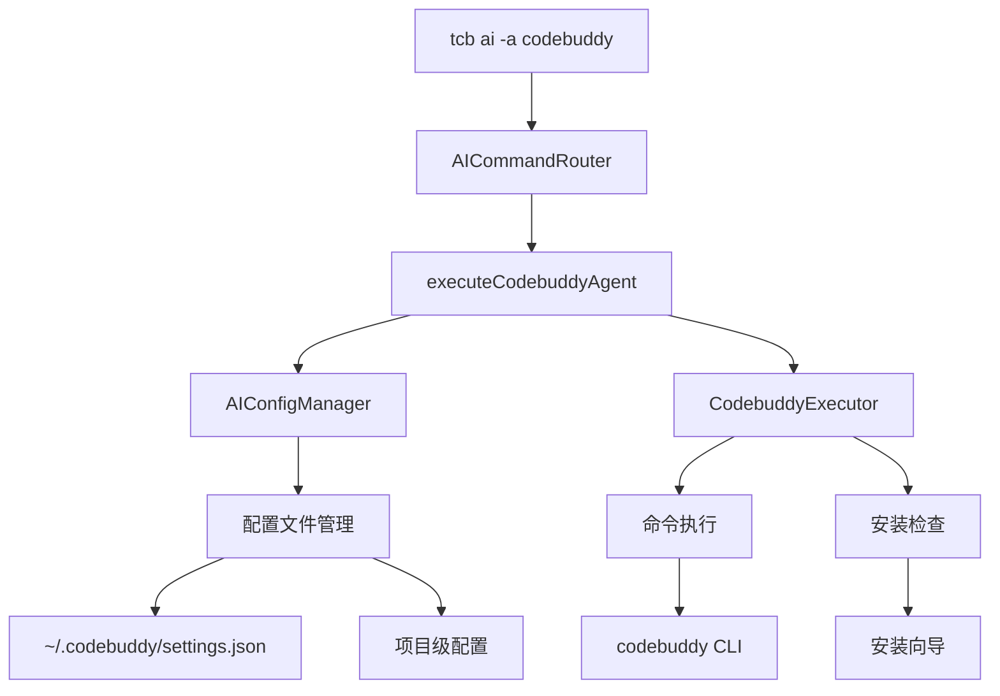

# 技术方案设计

## 架构概述

在 CloudBase CLI 的 ai 命令中集成 Codebuddy Code CLI，采用与现有 AI 工具（如 Claude、Qwen、Codex）相同的架构模式，通过命令路由器和配置管理器来实现统一的 AI 工具管理。

## 技术架构



## 技术选型

### 核心组件

- **AICommandRouter**: 现有的命令路由器，负责路由到不同的 AI 工具
- **CodebuddyConfigManager**: Codebuddy 配置管理器（复用现有的 AIConfigManager）
- **CodebuddyExecutor**: Codebuddy 命令执行器（集成到现有的 executeAgentWithConfig 方法中）

### 配置管理

- **配置文件格式**: JSON
- **配置位置**:
    - 用户级: `~/.codebuddy/settings.json`
    - 项目级: `.codebuddy/settings.json`
- **配置验证**: 使用 Zod 进行配置验证
- **配置方式**: 主要通过环境变量和命令行参数，配置文件为辅

### 命令执行

- **执行方式**: 子进程执行 `codebuddy` 命令
- **参数透传**: 通过 `--` 分隔符透传参数
- **环境变量**: 支持环境变量配置

## 数据库/接口设计

### 配置结构

```typescript
interface CodebuddyConfig {
    type: 'none' | 'custom'
    apiKey?: string
}

// Codebuddy Code CLI 配置特点：
// 1. 主要通过环境变量 CODEBUDDY_API_KEY 配置
// 2. 支持 OAuth 身份验证流程
// 3. MCP 服务器配置由 Codebuddy CLI 自己管理
// 4. 通过参数透传实现 MCP 命令管理
```

### 配置验证 Schema

```typescript
const CodebuddyConfigSchema = z.discriminatedUnion('type', [
    z.object({
        type: z.literal('none')
    }),
    z.object({
        type: z.literal('custom'),
        apiKey: z.string().optional()
    })
])
```

## 实现策略

### 1. 扩展现有架构

- 在 `src/utils/ai/const.ts` 中添加 Codebuddy 常量定义
- 在 `src/utils/ai/router.ts` 中添加 Codebuddy 路由逻辑
- 在 `src/utils/ai/config.ts` 中添加 Codebuddy 配置管理

### 2. 命令执行流程

1. 检查 Codebuddy CLI 是否已安装
2. 验证配置有效性
3. 解析透传参数
4. 执行 Codebuddy 命令
5. 处理执行结果

### 3. 配置管理流程

1. 检查配置文件是否存在
2. 验证配置格式
3. 提供配置向导
4. 保存配置到指定位置

### 4. MCP 服务器管理

- 通过参数透传实现 MCP 命令管理
- 支持三种配置作用域
- 配置文件自动合并

## 测试策略

### 单元测试

- 配置验证测试
- 命令解析测试
- 参数透传测试

### 集成测试

- 完整命令执行流程测试
- 配置管理流程测试
- 错误处理测试

### 端到端测试

- 用户场景测试
- 安装向导测试
- MCP 服务器管理测试

## 安全性

### 配置安全

- API 密钥加密存储
- 配置文件权限控制
- 敏感信息脱敏显示

### 命令执行安全

- 参数验证和过滤
- 环境变量安全传递
- 子进程权限控制

## 部署和发布

### 开发阶段

1. 实现核心功能
2. 添加单元测试
3. 集成测试验证

### 发布阶段

1. 更新文档
2. 版本发布
3. 用户反馈收集

## 兼容性

### 系统兼容性

- 支持 macOS、Linux、Windows
- Node.js 18+ 版本要求
- 与现有 AI 工具共存

### 配置兼容性

- 向后兼容现有配置
- 支持配置迁移
- 配置文件格式统一
