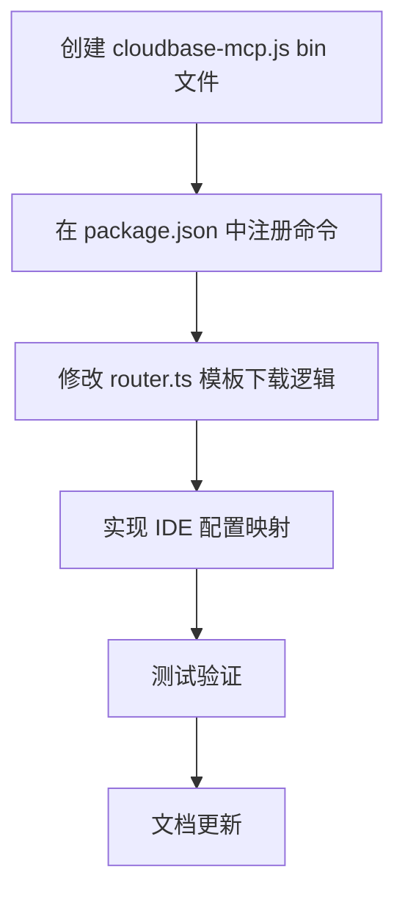

# 技术方案设计

## 架构概述

本方案通过在 CLI 中暴露一个全局的 `cloudbase-mcp` bin 命令，直接调用内置的 `@cloudbase/cloudbase-mcp` 包，并修改模板下载逻辑，使所有 MCP 配置都指向这个全局命令，从而避免用户需要额外安装 MCP 包。

## 技术栈

- Node.js CLI 工具
- `@cloudbase/cloudbase-mcp` 内置依赖
- 文件系统操作 (fs-extra)
- 模板下载和解压

## 技术选型

### 1. Bin 文件创建

- 在 `bin/` 目录下创建 `cloudbase-mcp.js` 文件
- 在 `package.json` 的 `bin` 字段中注册 `cloudbase-mcp` 命令
- 直接调用内置的 `@cloudbase/cloudbase-mcp` 包

### 2. 模板配置生成

- 修改 `router.ts` 中的模板下载逻辑
- 根据 IDE 类型生成对应的 MCP 配置文件
- 所有配置都指向 `cloudbase-mcp` 命令

### 3. IDE 配置映射和格式支持

- 参考 CloudBase-AI-ToolKit 的 IDE 到文件映射关系
- 支持 Cursor、VSCode、Claude Code、OpenAI Codex、OpenCode、Aider 等多种 IDE
- 支持 JSON 和 TOML 两种配置文件格式
- 实现 TOML 解析和修改功能

## 数据库/接口设计

无需数据库设计，主要涉及文件系统操作和命令行接口。

## 测试策略

1. **单元测试**：测试 bin 文件是否正确调用内置包
2. **集成测试**：测试模板下载和配置生成功能
3. **端到端测试**：测试完整的 MCP 配置流程

## 安全性

- 确保 bin 文件有正确的执行权限
- 验证模板下载源的安全性
- 防止路径遍历攻击

## 实施计划

