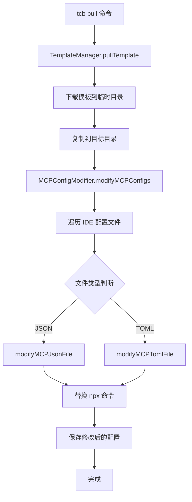
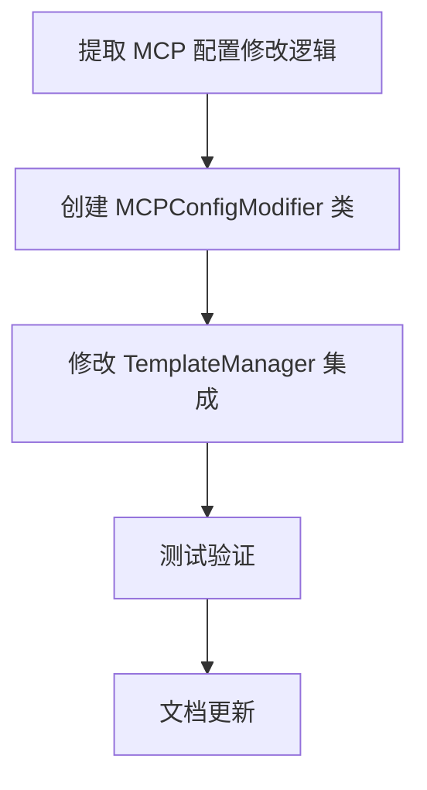

# 技术方案设计

## 架构概述

本方案通过在 `TemplateManager` 中集成 MCP 配置修改功能，使 `tcb pull` 命令在下载模板后能够自动修改 MCP 配置文件，将 npx 命令替换为 `cloudbase-mcp` 命令，从而与 `tcb ai` 命令保持一致的行为。

## 技术栈

- Node.js CLI 工具
- `fs-extra`: 文件系统操作
- `simple-git`: Git 操作
- 现有的 MCP 配置修改逻辑

## 技术选型

### 1. 代码复用策略
- 将 `tcb ai` 命令中的 MCP 配置修改逻辑提取到独立的工具类中
- 在 `TemplateManager` 中调用这些工具类
- 避免代码重复，保持逻辑一致性

### 2. 集成点设计
- 在 `TemplateManager.pullTemplate` 方法的最后阶段添加 MCP 配置修改
- 在 `copyFromTempToTarget` 方法完成后执行 MCP 配置修改
- 确保不影响现有的模板下载流程

### 3. 错误处理策略
- MCP 配置修改失败不应影响模板下载的成功完成
- 提供详细的日志记录，便于问题排查
- 支持用户选择跳过 MCP 配置修改

## 核心组件设计

### 1. MCPConfigModifier 工具类
```typescript
export class MCPConfigModifier {
    // 修改指定目录下的所有 MCP 配置文件
    async modifyMCPConfigs(extractDir: string, log: Logger): Promise<void>
    
    // 修改单个 JSON 配置文件
    private async modifyMCPJsonFile(filePath: string, log: Logger): Promise<void>
    
    // 修改单个 TOML 配置文件
    private async modifyMCPTomlFile(filePath: string, log: Logger): Promise<void>
}
```

### 2. TemplateManager 增强
```typescript
export class TemplateManager {
    private mcpConfigModifier: MCPConfigModifier
    
    constructor() {
        this.mcpConfigModifier = new MCPConfigModifier()
    }
    
    // 在模板复制完成后调用 MCP 配置修改
    private async copyFromTempToTarget(tempDir: string, targetPath: string, force: boolean, log: Logger): Promise<void> {
        // ... 现有的复制逻辑 ...
        
        // 新增：修改 MCP 配置文件
        try {
            await this.mcpConfigModifier.modifyMCPConfigs(targetPath, log)
        } catch (error) {
            log.warn(`⚠️ MCP 配置修改失败: ${error.message}`)
        }
    }
}
```

## 数据流设计



## 配置文件映射

复用 `tcb ai` 命令中已定义的 IDE 配置文件映射：

```typescript
const IDE_FILE_MAPPINGS: Record<string, IdeFileDescriptor[]> = {
    cursor: [
        { path: '.cursor/rules/cloudbase-rules.mdc' },
        { path: '.cursor/mcp.json', isMcpConfig: true }
    ],
    'claude-code': [
        { path: 'CLAUDE.md' }, 
        { path: '.mcp.json', isMcpConfig: true }
    ],
    // ... 其他 IDE 配置
}
```

## 测试策略

### 1. 单元测试
- 测试 `MCPConfigModifier` 类的各个方法
- 测试不同格式配置文件的修改逻辑
- 测试错误处理机制

### 2. 集成测试
- 测试 `tcb pull` 命令的完整流程
- 测试内置模板和 Git 仓库的 MCP 配置修改
- 测试与现有功能的兼容性

### 3. 端到端测试
- 测试完整的模板下载和配置修改流程
- 测试不同 IDE 配置文件的生成和修改
- 测试错误场景的处理

## 安全性考虑

- 确保 MCP 配置修改不影响模板下载的安全性
- 验证修改后的配置文件格式正确性
- 防止路径遍历攻击

## 性能考虑

- MCP 配置修改在模板复制完成后异步执行
- 避免重复读取和解析配置文件
- 优化文件遍历和修改逻辑

## 实施计划




