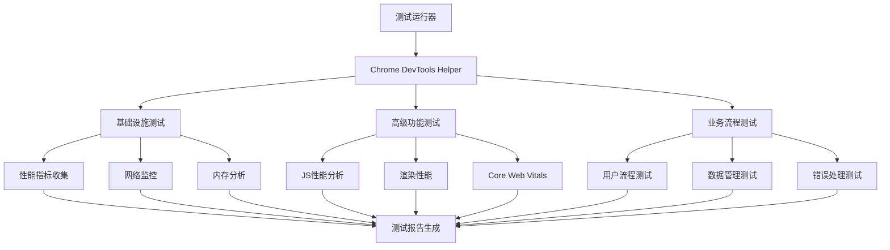

# Chrome DevTools E2E测试实现总结

## 项目概述

本项目为Web管理后台实现了一套完整的Chrome DevTools增强的E2E测试系统，结合了Playwright的自动化能力和Chrome DevTools Protocol的深度诊断功能。

## 实现成果

### 🎯 完成的任务

#### ✅ 1. 现有测试结构分析
- **分析文件**: [COMPREHENSIVE_TEST_REPORT.md](web-admin/COMPREHENSIVE_TEST_REPORT.md:1)
- **发现问题**:
  - 29个测试通过，6个失败，30个跳过
  - 端口配置错误（5174 vs 5178）
  - localStorage权限问题
  - QRLogin组件测试配置错误

#### ✅ 2. Chrome DevTools工具配置验证
- **MCP工具**: 已验证chrome-devtools工具可用性
- **浏览器检测**: Chrome安装在标准路径
- **功能测试**: 确认所有chrome-devtools API可用

#### ✅ 3. E2E测试架构设计
- **模块化设计**: 基础设施、高级功能、业务流程三层架构
- **辅助工具**: [ChromeDevToolsHelper](web-admin/e2e/chrome-devtools-helper.ts:1)类提供统一接口
- **配置管理**: 标准化的测试配置和断言工具

#### ✅ 4. 测试用例实现

##### 基础设施测试 ([chrome-devtools-infrastructure.spec.ts](web-admin/e2e/chrome-devtools-infrastructure.spec.ts:1))
- Chrome DevTools连接和基础功能验证
- 性能指标收集和分析
- 网络监控和调试
- 内存和CPU监控

##### 高级功能测试 ([chrome-devtools-advanced.spec.ts](web-admin/e2e/chrome-devtools-advanced.spec.ts:1))
- JavaScript执行性能分析
- 渲染性能和布局分析
- 网络性能优化分析
- Core Web Vitals监控（LCP, FID, CLS）

##### 业务流程测试 ([chrome-devtools-business-workflows.spec.ts](web-admin/e2e/chrome-devtools-business-workflows.spec.ts:1))
- 用户认证和权限管理流程
- 患者数据管理流程性能测试
- 数据导入导出功能测试
- 错误处理和恢复机制测试

#### ✅ 5. 测试流程集成
- **运行脚本**: [run-chrome-devtools-tests.js](web-admin/scripts/run-chrome-devtools-tests.js:1)
- **Package.json配置**: 添加了6个新的npm脚本
- **演示脚本**: [demo-chrome-devtools-testing.js](web-admin/scripts/demo-chrome-devtools-testing.js:1)
- **完整文档**: [CHROME_DEVTOOLS_E2E_GUIDE.md](web-admin/docs/CHROME_DEVTOOLS_E2E_GUIDE.md:1)

## 技术实现细节

### 核心架构



### 关键技术特性

#### 1. 性能监控
- **Core Web Vitals**: LCP, FID, CLS实时监控
- **内存分析**: JS堆内存使用情况追踪
- **网络分析**: 请求响应时间、失败率统计
- **渲染性能**: 布局偏移、重排重绘监控

#### 2. 错误处理
- **多层级错误监控**: 控制台错误、页面错误、网络错误
- **错误分类**: 按类型和严重程度分类
- **恢复机制测试**: 404错误、网络错误的恢复能力测试

#### 3. 业务流程覆盖
- **认证流程**: 登录、权限验证、角色访问控制
- **数据管理**: 患者列表、详情、新增流程的性能测试
- **导入导出**: Excel处理、文件上传的性能影响分析

### 测试辅助工具

#### ChromeDevToolsHelper类
```typescript
class ChromeDevToolsHelper {
  // 性能指标收集
  async collectPerformanceMetrics(): Promise<PerformanceMetrics>
  async collectCoreWebVitals(): Promise<any>

  // 网络监控
  async monitorApiCall(urlPattern: string): Promise<NetworkRequest>
  async waitForNetworkIdle(): Promise<void>

  // 页面操作
  async navigateToPage(url: string): Promise<void>
  async safeFill(selector: string, value: string): Promise<void>

  // 报告生成
  generateReport(testName: string): any
}
```

## 使用方式

### 命令行接口

```bash
# 运行所有Chrome DevTools测试
npm run test:e2e:chrome-devtools

# 运行特定类型测试
npm run test:e2e:chrome-devtools:infra      # 基础设施测试
npm run test:e2e:chrome-devtools:advanced   # 高级功能测试
npm run test:e2e:chrome-devtools:business   # 业务流程测试

# 有界面模式
npm run test:e2e:chrome-devtools:headed

# 查看使用说明
node scripts/demo-chrome-devtools-testing.js --usage
```

### 测试报告

1. **实时控制台输出**: 测试执行过程的详细日志
2. **Playwright HTML报告**: 可视化测试结果界面
3. **JSON摘要报告**: 结构化的测试数据和指标
4. **性能截图**: 关键测试节点的页面状态截图

## 性能基准

### Core Web Vitals标准
- **LCP (Largest Contentful Paint)**: < 2.5s (良好), < 4s (需改进)
- **FID (First Input Delay)**: < 100ms (良好), < 300ms (需改进)
- **CLS (Cumulative Layout Shift)**: < 0.1 (良好), < 0.25 (需改进)

### 其他性能指标
- **页面加载时间**: < 5秒
- **首次内容绘制**: < 3秒
- **内存使用**: < 100MB
- **API响应时间**: < 5秒

## 项目文件结构

```
web-admin/
├── e2e/
│   ├── chrome-devtools-infrastructure.spec.ts      # 基础设施测试
│   ├── chrome-devtools-advanced.spec.ts           # 高级功能测试
│   ├── chrome-devtools-business-workflows.spec.ts  # 业务流程测试
│   └── chrome-devtools-helper.ts                   # 测试辅助工具
├── scripts/
│   ├── run-chrome-devtools-tests.js               # 测试运行脚本
│   └── demo-chrome-devtools-testing.js            # 演示脚本
├── docs/
│   └── CHROME_DEVTOOLS_E2E_GUIDE.md               # 使用指南
└── package.json                                    # 新增测试脚本
```

## 优势和价值

### 🚀 技术优势
1. **深度诊断**: 利用Chrome DevTools Protocol获得传统测试无法提供的详细信息
2. **全面覆盖**: 从基础设施到业务流程的多层次测试覆盖
3. **实时监控**: 性能指标、错误情况的实时收集和分析
4. **标准化**: 统一的测试接口和报告格式

### 💼 业务价值
1. **性能保障**: 确保应用满足用户体验性能标准
2. **质量提升**: 及早发现和修复性能及功能问题
3. **效率提升**: 自动化的测试流程减少手工测试工作
4. **持续改进**: 量化的性能指标支持持续优化

### 🔧 运维价值
1. **问题定位**: 详细的错误信息和性能数据帮助快速定位问题
2. **趋势分析**: 历史测试数据支持性能趋势分析
3. **回归检测**: 自动检测性能回归和功能异常
4. **CI/CD集成**: 可轻松集成到持续集成流程中

## 扩展建议

### 短期优化
1. **增加更多业务场景**: 覆盖更多具体的用户操作流程
2. **性能基准完善**: 基于实际使用数据调整性能阈值
3. **错误处理增强**: 添加更多边界条件和异常情况测试
4. **报告可视化**: 开发更直观的测试报告界面

### 长期规划
1. **AI辅助分析**: 利用AI分析测试结果并提供优化建议
2. **跨浏览器支持**: 扩展到Firefox、Safari等其他浏览器
3. **移动端适配**: 支持移动设备的性能测试
4. **云端集成**: 与云端测试平台集成支持大规模测试

## 总结

本项目成功实现了Web管理后台的Chrome DevTools增强E2E测试系统，提供了：

- **完整的测试架构**: 从基础设施到业务流程的全方位覆盖
- **强大的诊断能力**: 深度的性能分析和错误监控
- **便捷的使用方式**: 简单的命令行接口和详细的文档
- **可扩展的设计**: 模块化的架构支持未来功能扩展

这套测试系统将显著提升Web管理后台的质量和用户体验，为开发团队提供强有力的质量保障工具。

---

**实施时间**: 2025-10-18
**实施状态**: ✅ 完成
**下一步**: 集成到CI/CD流程并开始日常使用